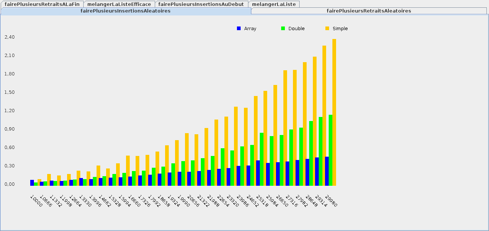
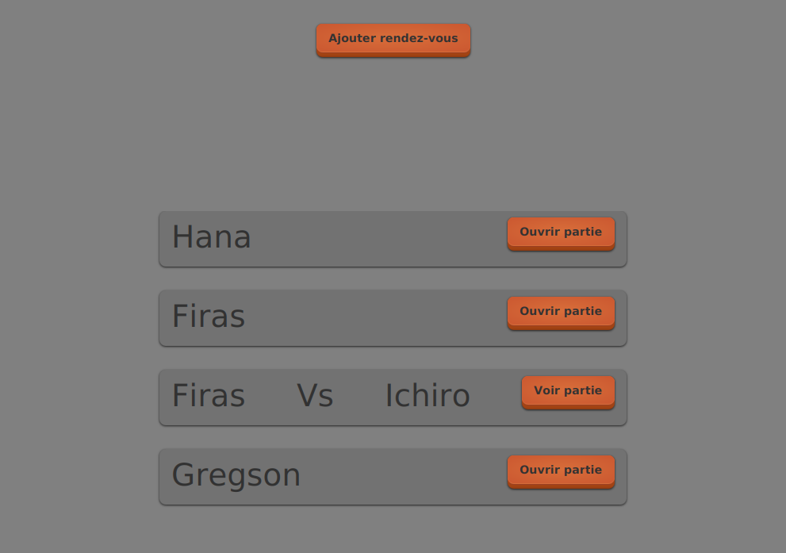

# Outils pour les cours d'intro en programmation

## Visualiser les structures de données

## Visualiser l'efficacité d'une structure de données

## Visualiser le modèle d'une application graphique

## Visualiser les tâches d'une application graphique

