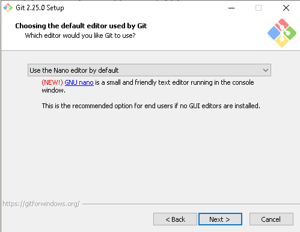
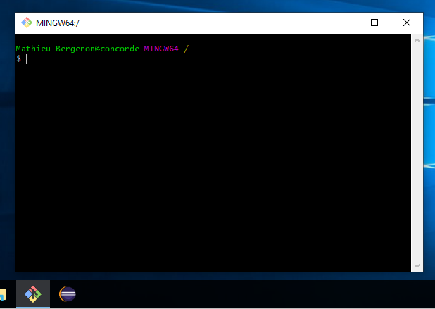
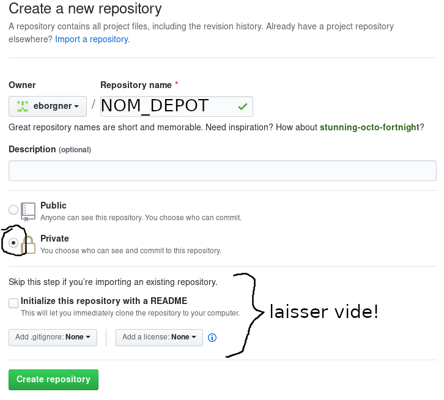
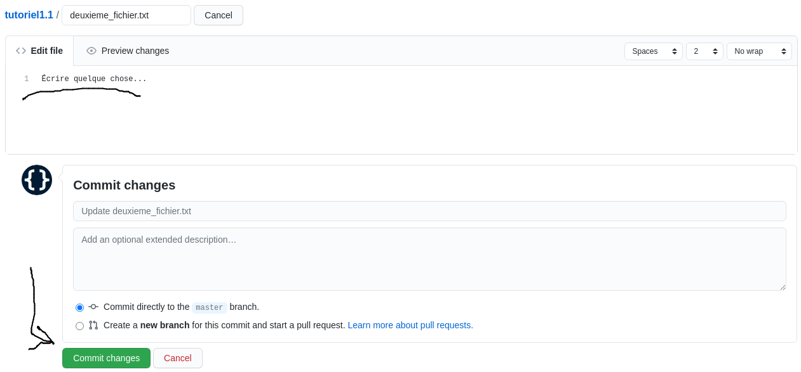

# Tutoriel 1.1: Git

**IMPORTANT**: 

* Certaines étapes sont à faire **Uniquement sur votre Windows**
	* Vous pouvez ignorer ces étapes si vous travailler sur le poste du Collège.

## Créer un compte sur GitHub

1. Je me crée un compte GitHub si ce n'est pas déjà fait

## Uniquement sur votre Windows: installer Git

1. J'installe Git
	* Je visite <a href="https://git-scm.com/download/win" target="_blank">https://git-scm.com/download/win</a>
	* Je télécharge et j'exécute `Git-<VERSION>.exe`
	* J'installe avec les options par défaut, **sauf**:
		* Je choisis `nano` comme éditeur si je n'aime pas `vim`:

## Démarrer *Git Bash*

1. J'ouvre une fenêtre *Git Bash*

1. Les commandes à faire en Git Bash sont formattées comme suit:

        $ cd ~   
        $ pwd
        $ ls

1. Dans une commande, les `MAJUSCULES` sont à **ajuster selon VOS INFOS**:

    * Par exmeple:

            $ cd ~/PRENOM_NOM

    * serait adapté à:

            $ cd ~/mathieu_bergeron

## Usage 01: travailler en local

### Étape 00: configurer Git

1. Je configure Git (si c'est la première fois que je l'utilise)

        $ git config --global user.email "MON_COURRIEL@ASDF.COM"
        $ git config --global user.name "PRENOM NOM"

### Étape 01: créer un dépôt local

1. Je crée un répertoire où placer mon dépôt:

        $ mkdir ~/tutoriels_3c6
        $ mkdir ~/tutoriels_3c6/tutoriel1.1

1. J'initialise de dépôt:

        $ cd ~/tutoriels_3c6/tutoriel1.1
        $ git init

1. J'observe que je n'ai pas encore de commit dans mon historique:

        $ git log

1. J'observe qu'il n'y a aucune modifications détectées par Git

        $ git status

1. J'ajoute un fichier

        $ touch un_fichier.txt
        $ ls

1. J'observe que je n'ai toujours pas de commit dans mon historique:

        $ git log

1. Par contre, il y a maintenant des modifications détectées par Git:

        $ git status

    * En particulier, Git indique que le fichier est non-suivi

1. J'ajoute le fichier à l'index

        $ git add un_fichier.txt

1. J'observe que je n'ai toujours pas de commit dans mon historique:

        $ git log

1. J'observe aussi que le statut du fichier a changé de `non-suivi` à `nouveau`:

        $ git status

1. Je fais mon premier commit

        $ git commit -a

    * Un `ÉDITEUR` va s'ouvrir. Je dois:
        * écrire mon commentaire de commit
        * sauvegarder le fichier
        * quitter l'`ÉDITEUR`
            

1. J'observe que j'ai maintenant un commit dans mon historique:

        $ git log

    * la chaîne du genre `8e19b75a767fd8af1bccb74be8343c054eab8819` est l'**identifiant**

1. J'observe qu'il y de nouveau aucune modification

        $ git status

1. J'ouvre le fichier et j'écris quelque chose à l'intérieur

        $ ÉDITEUR un_fichier.txt

                quelque chose

    * je choisis mon `ÉDITEUR`: `nano`, `vim`, `vscode`, etc.

1. J'observe que le fichier est maintenant modifié

        $ git status

1. J'inspecte la modification

        $ git diff

1. Je fais mon deuxième commit

        $ git commit -a

1. J'observe qu'il y a maintenant deux commits dans mon historique

        $ git log

## Usage 02: synchroniser local et serveur

### Étape 00: ajouter ma clé publique *SSH* à mon compte GitHub

1. Je crée mes clés privée et publique

		$ cd
		$ ssh-keygen.exe

			# je fais Entrée pour accepter les options par défaut

1. Je vérifie que mes clés existent

		$ cat ~/.ssh/id_rsa             # ma clé privée
		$ cat ~/.ssh/id_rsa.pub         # ma clé publique

1. Je copie le texte de ma clé **publique**

		$ cat ~/.ssh/id_rsa.pub

			# je sélectionne et copie le texte du fichier

1. J'ajoute ma clé **publique** sur GitHub
	* Sur GitHub, je clique sur mon icône de profil
	* => *Settings*
	* => *SSH and GPG keys*
	* => *New SSH key*
	* je colle le texte de ma clé
	* Je clique sur *Add SSH key*

### Étape 01: créer mon dépôt disant

1. Je crée un dépôt sur GitHub nommé `tutoriel1.1`
    * Dépôt **privé**
    * Dépôt **vide**

    

### Étape 02: associer les deux dépôts

1. J'ajoute le *distant* à mon dépôt local

        $ cd ~/tutoriels_3c6/tutoriel1.1
        $ git remote add origin 'git@github.com:USAGER/tutoriel1.1'

1. Je pousse pour la première fois sur le dépôt distant

        $ git push -u origin master

1. En cas d'erreur, je vérifie et corrige mon fichier `.git/config`

        $ EDITEUR .git/config

            # Corriger l'URL si elle est erronée

        $ git push -u origin master

### Étape03: obtenir les modifications distantes

1. J'ajoute un nouveau fichier et je le pousse:

        $ touch deuxieme_fichier.txt
        $ git add .
        $ git commit -a
        $ git push

1. Sur GitHub, je rafraîchis la page du dépôt, puis:
    * je sélectionne `deuxieme_fichier.txt` et l'icône pour éditer ✎
    * j'écris quelque chose et je choisis *Commit Changes*

    

        
    

1. J'obtient les derniers commit du serveur

        $ git pull
        $ cat deuxieme_fichier.txt
