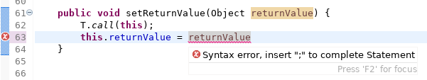
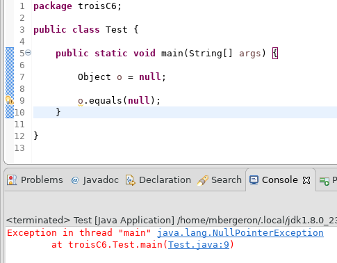

# L'environnement Java (JDK)

<video width="50%" src="01.mp4" type="video/mp4" controls>

## Le compilateur

### Rôle du compilateur

<video width="50%" src="02.mp4" type="video/mp4" controls>

* Avant d'exécuter le programme, il faut transformer chaque fichier `.java` en `.class`

        $ javac MonProgramme.java 

    * NOTE: la commande est `javac` (avec un `c`)

* Le compilateur va détecter les erreurs de compilation:

    

    <video width="50%" src="03.mp4" type="video/mp4" controls>
    

    * Erreur de syntaxe

            $ javac MonProgramme.java

                MonProgramme.java:5: error: ';' expected
                        System.out.println("Bonjour!")
                                                      ^
                1 error

    * Erreur de type

            $ javac MonProgramme.java

                MonProgramme.java:5: error: incompatible types: 
                                            String cannot be converted to int
                        int x = "asdf";
                                ^
                1 error

    * Erreur d'importation

            $ javac MonProgramme.java

                MonProgramme.java:5: error: cannot find symbol
                        MaClasse x = new MaClasse();
                        ^
                  symbol:   class MaClasse
                  location: class MonProgramme

                2 errors

### Options du compilateur

<video width="50%" src="04.mp4" type="video/mp4" controls>

* Indiquer le `classpath`, c-à-d où trouver les classes que le programme utilise

        $ javac -cp .:cheminA:cheminB:cheminC MonProgramme.java

    * où `.` est le répertoire courant et `:` sert à séparer différents chemins

* Indiquer l'encodage des fichiers `.java`

        $ javac -encoding ascii MonProgramme.java

            /home/mbergeron/tmp/MonProgramme.java:5: error: unmappable character 
                                                            for encoding ascii
                    System.out.println("���");
                                        ^
            1 error

        $ javac -encoding utf8 MonProgramme.java

            # pas d'erreur

## La machine virtuelle (JVM)

<video width="50%" src="05.mp4" type="video/mp4" controls>

### Rôle de la JVM

* Exécuter le programme à partir des fichiers `.class`

        $ java MonProgramme

    * NOTE: on donne le nom de la classe, pas le nom du fichier

    

    <video width="50%" src="06.mp4" type="video/mp4" controls>
    

* Retourner les erreurs d'exécution, p.ex.

    

    <video width="50%" src="07.mp4" type="video/mp4" controls>
    

    * Erreur de pointeur `null`:

            $ java MonProgramme

                Exception in thread "main" java.lang.NullPointerException
	                at MonProgramme.methodeC(MonProgramme.java:27)
	                at MonProgramme.methodeB(MonProgramme.java:18)
	                at MonProgramme.methodeA(MonProgramme.java:12)
	                at MonProgramme.main(MonProgramme.java:6)

	    * Il faut lire à partir du bas:
	        * `main` a appelé `methodeA`
	        * `methodeA` a appelé `methodB`
	        * `methodeB` a appelé `methodeC`
	        * dans `methodeC` à la ligne 27:
	            * un appel a été fait à partir d'un objet `null`
	            * (NOTE: l'erreur ne dis pas quel était l'objet `null` ou la méthode appelée sur cet objet `null`)

    

    <video width="50%" src="08.mp4" type="video/mp4" controls>
    

    * Erreur de transtypage:

            $ java MonProgramme

                Exception in thread "main" java.lang.ClassCastException: 
                                            java.lang.String 
                                            cannot be cast to java.lang.Double

	                at MonProgramme.methodeA(MonProgramme.java:14)
	                at MonProgramme.main(MonProgramme.java:6)

    * Erreur d'indice dans un tableau:

            $ java MonProgramme

                Exception in thread "main" 
                                    java.lang.ArrayIndexOutOfBoundsException: 10

	                at MonProgramme.methodeA(MonProgramme.java:14)
	                at MonProgramme.main(MonProgramme.java:6)

 
### Options de la JVM

<video width="50%" src="09.mp4" type="video/mp4" controls>

* Il faut encore indiquer le `classpath`:

        $ java -cp .:cheminA:cheminB:cheminC MonProgramme

* Indiquer la langue à utiliser

    * En français:

            $ java -Duser.language=fr

                Syntaxe : java [-options] class [args...]
                           (pour l'exécution d'une classe)
                   ou  java [-options] -jar jarfile [args...]
                           (pour l'exécution d'un fichier JAR)
                [...]

    * En anglais:

            $ java -Duser.language=en

                Usage: java [-options] class [args...]
                           (to execute a class)
                   or  java [-options] -jar jarfile [args...]
                           (to execute a jar file)
                [...]

# L'IDE Eclipse

<video width="50%" src="10.mp4" type="video/mp4" controls>

* Un IDE (*integrated development environment*) gère pour vous l'environnement

* Eclipse utilise à votre place les commandes `javac` et `java` (et d'autres)
    * p.ex. le `classpath` est géré pour vous

* Les erreurs de compilation sont rapportées à même le code:

    

        
    

* Les erreurs d'exécution sont rapportées dans la console d'Eclipse:

    

        
    

