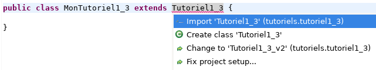

# Tutoriel 1.3: ajout de méthodes

## Étape 01: créer le projet `tutoriel1_3`

1. Je crée un projet
    * *File* => *New* => *Java Project*
        * Je décoche *Use default location*
            * je navigue à la racine d'un dépôt Git
                * p.ex. `~/3c6`
            * je crée un nouveau répertoire nommé `tutoriel1_3`
            * je sélectionne ce nouveau répertoire
        * Je vérifie que le nom du projet est `tutoriel1_3`
        * Je vérifie que le projet utilise le JDK **1.8**
        * Je clique sur *Finish*

## Étape 02: ajouter la librairie `tutoriel1_3.jar`

1. Je télécharge le fichier $[download ./tutoriel1_3.jar](tutoriel1_3.jar) et je le place **à la racine du projet**

1. Je rafraîchis Eclipse afin de voir le fichier `.jar`
    * *Clique-droit* sur le projet => *Refresh*

    

    
    

1. J'ajoute la librairie au `classpath`:
    * *Clique-droit* sur le projet => *Build path* => *Configure Build Path*
        * Onglet *Librairies* =>
        * Je clique sur *Add JARs...*
            * je sélectionne le projet `tutoriel1_3`
            * je sélectionne le fichier `tutoriel1_3.jar`

    

    
    

## Étape 03: créer la classe `MonTutoriel1_3`

1. Je crée une nouvelle classe nommée `MonTutoriel1_3`
    * *Clique-droit* sur le projet => *New* => *Class*
        *  *Name*: `MonTutoriel1_3`

## Étape 04: hériter de Tutoriel1_3

1. J'ouvre `MonTutoriel1_3` et j'ajoute `extends Tutoriel1_3`

    

    
    

1. J'utilise $[kbd](Ctrl+1) pour ajouter le `import` de `Tutoriel1_3`

    

    
    

1. J'utilise $[kbd](Ctrl+1) pour générer les méthodes manquantes
    * option `add unimplemented methods`

    

    
    

1. NOTE: pas besoin de remplir la méthode dans ce tutoriel

## Étape 05: hériter plutôt de Tutoriel1_3_v2

1. Je change la super classe à `Tutoriel1_3_v2`

    

    
    

1. J'utilise $[kbd](Ctrl+1) pour ajouter le `import` de `Tutoriel1_3_v2`

1. J'utilise $[kbd](Ctrl+1) pour générer les méthodes manquantes
    * option `add unimplemented method`

1. Je note les erreurs de compilation pour `fournirUnEntier` et `fournirUnReel`
    * Le contrat a changé et la super classe n'exige plus ces méthodes
    * Je peux soit:
        * effacer les méthodes
        * OU: renommer les méthodes vers p.ex. `fournirUnNombreEntier`
            * (puis effacer les méthodes générées par Eclipse)
        * OU: effacer l'annotation `@Override`

    

    
    

1. Quoi faire quand le contrat a changé dépend de la situation
    * Le compilateur donne l'erreur, mais c'est à moi de savoir la régler

## Étape 06: ajouter les fichiers du projet dans Git

1. J'ajoute les fichiers du projet dans Git

        $ cd ~/3c6/tutoriel1_3
        $ git add .
