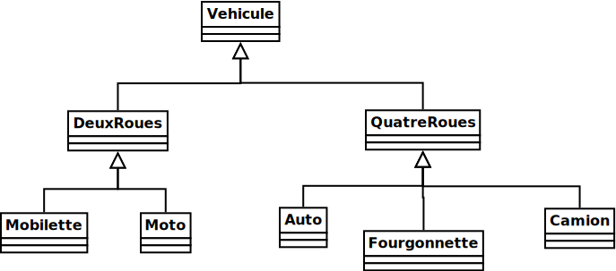
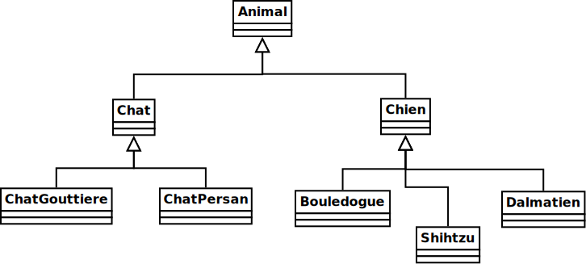

# Théorie 2.2: Héritage

<video width="50%" src="01.mp4" type="video/mp4" controls>

* On a vu que l'héritage est parfois un contrat qu'il faut remplir
* C'est aussi une façon de réutiliser du code
* Par exemple:

    $[java ./MonTutoriel2_1 1 6]()

    * L'outil de validation au complet devient accessible:
        * En héritant de `Tutoriel2_1`
        * En créant un nouvel objet `MonTutoriel2_1`
        * En appelant la méthode `valider` sur cet objet

    * La classe `MonTutoriel2_1` n'a pas à définir la méthode `valider`
    * Cette méthode est héritée de `Tutoriel2_1`

## Hiérarchie de classe

<video width="50%" src="02.mp4" type="video/mp4" controls>

* On visualise l'héritage des classes en arbre (ou hiérarchie):

    

    
    

* Ci-haut, on a par exemple:
    * `DeuxRoues` hérite de `Vehicule`
    * `Mobilette` hérite de `DeuxRoues`
    * `Moto` hérite de `DeuxRoues`

* En java, on utilise le mot clé `extends`. P.ex:

    $[java ./DeuxRoues 1 1]()

    $[java ./Mobilette 1 1]()

    $[java ./Moto 1 1]()

## Trois types de méthodes

<video width="50%" src="03.mp4" type="video/mp4" controls>

* Par rapport à l'héritage, il y a trois types de méthodes:
    * *méthode implantée*
        * nouvelle méthode (elle n'existe pas dans la classe parent)
    * *méthode redéfinie*
        * nouvelle version d'une méthode déjà qui existe dans la classe parent
    * *méthode héritée*
        * méthode qui existe déjà dans la classe parent et qu'on ne redéfinie pas

* Exemples:

    $[java ./Vehicule 1 9]()

    * Les méthodes `nombreDeRoues` et `litresEssenceConsomes` sont *implantées*
    * Elles n'existent pas dans une classe parent

    $[java ./DeuxRoues 1 6]()

    * La méthode `nombreDeRoues` est *redéfinie*
        * On met l'annotation `@Override` pour indiquer
        * Cette méthode existe dans la classe parent `Vehicule`
        * Dans `DeuxRoues`, on veut lui donner un autre comportement
    * La méthode `litresEssenceConsomes` est *héritée*
        * La classe `DeuxRoues` ne la redéfinie pas
        * Le comportement défini dans `Vehicule` va s'appliquer

## Où implanter une méthode?

<video width="50%" src="04.mp4" type="video/mp4" controls>

* Considérer p.ex:

    

    
    

* Il faut se poser la question:
    * *Est-ce que tous les XXX ont ce comportement?*
    * On implante la méthode dans la classe la plus haute qui se qualifie

* Par exemple:
    * *Est-ce que tous les XXX peuvent miauler?*
        * la méthode `miauler` va dans la classe `Chat`
    * *Est-ce que tous les XXX peuvent dormir?*
        * la méthode `dormir` va dans la classe `Animal`

## Où redéfinir une méthode?

<video width="50%" src="05.mp4" type="video/mp4" controls>

* Revenons à:

    

    
    

* Il faut se poser la question:
    * *Où connaît-on vraiment la réponse?*
    * On redéfini la méthode à chaque fois que la réponse change

* Par exemple:
    * *Où connaît-on le nombre de roues?*
        * on redéfini `nombreDeRoues` dans `DeuxRoues` et `QuatreRoues`
        * mais *pas* dans `Auto` puisque c'est la même réponse que `QuatreRoues`
    * *Où connait-on la consomation d'essence?*
        * on redéfini `consomationLitresParKilometre` dans chaque type de véhicule 
            * `Moto`, `Mobilette`, `Auto`, `Camion` et `Fourgonnette`

## Et les attributs?

<video width="50%" src="06.mp4" type="video/mp4" controls>

* Il est possible d'hériter d'un attribut, mais il n'est pas possible de *redéfinir* un attribut.
* Pour cette raison:
    * On utilise des accesseurs (*getter*) pour obtenir la valeur d'un attribut
        * comme ça la classe enfant peut modifier la valeur!
    * L'héritage n'est généralement **pas utile** pour représenter les données
    * L'héritage est **utile** pour représenter des variatons de comportement

## Exemple: `litresEssenceConsomes`

<video width="50%" src="07.mp4" type="video/mp4" controls>

* Considérer la méthode `litresEssenceConsomes`:

    $[java ./Vehicule 1 9]()

* Cette méthode utilise un accesseur (`consomationLitresParKilometre`) 
    * On écrit le calcul dans la classe parent, sans connaître la valeur

* C'est la classe enfant qui retourne la bonne valeur:

    $[java ./Mobilette 1 6]()

* Ainsi, on a pas besoin de redéfinir `litresEssenceConsomes`

* Le calcul va fonctionner pour tous les types de véhicule, car:
    * `Moto` redéfini `consomationLitresParKilometre`
    * `Mobilette` redéfini `consomationLitresParKilometre`
    * `Auto` redéfini `consomationLitresParKilometre`
    * etc.

