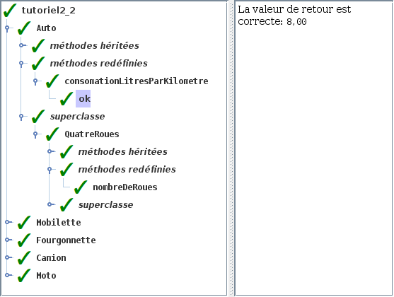

# Tutoriel 2.2: héritage

## Préalable

1. Je regarde d'abord la présentation des $[link ../validation/](ajouts à l'outil de validation)

## Objectifs

1. En utilisant Eclipse, je crée un nouveau projet Java
    * Le projet doit **obligatoirement** être comme suit:
        * nom du projet: `tutoriel2_2`
        * chemin du projet: `~/3c6_PRENOM_NOM/tutoriel2_2`
        * le projet doit utiliser le **JDK 1.8**
        * le projet utilise la librairie $[download ./tutoriel2_2.jar](tutoriel2_2.jar)
        * le projet utilise la base de données $[download ./tutoriel2_2.db](tutoriel2_2.db)

1. Je crée la classe `MonTutoriel2_2` qui hérite de la classe `Tutoriel2_2`

1. J'implante les méthodes pour remplir le contrat du `Tutoriel2_2`

1. Je crée les classes de la hiérarchie suivante:

    

    
    

1. J'implante ou redéfini les méthodes suivantes, **dans les bonnes classes**
    * `public int nombreDeRoues()`
        * retourne le nombre de roues du véhicule
    * `public double consomationLitresParKilometre() `
        * retourne la consomation théorique en `litres/kilomètres`
            * `Mobilette`: `1.5`
            * `Moto`: `3.5`
            * `Auto`: `8.0`
            * `Fourgonnette`: `12.0`
            * `Camion`: `14.0`
    * `public double litresEssenceConsomes(double kilometres) `
        * calcule la consomation en litres pour un certain kilométrage

1. J'ajoute une méthode `main` à la classe `MonTutoriel2_2`:

    $[java ./MonTutoriel2_2 1 6]()

1. J'exécute mon projet et je valide mes classes et mes méthodes

1. J'ajoute les fichiers du projet dans Git 

1. Je fais un `commit` et un `push`

## Réalisation

### Étape 01: créer le projet `tutoriel2_2`

1. Je crée un projet nommé `tutoriel2_2`
    * *File* => *New* => *Java Project*
        * Je décoche *Use default location*
            * je navigue à la racine du dépôt Git `~/3c6_PRENOM_NOM`
            * je crée un nouveau répertoire nommé `tutoriel2_2`
            * je sélectionne ce nouveau répertoire
        * Je vérifie que le projet utilise le JDK **1.8**
        * Je clique sur *Finish*

### Étape 02: ajouter la librairie `tutoriel2_2.jar`

1. Je télécharge le fichier $[download ./tutoriel2_2.jar](tutoriel2_2.jar) et je le place **à la racine du projet**

1. Je rafraîchis Eclipse afin de voir le fichier `.jar`
    * *Clique-droit* sur le projet => *Refresh*

1. J'ajoute la librairie au `classpath`:
    * *Clique-droit* sur le projet => *Build path* => *Configure Build Path*
        * Onglet *Librairies* =>
        * Je clique sur *Add JARs...*
            * je sélectionne le projet `tutoriel2_2`
            * je sélectionne le fichier `tutoriel2_2.jar`
        * Je clique sur *Apply and Close*

### Étape 03: ajouter la base de données `tutoriel2_2.db`

1. Je télécharge le fichier $[download ./tutoriel2_2.db](tutoriel2_2.db) et je le place **à la racine du projet**

1. Je rafraîchis Eclipse afin de voir le fichier `.db`
    * *Clique-droit* sur le projet => *Refresh*

### Étape 04: créer la classe `MonTutoriel2_2`

1. Je crée une nouvelle classe nommée `MonTutoriel2_2`
    * *Clique-droit* sur le projet => *New* => *Class*
        *  *Name*: `MonTutoriel2_2`

### Étape 05: hériter de Tutoriel2_2

1. J'ouvre `MonTutoriel2_2` et j'ajoute `extends Tutoriel2_2`

1. J'utilise $[kbd](Ctrl+1) pour ajouter le `import` de `Tutoriel2_2`

1. J'utilise $[kbd](Ctrl+1) pour générer les méthodes manquantes
    * option `add unimplemented methods`

### Étape 06: créer la classe `Vehicule`

1. Je crée une nouvelle classe nommée `Vehicule`
    * *Clique-droit* sur le projet => *New* => *Class*
        *  *Name*: `Vehicule`

### Étape 07: créer la classe `DeuxRoues`

1. Je crée une nouvelle classe nommée `DeuxRoues`
    * *Clique-droit* sur le projet => *New* => *Class*
        *  *Name*: `DeuxRoues`

1. J'ouvre `DeuxRoues` et j'ajoute `extends Vehicule`

    $[java ./DeuxRoues 1 1]()

### Étape 08: créer la classe `QuatreRoues`

1. Je crée une nouvelle classe nommée `QuatreRoues`
    * *Clique-droit* sur le projet => *New* => *Class*
        *  *Name*: `QuatreRoues`

1. J'ouvre `QuatreRoues` et j'ajoute `extends Vehicule`

    $[java ./QuatreRoues 1 1]()

### Étape 09: créer la classe `Moto`

1. Je crée une nouvelle classe nommée `Moto`
    * *Clique-droit* sur le projet => *New* => *Class*
        *  *Name*: `Moto`

1. J'ouvre `Moto` et j'ajoute `extends DeuxRoues`

    $[java ./Moto 1 1]()

### Étape 10: créer la classe `Mobilette`

1. Je crée une nouvelle classe nommée `Mobilette`
    * *Clique-droit* sur le projet => *New* => *Class*
        *  *Name*: `Mobilette`

1. J'ouvre `Mobilette` et j'ajoute `extends DeuxRoues`

    $[java ./Mobilette 1 1]()

### Étape 11: créer la classe `Auto`

1. Je crée une nouvelle classe nommée `Auto`
    * *Clique-droit* sur le projet => *New* => *Class*
        *  *Name*: `Auto`

1. J'ouvre `Auto` et j'ajoute `extends QuatreRoues`

    $[java ./Auto 1 1]()

### Étape 12: créer la classe `Camion`

1. Je crée une nouvelle classe nommée `Camion`
    * *Clique-droit* sur le projet => *New* => *Class*
        *  *Name*: `Camion`

1. J'ouvre `Camion` et j'ajoute `extends QuatreRoues`

    $[java ./Camion 1 1]()

### Étape 13: créer la classe `Fourgonnette`

1. Je crée une nouvelle classe nommée `Fourgonnette`
    * *Clique-droit* sur le projet => *New* => *Class*
        *  *Name*: `Fourgonnette`

1. J'ouvre `Fourgonnette` et j'ajoute `extends QuatreRoues`

    $[java ./Fourgonnette 1 1]()

### Étape 14: ajouter les méthodes *implantées*

1. J'ouvre `Vehicule` et j'implante les méthodes suivantes:

    $[java ./Vehicule 3 13]()

### Étape 15: ajouter les méthodes *redéfinies*

1. J'ouvre `DeuxRoues` et je redéfinis la méthode suivante:

    $[java ./DeuxRoues 3 6]()

1. J'ouvre `QuatreRoues` et je redéfinis la méthode suivante:

    $[java ./QuatreRoues 3 6]()

1. J'ouvre `Mobilette` et je redéfinis la méthode suivante:

    $[java ./Mobilette 3 6]()

1. J'ouvre `Moto` et je redéfinis la méthode suivante:

    $[java ./Moto 3 6]()

1. J'ouvre `Auto` et je redéfinis la méthode suivante:

    $[java ./Auto 3 6]()

1. J'ouvre `Camion` et je redéfinis la méthode suivante:

    $[java ./Camion 3 6]()

1. J'ouvre `Fourgonnette` et je redéfinis la méthode suivante:

    $[java ./Fourgonnette 3 6]()

### Étape 16: ajouter la méthode `main`

1. J'ouvre `MonTutoriel2_2` et j'ajoute la méthode `main`

    $[java ./MonTutoriel2_2 1 6]()

### Étape 17: exécuter pour valider

1. J'exécute mon programme

1. Je vérifie que la validation est réussie:

    

    
    

