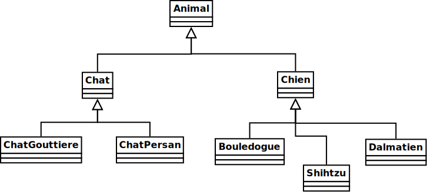

# Atelier 2.4: héritage

À cause d'erreurs dans le corrigé, SVP:
<ul>
<li>écrire exactement <code>"bouledoge"</code> plutôt que <code>"bouledogue"</code>
<li>mettre la méthode <code>typeDeCri</code> publique dans <code>ChatPersan</code> (mais <code>protected</code> ailleurs)
</ul> 

## Préalable

1. J'effectue d'abord le $[link ../tutoriel/](tutoriel 2.4)

## Objectifs

1. En utilisant Eclipse, je crée un nouveau projet Java
    * Le projet doit **obligatoirement** être comme suit:
        * nom du projet: `atelier2_4`
        * chemin du projet: `~/3c6_PRENOM_NOM/atelier2_4`
        * le projet doit utiliser le **JDK 1.8**
        * le projet utilise la librairie $[download ./atelier2_4.jar](atelier2_4.jar)
        * le projet utilise la base de données $[download ./atelier2_4.db](atelier2_4.db)

1. Je crée la classe `MonAtelier2_4` qui hérite de la classe `Atelier2_4`

1. Je crée les classes de la hiérarchie suivante:

    

    
    

1. Je m'assure que `Animal implements Dormeur, Formateur`
    * j'ajoute les deux méthodes obligatoires
    * il s'agit des deux seules métodes publiques de `Animal`

1. Dans `Animal`, je définis cet attribut, **avec la bonne visibilité**
    * `int heuresTotalesDeSommeil `
        * le nombre total d'heures de sommeil depuis le début du programme

1. Dans la bonne classe, j'implante ou redéfini ces méthodes, **avec la bonne visibilité**
    1. `void dormir(int heures)`
        * si les `heures` sont plus grande que `heuresMinimalesDeSommeil`
            * ajouter les `heures` au `heuresTotalesDeSommeil`
        * sinon
            * ajouter les `heuresMinimalesDeSommeil()` au `heuresTotalesDeSommeil`
    1. `String formater()`
        * retourne `"Bonjour, je suis un ANIMAL et mon type de cri est le CRI. Depuis le début du programme, j'ai dormi un total de TOTAL heures. D'ailleurs,
        quand je dors c'est au minimum MINIMUM heures."`
        * où:
            * `ANIMAL` est remplacé par le nom de l'animal
            * `CRI` est remplacé par le cri de l'animal
            * `TOTAL` est remplacé par le total d'heures dormies
            * `MINIMUM` est remplacé par le minimum d'heures de sommeil
    1. `String typeDeCri()`
        * retourne le type de cri de l'animal
    1. `String nomAnimal()`
        * retourne le nom de l'animal
    1. `int heuresMinimalesDeSommeil()`
        * retourne le nombre d'heure minimal de sommeil
            * chien: `2`
            * chat: `3`
            * chat persan: `5`

1. Dans `ChatPersan`, j'implante cette méthode, **avec la bonne visibilité**
    * `String rendreJoli(String mot)`
        * ajoute `"joli "` devant le mot

1. J'ajoute une méthode `main` à la classe `MonAtelier2_4`:

    $[java ./MonAtelier2_4 3 6]()

1. J'implante les méthodes pour remplir le contrat du `Atelier2_4`, p.ex:

    $[java ./MonAtelier2_4 8 11]()

1. J'exécute mon projet et je valide mes classes et mes méthodes

1. J'ajoute les fichiers du projet dans Git 

1. Je fais un `commit` et un `push`

## Remise

1. Je pousse un commit avec **exactement** le commentaire `atelier 2.4`, p.ex:

        $ git commit --allow-empty -m"atelier 2.4"
        $ git push

<!--

1. Je peux faire l'entrevue avant la date limite en créant un billet `entrevue 2.4`
    * Le prof va prioriser les questions, je devrai peut-être faire preuve de patience

1. Sinon, le prof va me contacter avec un rendez-vous avant la date limite

-->
