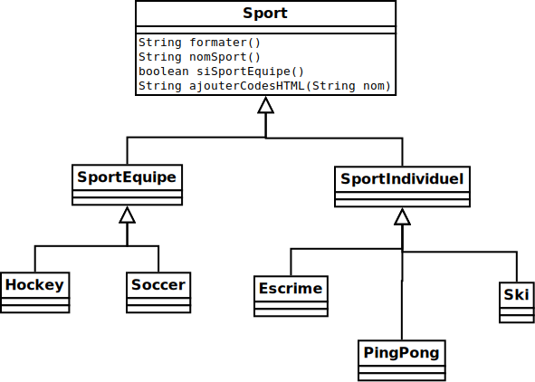

# sdf

Considérer la hiérarchie de classes suivante:

Considérer le programme suivant:

<pre>
static public void main(String[] args){

    Sport sportAuHasard = creerSportAuHasard();

    System.out.println(sportAuHasard.formater());
}
</pre>

Pour chaque méthode, indiquer:

* La visibilité de la méthode
* Si la méthode est redéfinie, dans quelles classes
    * choisir `∅` lorsqu'une réponse ne s'applique pas

**IMPORTANT**: on suppose que la `main` ci-haut est la seule utilisation des classes ci-haut.

1. La méthode `String formater()` est `{1:MCS:~=public~protected~private}` et est redéfinie dans: 
    * `{1:MCS:~SportEquipe~=∅}`
    * `{1:MCS:~SportIndividuel~=∅}`
    * `{1:MCS:~Hockey~=∅}`
    * `{1:MCS:~Soccer~=∅}`
    * `{1:MCS:~Escrime~=∅}`
    * `{1:MCS:~PingPong~=∅}`
    * `{1:MCS:~Ski~=∅}`

1. La méthode `String nomSport()` est `{1:MCS:~public~=protected~private}` et est redéfinie dans: 
    * `{1:MCS:~SportEquipe~=∅}`
    * `{1:MCS:~SportIndividuel~=∅}`
    * `{1:MCS:~=Hockey~∅}`
    * `{1:MCS:~=Soccer~∅}`
    * `{1:MCS:~=Escrime~∅}`
    * `{1:MCS:~=PingPong~∅}`
    * `{1:MCS:~=Ski~∅}`

1. La méthode `boolean siSportEquipe()` est `{1:MCS:~public~=protected~private}` et est redéfinie dans: 
    * `{1:MCS:~=SportEquipe~∅}`
    * `{1:MCS:~=SportIndividuel~∅}`
    * `{1:MCS:~Hockey~=∅}`
    * `{1:MCS:~Soccer~=∅}`
    * `{1:MCS:~Escrime~=∅}`
    * `{1:MCS:~PingPong~=∅}`
    * `{1:MCS:~Ski~=∅}`

1. La méthode `String ajouterCodesHTML()` est `{1:MCS:~public~protected~=private}` et est redéfinie dans: 
    * `{1:MCS:~SportEquipe~=∅}`
    * `{1:MCS:~SportIndividuel~=∅}`
    * `{1:MCS:~Hockey~=∅}`
    * `{1:MCS:~Soccer~=∅}`
    * `{1:MCS:~Escrime~=∅}`
    * `{1:MCS:~PingPong~=∅}`
    * `{1:MCS:~Ski~=∅}`

# Dire quelle type de méthode s'agit-il?
    

