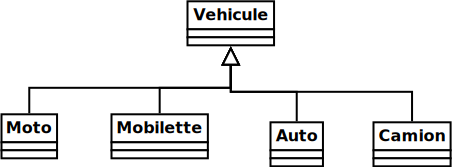
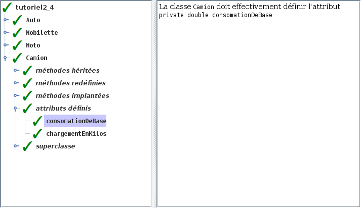

# Tutoriel 2.4: visibilité

## Préalable

1. Je regarde d'abord la présentation des $[link ../validation/](ajouts à l'outil de validation)

## Objectifs

1. En utilisant Eclipse, je crée un nouveau projet Java
    * Le projet doit **obligatoirement** être comme suit:
        * nom du projet: `tutoriel2_4`
        * chemin du projet: `~/3c6_PRENOM_NOM/tutoriel2_4`
        * le projet doit utiliser le **JDK 1.8**
        * le projet utilise la librairie $[download ./tutoriel2_4.jar](tutoriel2_4.jar)
        * le projet utilise la base de données $[download ./tutoriel2_4.db](tutoriel2_4.db)

1. Je crée la classe `MonTutoriel2_4` qui hérite de la classe `Tutoriel2_4`

1. Je crée les classes de la hiérarchie suivante:

    

    
    

1. Je m'assure que `Vehicule implements Rouleur, Formateur`
    * j'ajoute les deux méthodes obligatoires
    * il s'agit des deux seules métodes publiques de `Vehicule`

1. Dans `Vehicule`, je définis cet attribut, **avec la bonne visibilité**
    * `double totalKilometres`
        * le nombre total de kilomètres parcourus depuis le début du programme

1. Dans la bonne classe, j'implante ou redéfini ces méthodes, **avec la bonne visibilité**
    1. `void rouler(double kilometres)`
        * ajoute `kilometres` au `totalKilometres`
    1. `String formater()`
        * retourne `"Ma/Mon VEHICULE a roulé TOTAL kilomètres et consomé LITRES litres d'essence."`
        * où:
            * `Ma/Mon` selon si le nom du véhicule est masculin ou féminin
            * `VEHICULE` est remplacé par le nom du véhicule
            * `TOTAL` est remplacé par le total des kilomètres parcourus
            * `LITRES` est remplacé par les litres d'essence consomés, au total
    1. `double consomationLitresParKilometre() `
        * retourne la consomation théorique en `litres/kilomètres`
            * `Mobilette`: `1.5`
            * `Moto`: `3.5`
            * `Auto`: `8.0`
            * `Fourgonnette`: `12.0`
            * `Camion`: selon un calcul (voir ci-bas)
    1. `String nomVehicule()`
        * retourne le nom du véhicule (en minuscule)
    1. `boolean siNomFeminin()`
        * retourne vrai si le nom du véhicule est féminin
        * retourne faux sinon
    1.  `double litresEssenceConsomes(double kilometres)`
        * calcule la consomation en litres pour un certain kilométrage

1. Dans `Camion`, je définis ces attributs, **avec la bonne visibilité**
    * `double consomationDeBase`
        * la consomation de base de `14`, en litres par kilomètre
    * `double chargementEnKilos`
        * le poids du chargement du camion, en kilos

1. Dans `Camion`, j'implante ces méthodes, **avec la bonne visibilité**
    * `void accepterChargement(double chargementEnKilos)`
        * mémorise le poids d'un nouveau chargement
    * `double calculerConsomationSelonChargement`
        * calcule la consomation d'essence en fonction du poids du chargement
        * selon la formule: `(1 + chargementEnKilos / 1E6) * consomationDeBase`

1. J'ajoute une méthode `main` à la classe `MonTutoriel2_4`:

    $[java ./MonTutoriel2_4 3 6]()

1. J'implante les méthodes pour remplir le contrat du `Tutoriel2_4`, p.ex:

    $[java ./MonTutoriel2_4 8 11]()

1. J'exécute mon projet et je valide mes classes et mes méthodes

1. J'ajoute les fichiers du projet dans Git 

1. Je fais un `commit` et un `push`

## Réalisation

### Étape 01: créer le projet `tutoriel2_4`

1. Je crée un projet nommé `tutoriel2_4`
    * *File* => *New* => *Java Project*
        * Je décoche *Use default location*
            * je navigue à la racine du dépôt Git `~/3c6_PRENOM_NOM`
            * je crée un nouveau répertoire nommé `tutoriel2_4`
            * je sélectionne ce nouveau répertoire
        * Je vérifie que le projet utilise le JDK **1.8**
        * Je clique sur *Finish*

### Étape 02: ajouter la librairie `tutoriel2_4.jar`

1. Je télécharge le fichier $[download ./tutoriel2_4.jar](tutoriel2_4.jar) et je le place **à la racine du projet**

1. Je rafraîchis Eclipse afin de voir le fichier `.jar`
    * *Clique-droit* sur le projet => *Refresh*

1. J'ajoute la librairie au `classpath`:
    * *Clique-droit* sur le projet => *Build path* => *Configure Build Path*
        * Onglet *Librairies* =>
        * Je clique sur *Add JARs...*
            * je sélectionne le projet `tutoriel2_4`
            * je sélectionne le fichier `tutoriel2_4.jar`
        * Je clique sur *Apply and Close*

### Étape 03: ajouter la base de données `tutoriel2_4.db`

1. Je télécharge le fichier $[download ./tutoriel2_4.db](tutoriel2_4.db) et je le place **à la racine du projet**

1. Je rafraîchis Eclipse afin de voir le fichier `.db`
    * *Clique-droit* sur le projet => *Refresh*

### Étape 04: créer la classe `MonTutoriel2_4`

1. Je crée une nouvelle classe nommée `MonTutoriel2_4`
    * *Clique-droit* sur le projet => *New* => *Class*
        *  *Name*: `MonTutoriel2_4`

### Étape 05: hériter de Tutoriel2_4

1. J'ouvre `MonTutoriel2_4` et j'ajoute `extends Tutoriel2_4`

1. J'utilise $[kbd](Ctrl+1) pour ajouter le `import` de `Tutoriel2_4`

1. J'utilise $[kbd](Ctrl+1) pour générer les méthodes manquantes
    * option `add unimplemented methods`

### Étape 06: créer la classe `Vehicule`

1. Je crée une nouvelle classe nommée `Vehicule`
    * *Clique-droit* sur le projet => *New* => *Class*
        *  *Name*: `Vehicule`

1. J'ouvre `Vehicule` et j'ajoute `implements Rouleur, Formateur`

1. J'utilise $[kbd](Ctrl+1) pour ajouter les `import`

1. J'utilise $[kbd](Ctrl+1) pour générer les méthodes manquantes
    * option `add unimplemented methods`

### Étape 07: créer la classe `Moto`

1. Je crée une nouvelle classe nommée `Moto`
    * *Clique-droit* sur le projet => *New* => *Class*
        *  *Name*: `Moto`

1. J'ouvre `Moto` et j'ajoute `extends Vehicule`

    $[java ./Moto 1 1]()

### Étape 08: créer la classe `Mobilette`

1. Je crée une nouvelle classe nommée `Mobilette`
    * *Clique-droit* sur le projet => *New* => *Class*
        *  *Name*: `Mobilette`

1. J'ouvre `Mobilette` et j'ajoute `extends Vehicule`

    $[java ./Mobilette 1 1]()

### Étape 09: créer la classe `Auto`

1. Je crée une nouvelle classe nommée `Auto`
    * *Clique-droit* sur le projet => *New* => *Class*
        *  *Name*: `Auto`

1. J'ouvre `Auto` et j'ajoute `extends Vehicule`

    $[java ./Auto 1 1]()

### Étape 10: créer la classe `Camion`

1. Je crée une nouvelle classe nommée `Camion`
    * *Clique-droit* sur le projet => *New* => *Class*
        *  *Name*: `Camion`

1. J'ouvre `Camion` et j'ajoute `extends Vehicule`

    $[java ./Camion 1 1]()

### Étape 11: ajouter les attributs

1. J'ouvre `Vehicule` et j'ajoute:

    $[java ./Vehicule 3 3]()

1. J'ouvre `Camion` et j'ajoute:

    $[java ./Camion 3 4]()

### Étape 12: ajouter les méthodes *implantées*

1. J'ouvre `Vehicule` et j'ajoute:

    $[java ./Vehicule 29 43]()

    * la dernière méthode est `private`. C'est un détail d'implantation.
    * les autres sont `protected` car les sous-classes vont les redéfinir

1. J'ouvre `Camion` et j'ajoute:

    $[java ./Camion 6 8]()

    * la méthode est `public`. C'est ailleurs dans
    le programme qu'on va indiquer au camion d'accepter un nouveau chargement

    $[java ./Camion 25 27]()

    * la méthode est `private`. C'est un détail d'implantation.

### Étape 12: ajouter les méthodes *redéfinies*

1. J'ouvre `Vehicule` et je complète les méthodes suivantes:

    $[java ./Vehicule 5 27]()

1. J'ouvre `Mobilette` et je redéfinis les méthodes suivantes:

    $[java ./Mobilette 3 16]()

1. J'ouvre `Moto` et je redéfinis les méthodes suivantes:

    $[java ./Moto 3 16]()

1. J'ouvre `Auto` et je redéfinis les méthodes suivantes:

    $[java ./Auto 3 16]()

1. J'ouvre `Camion` et je redéfinis les méthodes suivantes:

    $[java ./Camion 10 23]()

### Étape 16: ajouter la méthode `main`

1. J'ouvre `MonTutoriel2_4` et j'ajoute la méthode `main`

    $[java ./MonTutoriel2_4 1 6]()

### Étape 17: exécuter pour valider

1. J'exécute mon programme

1. Je vérifie que la validation est réussie:

    

    
    

