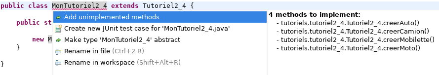
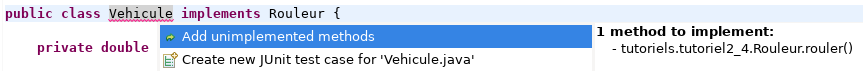
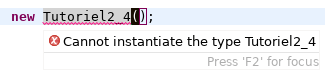

# Théorie 2.5: interface, classe abstraite

<video width="50%" src="01.mp4" type="video/mp4" controls>

* On a vu que `extends` et `implements` peuvent spécifier un contrat:
    * une liste de méthodes qu'il faut implanter

* P.ex. pour `extends`:

    

* P.ex. pour `implements`:

    

* Vous avez déjà *rempli* ces contrats dans les tutoriels et les ateliers

* Maintenant, pour *créer* vos propres contrats, il faut *créer* soit:
    * une classe abstraite dans le cas de `extends`
    * une interface dans le cas de `implements`

## Interface

<video width="50%" src="02.mp4" type="video/mp4" controls>

* L'interface est le contrat le plus simple

* Il s'agit exclusivement de *signatures* de méthodes **publiques**

* L'interface ne contient **jamais** le code d'une méthode

* P.ex. voici deux interfaces:

$[java ./Rouleur]()
$[java ./Formateur]()

* Pour implanter l'interface `Rouleur`, il faut obligatoirement implanter la méthode `rouler`

$[java ./MonRouleur]()

* Pour implanter l'interface `Formateur`, il faut obligatoirement implanter deux méthodes:

$[java ./MonFormateur]()

* NOTE: le contrat concerne uniquement la *signature* et non le code de la méthode

## Classe abstraite

<video width="50%" src="03.mp4" type="video/mp4" controls>

* La classe abstraite est plus flexible

* Elle implante certaines méthodes:

$[java ./Atelier 1 14]()

* Alors que d'autres sont *abstraites* et seulement la signature est spécifiée:

$[java ./Atelier 16 18]()

* Au complet ça donne:

$[java ./Atelier]()

* Quand on hérite de `Atelier` il faut obligatoirement implanter deux méthodes:

$[java ./MonAtelier]()

* NOTE: une méthode abstraite peut être `protected`

## Impossible d'instancier une interface ou une classe abstraite

<video width="50%" src="04.mp4" type="video/mp4" controls>

* On ne peut pas créer un objet à partir d'une interface ou d'une classe abstraite

* P.ex. si on essaie d'instancier une classe abstraite:

    

* P.ex. si on essaie d'instancier une interface:

    

* Pour créer un objet qui remplit le contrat, il faut utiliser `extends` ou `implements`

## Quand utiliser une interface?

<video width="50%" src="05.mp4" type="video/mp4" controls>

* Quand on veut faire la liste des *méthodes publiques* d'une classe

* Typiquement, on utiliser une interface pour chaque thème: `rouler`, `formater`, `manger`

* Une classe peut implanter plusieurs interfaces (c-à-d plusieurs `implements`):

$[java ./MonVehicule]()

## Interface et polymorphisme

<video width="50%" src="06.mp4" type="video/mp4" controls>

* Une interface est aussi une façon d'accéder à un comportement restreint d'un objet

* P.ex:

$[java ./MonMain]()

* En utilisant la variable `Rouleur vehicule` (de type `Rouleur`), on dit:
    * j'ai seulement besoin des méthodes spécifiées dans `Rouleur`
    * les autres méthodes de `Vehicule` ne seront *pas accessibles*

* Notre code est alors plus général et plus lisible:
    * on a rendu explicite le contrat qu'on utilise
    * n'importe quel objet qui implante `Rouleur` est compatible avec notre code
        * (et non uniquement les objets de type `Vehicule`)
    

## Quand utiliser une classe abtraite?

<video width="50%" src="07.mp4" type="video/mp4" controls>

* Quand on veut obliger une sous-classe à redéfinir une méthode

* Typiquement, cette méthode n'a pas de sens dans la classe parent

* P.ex:

$[java ./Vehicule 1 7]()

* Aucune des méthodes ci-haut n'a de sens dans `Vehicule`
    * il faut un type de véhicule en particulier (`Auto`, `Moto`) pour répondre

* Mais on veut utiliser ces méthodes dans `Vehicule`, p.ex:

$[java ./Vehicule 9 11]()

* Alors la classe abstraite *force* les sous-classes à avoir ces méthodes

* C'est le contrat de la classe abstraite

## Pourquoi ne pas toujours utiliser une classe abstraite?

<video width="50%" src="08.mp4" type="video/mp4" controls>

* Parce que ce n'est pas permis en Java ;-)

* Java ne supporte pas l'héritage multiple (c-à-d plusieurs `extends`)

