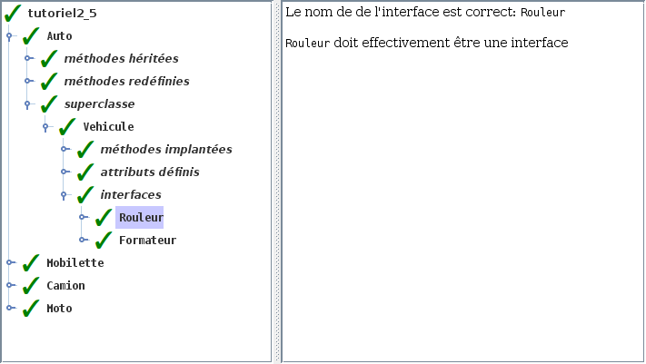

# Tutoriel 2.5: visibilité

## Préalable

1. Je regarde d'abord la présentation des $[link ../validation/](ajouts à l'outil de validation)

## Objectifs

1. En utilisant Eclipse, je crée un nouveau projet Java
    * Le projet doit **obligatoirement** être comme suit:
        * nom du projet: `tutoriel2_5`
        * chemin du projet: `~/3c6_PRENOM_NOM/tutoriel2_5`
        * le projet doit utiliser le **JDK 1.8**
        * le projet utilise la librairie $[download ./tutoriel2_5.jar](tutoriel2_5.jar)
        * le projet utilise la base de données $[download ./tutoriel2_5.db](tutoriel2_5.db)

1. Attention: la librairie `tutoriel2_5.jar` ne *contient plus* les interfaces:
    * `Rouleur`
    * `Formateur`

1. Je crée la classe `MonTutoriel2_5` qui hérite de la classe `Tutoriel2_5`

1. Je crée moi-même les interfaces `Rouleur` et `Formateur`

1. Je recopie les classes suivantes du `tutoriel2_4`:
    * `Vehicule`
    * `Auto`
    * `Camion`
    * `Mobilette`
    * `Moto`

1. J'ajoute les bonnes méthodes dans les interfaces

1. Je transforme la classe `Vehicule` en classe abstraite

1. Je transforme les méthodes "vides" en méthodes abstraites

1. Je corrige les erreurs de compilation

1. J'ajoute une méthode `main` à la classe `MonTutoriel2_5`:

    $[java ./MonTutoriel2_5 3 6]()

1. J'implante les méthodes pour remplir le contrat du `Tutoriel2_5`, p.ex:

    $[java ./MonTutoriel2_5 8 26]()

1. J'exécute mon projet et je valide mes classes et mes interfaces

1. J'ajoute les fichiers du projet dans Git 

1. Je fais un `commit` et un `push`

## Réalisation

### Étape 01: créer le projet `tutoriel2_5`

1. Je crée un projet nommé `tutoriel2_5`
    * *File* => *New* => *Java Project*
        * Je décoche *Use default location*
            * je navigue à la racine du dépôt Git `~/3c6_PRENOM_NOM`
            * je crée un nouveau répertoire nommé `tutoriel2_5`
            * je sélectionne ce nouveau répertoire
        * Je vérifie que le projet utilise le JDK **1.8**
        * Je clique sur *Finish*
        
### Étape 02: ajouter la librairie `tutoriel2_5.jar`

1. Je télécharge le fichier $[download ./tutoriel2_5.jar](tutoriel2_5.jar) et je le place **à la racine du projet**

1. Je rafraîchis Eclipse afin de voir le fichier `.jar`
    * *Clique-droit* sur le projet => *Refresh*

1. J'ajoute la librairie au `classpath`:
    * *Clique-droit* sur le projet => *Build path* => *Configure Build Path*
        * Onglet *Librairies* =>
        * Je clique sur *Add JARs...*
            * je sélectionne le projet `tutoriel2_5`
            * je sélectionne le fichier `tutoriel2_5.jar`
        * Je clique sur *Apply and Close*

### Étape 03: ajouter la base de données `tutoriel2_5.db`

1. Je télécharge le fichier $[download ./tutoriel2_5.db](tutoriel2_5.db) et je le place **à la racine du projet**

1. Je rafraîchis Eclipse afin de voir le fichier `.db`
    * *Clique-droit* sur le projet => *Refresh*

### Étape 04: créer la classe `MonTutoriel2_5`

1. Je crée une nouvelle classe nommée `MonTutoriel2_5`
    * *Clique-droit* sur le projet => *New* => *Class*
        *  *Name*: `MonTutoriel2_5`

### Étape 05: hériter de Tutoriel2_5

1. J'ouvre `MonTutoriel2_5` et j'ajoute `extends Tutoriel2_5`

1. J'utilise $[kbd](Ctrl+1) pour ajouter le `import` de `Tutoriel2_5`

1. J'utilise $[kbd](Ctrl+1) pour générer les méthodes manquantes
    * option `add unimplemented methods`

### Étape 06: créer les interfaces

1. Je crée une nouvelle interface nommée `Rouleur`
    * *Clique-droit* sur le projet => *New* => *Interface*
        *  *Name*: `Rouleur`

1. Je crée une nouvelle interface nommée `Formateur`
    * *Clique-droit* sur le projet => *New* => *Interface*
        *  *Name*: `Formateur`

### Étape 07: copier les classes à partir de `tutoriel2_4`

1. Pour les classes `Auto`, `Camion`, `Mobilette`, `Moto` et `Vehicule`
    * je fais un copier-coller:
        * à partir de la classe située dans le paquet `tutoriel2_4`
        * vers le paquet `tutoriel2_5`

### Étape 08: réparer les `import`

1. Dans `Vehicule`, j'efface les `import` de `Rouleur` et `Formateur`

### Étape 09: remplir les interfaces

1. Dans `Rouleur`, j'ajoute la méthode `rouler`:

    $[java ./Rouleur]()

1. Dans `Formateur`, j'ajoute la méthode `formter`:

    $[java ./Formateur]()

### Étape 10: transformer `Vehicule` en classe abstraite

1. Dans `Vehicule`, j'ajoute le mot clé `abstract`:

    $[java ./Vehicule 1 1]()

### Étape 11: transformer les méthodes "vides" en méthodes abstraites

1. Dans `Vehicule`, je considère les méthodes:
    * `consomationLitresParKilometre`
    * `nomVehicule`
    * `siNomFeminin`

1. Pour chaque, méthode ci-haut:
    * j'ajoute le mot clé `abstract`
    * j'efface le corps de la méthode (le code)

1. Voici le résultat:

    $[java ./Vehicule 3 7]()

### Étape 12: ajouter la méthode `main`

1. J'ouvre `MonTutoriel2_5` et j'ajoute la méthode `main`

    $[java ./MonTutoriel2_5 1 6]()

### Étape 17: exécuter pour valider

1. J'exécute mon programme

1. Je vérifie que la validation est réussie:

    

    
    

