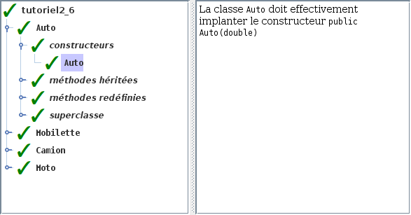

# Tutoriel 2.6: constructeurs et `super`

## Préalable

1. Je regarde d'abord la présentation des $[link ../validation/](ajouts à l'outil de validation)

## Objectifs

1. En utilisant Eclipse, je crée un nouveau projet Java
    * Le projet doit **obligatoirement** être comme suit:
        * nom du projet: `tutoriel2_6`
        * chemin du projet: `~/3c6_PRENOM_NOM/tutoriel2_6`
        * le projet doit utiliser le **JDK 1.8**
        * le projet utilise la librairie $[download ./tutoriel2_6.jar](tutoriel2_6.jar)
        * le projet utilise la base de données $[download ./tutoriel2_6.db](tutoriel2_6.db)

1. Je crée la classe `MonTutoriel2_6` qui hérite de la classe `Tutoriel2_6`

1. Je recopie les classes suivantes du `tutoriel2_5`:
    * `Vehicule`
    * `Auto`
    * `Camion`
    * `Mobilette`
    * `Moto`

1. Je recopie les interfaces suivantes du `tutoriel2_5`:
    * `Rouleur`
    * `Formateur`

1. J'ajoute un constructeur `Vehicule(double totalKilometres)`

1. J'ajoute un constructeur `Camion(double totalKilometres, double chargementEnKilos)`

1. Dans `Auto`, je redéfinis la méthode `formater` pour retourner:
    * la même chose que `Vehicule.formater`, mais en ajoutant `" J'adore mon XXX!"`
        * où: `XXX` sera remplacé par le nom du véhicule (ici `auto`)

1. Dans `Mobilette`, je redéfinis la méthode `rouler` pour:
    * faire d'abord la même chose que `Vehicule.rouler`, puis
        * afficher `"La mobilette devrait déjà être remisée!"`
            * si la date actuelle est plus grande que le 1er octobre 2020
        * sinon afficher `"ATTENTION: il reste JOURS avant de remiser la mobilette"`
            * où `JOURS` est le nombre de jours qu'il reste avant le 1er octobre 2020

1. Je corrige les erreurs de compilation

1. J'ajoute une méthode `main` à la classe `MonTutoriel2_6`:

    $[java ./MonTutoriel2_6 3 6]()

1. J'implante les méthodes pour remplir le contrat du `Tutoriel2_6`, p.ex:

    $[java ./MonTutoriel2_6 8 26]()

    * NOTE: il y a maintenant des paramètres à passer au constructeur

1. J'exécute mon projet et je valide mes classes et mes méthodes

1. J'ajoute les fichiers du projet dans Git 

1. Je fais un `commit` et un `push`

## Réalisation

### Étape 01: créer le projet `tutoriel2_6`

1. Je crée un projet nommé `tutoriel2_6`
    * *File* => *New* => *Java Project*
        * Je décoche *Use default location*
            * je navigue à la racine du dépôt Git `~/3c6_PRENOM_NOM`
            * je crée un nouveau répertoire nommé `tutoriel2_6`
            * je sélectionne ce nouveau répertoire
        * Je vérifie que le projet utilise le JDK **1.8**
        * Je clique sur *Finish*

### Étape 02: ajouter la librairie `tutoriel2_6.jar`

1. Je télécharge le fichier $[download ./tutoriel2_6.jar](tutoriel2_6.jar) et je le place **à la racine du projet**

1. Je rafraîchis Eclipse afin de voir le fichier `.jar`
    * *Clique-droit* sur le projet => *Refresh*

1. J'ajoute la librairie au `classpath`:
    * *Clique-droit* sur le projet => *Build path* => *Configure Build Path*
        * Onglet *Librairies* =>
        * Je clique sur *Add JARs...*
            * je sélectionne le projet `tutoriel2_6`
            * je sélectionne le fichier `tutoriel2_6.jar`
        * Je clique sur *Apply and Close*

### Étape 03: ajouter la base de données `tutoriel2_6.db`

1. Je télécharge le fichier $[download ./tutoriel2_6.db](tutoriel2_6.db) et je le place **à la racine du projet**

1. Je rafraîchis Eclipse afin de voir le fichier `.db`
    * *Clique-droit* sur le projet => *Refresh*

### Étape 04: créer la classe `MonTutoriel2_6`

1. Je crée une nouvelle classe nommée `MonTutoriel2_6`
    * *Clique-droit* sur le projet => *New* => *Class*
        *  *Name*: `MonTutoriel2_6`

### Étape 05: hériter de Tutoriel2_6

1. J'ouvre `MonTutoriel2_6` et j'ajoute `extends Tutoriel2_6`

1. J'utilise $[kbd](Ctrl+1) pour ajouter le `import` de `Tutoriel2_6`

1. J'utilise $[kbd](Ctrl+1) pour générer les méthodes manquantes
    * option `add unimplemented methods`

### Étape 06: copier les classes et les interfaces à partir de `tutoriel2_5`

1. Pour les classes `Auto`, `Camion`, `Mobilette`, `Moto` et `Vehicule`
    * je fais un copier-coller:
        * à partir de la classe située dans le paquet `tutoriel2_5`
        * vers le paquet `tutoriel2_6`

1. Pour les interfaces `Rouleur` et `Formateur`
    * je fais un copier-coller:
        * à partir de l'interface située dans le paquet `tutoriel2_5`
        * vers le paquet `tutoriel2_6`

### Étape 07: ajouter les constructeurs

1. Dans `Vehicule`, j'ajoute le constructeur suivant:

$[java ./Vehicule 5 7]()

1. Dans `Camion`, j'ajoute le constructeur suivant:

$[java ./Camion 7 11]()

1. J'utilise $[kbd](Ctrl+1) pour ajouter les constructeurs de
    * `Auto`, `Moto` et `Mobilette`

### Étape 08: redéfinir `formater` dans `Auto`

1. Dans `Auto`, je redéfinis `formater`:

$[java ./Auto 7 10]()

### Étape 09: redéfinir `rouler` dans `Mobilette`

1. Dans `Mobilette`, j'ajoute un attribut pour la date limite:

$[java ./Mobilette 1 3]()

1. Dans `Mobilette`, je redéfinis la méthode `rouler`

$[java ./Mobilette 10 26]()

### Étape 10: ajouter la méthode `main`

1. J'ouvre `MonTutoriel2_6` et j'ajoute la méthode `main`

    $[java ./MonTutoriel2_6 1 6]()

### Étape 11: exécuter pour valider

1. J'exécute mon programme

1. Je vérifie que la validation est réussie:

    

    
    

