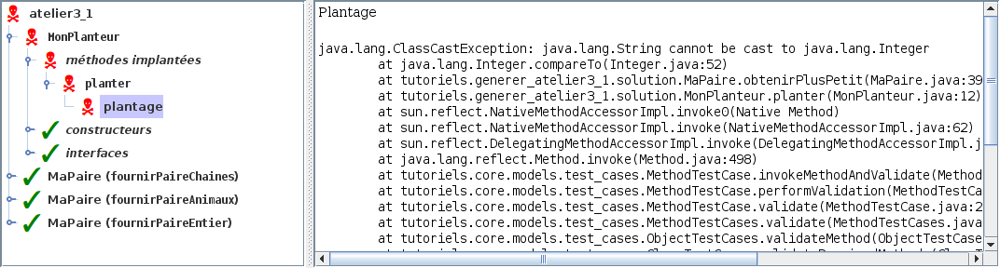

# Atelier 3.1: structures génériques (2)

## Préalable

1. J'effectue d'abord le $[link ../tutoriel/](tutoriel 3.1)

## Objectifs

1. En utilisant Eclipse, je crée un nouveau projet Java
    * Le projet doit **obligatoirement** être comme suit:
        * nom du projet: `atelier3_1`
        * chemin du projet: `~/3c6_PRENOM_NOM/atelier3_1`
        * le projet doit utiliser le **JDK 1.8**
        * le projet utilise la librairie $[download ./atelier3_1.jar](atelier3_1.jar)
        * le projet utilise la base de données $[download ./atelier3_1.db](atelier3_1.db)

1. Je crée la classe `MonAtelier3_1` qui hérite de la classe `Atelier3_1`

1. Je crée l'interface `Paire`: 
    * une paire mémorise deux éléments: un à gauche et un à droite
    * les éléments sont des `Comparable`
    * les méthodes supportées sont:
        * `obtenirGauche`: 
            * retourne l'élément de gauche
        * `obtenirDroite`: 
            * retourne l'élément de droite
        * `modifierGauche`: 
            * reçoit un `element`
            * mémmorise l'`element` à gauche
        * `modifierDroite`: 
            * reçoit un `element`
            * mémmorise l'`element` à droite
        * `obtenirPlusPetit`:
            * retourne le plus petit élément

1. Je crée la classe `MaPaire` qui implante mon interface `Paire`
    * j'ajoute un constructeur qui reçoit deux valeurs initiales

1. Je crée la classe `MonPlanteur` qui implante l'interface `Planteur`
    * la méthode `planter` doit contenir une erreur d'exécution directement liée à la création et l'utilisation d'un objet `MaPaire`

1. Je corrige les erreurs de compilation

1. J'ajoute une méthode `main` à la classe `MonAtelier3_1`:

    $[java ./MonAtelier3_1 3 6]()

1. J'implante les méthodes pour remplir le contrat du `Atelier3_1`, p.ex:

    $[java ./MonAtelier3_1 9 29]()

    * NOTE: il y a des valeurs à passer aux constructeurs

1. J'exécute mon projet et je valide mes classes et mes méthodes
    * je vérifie que `MonPlanteur` fait une erreur d'exécution: ☠ 

    

    
    

1. J'ajoute les fichiers du projet dans Git 

1. Je fais un `commit` et un `push`

## Remise

1. Je pousse un commit avec **exactement** le commentaire `atelier 3.1`, p.ex:

        $ git commit --allow-empty -m"atelier 3.1"
        $ git push

<!--

1. Je peux faire l'entrevue avant la date limite en créant un billet `entrevue 3.1`
    * Le prof va prioriser les questions, je devrai peut-être faire preuve de patience

1. Sinon, le prof va me contacter avec un rendez-vous avant la date limite

-->
