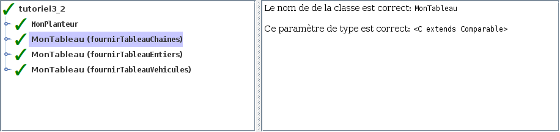

# Tutoriel 3.2: structure générique (2)

## Préalable

1. Je regarde d'abord la présentation des $[link ../validation/](ajouts à l'outil de validation)

## Objectifs

1. En utilisant Eclipse, je crée un nouveau projet Java
    * Le projet doit **obligatoirement** être comme suit:
        * nom du projet: `tutoriel3_2`
        * chemin du projet: `~/3c6_PRENOM_NOM/tutoriel3_2`
        * le projet doit utiliser le **JDK 1.8**
        * le projet utilise la librairie $[download ./tutoriel3_2.jar](tutoriel3_2.jar)
        * le projet utilise la base de données $[download ./tutoriel3_2.db](tutoriel3_2.db)

1. Je crée la classe `MonTutoriel3_2` qui hérite de la classe `Tutoriel3_2`

1. Je recopie l'interface `Tableau` du `tutoriel3_1`:

1. Je recopie les classes suivantes du `tutoriel3_1`:
    * `MonTableau`
    * `MonPlanteur`

1. J'ajoute tous les paramètres de type `C` dans:
    * `Tableau`
    * `MonTableau`

1. Je modifie `MonPlanteur` pour utiliser le nouveau `Tableau`
    * je vérifie qu'il y a maintenant une erreur de compliation
    * je commente le code générant cette erreur

1. Je corrige les autres erreurs de compilation

1. J'ajoute une méthode `main` à la classe `MonTutoriel3_2`:

    $[java ./MonTutoriel3_2 3 6]()

1. J'implante les méthodes pour remplir le contrat du `Tutoriel3_2`, p.ex:

    $[java ./MonTutoriel3_2 8 26]()

    * NOTE: il y a maintenant des paramètres à passer au constructeur

1. J'exécute mon projet et je valide mes classes et mes méthodes

1. J'ajoute les fichiers du projet dans Git 

1. Je fais un `commit` et un `push`

## Réalisation

### Étape 01: créer le projet `tutoriel3_2`

1. Je crée un projet nommé `tutoriel3_2`
    * *File* => *New* => *Java Project*
        * Je décoche *Use default location*
            * je navigue à la racine du dépôt Git `~/3c6_PRENOM_NOM`
            * je crée un nouveau répertoire nommé `tutoriel3_2`
            * je sélectionne ce nouveau répertoire
        * Je vérifie que le projet utilise le JDK **1.8**
        * Je clique sur *Finish*

### Étape 02: ajouter la librairie `tutoriel3_2.jar`

1. Je télécharge le fichier $[download ./tutoriel3_2.jar](tutoriel3_2.jar) et je le place **à la racine du projet**

1. Je rafraîchis Eclipse afin de voir le fichier `.jar`
    * *Clique-droit* sur le projet => *Refresh*

1. J'ajoute la librairie au `classpath`:
    * *Clique-droit* sur le projet => *Build path* => *Configure Build Path*
        * Onglet *Librairies* =>
        * Je clique sur *Add JARs...*
            * je sélectionne le projet `tutoriel3_2`
            * je sélectionne le fichier `tutoriel3_2.jar`
        * Je clique sur *Apply and Close*

### Étape 03: ajouter la base de données `tutoriel3_2.db`

1. Je télécharge le fichier $[download ./tutoriel3_2.db](tutoriel3_2.db) et je le place **à la racine du projet**

1. Je rafraîchis Eclipse afin de voir le fichier `.db`
    * *Clique-droit* sur le projet => *Refresh*

### Étape 04: créer la classe `MonTutoriel3_2`

1. Je crée une nouvelle classe nommée `MonTutoriel3_2`
    * *Clique-droit* sur le projet => *New* => *Class*
        *  *Name*: `MonTutoriel3_2`

### Étape 05: hériter de Tutoriel3_2

1. J'ouvre `MonTutoriel3_2` et j'ajoute `extends Tutoriel3_2`

1. J'utilise $[kbd](Ctrl+1) pour ajouter le `import` de `Tutoriel3_2`

1. J'utilise $[kbd](Ctrl+1) pour générer les méthodes manquantes
    * option `add unimplemented methods`

### Étape 06: copier les classes et les interfaces à partir de `tutoriel3_1`

1. Pour l'interface `Tableau`
    * je fais un copier-coller:
        * à partir de l'interface située dans le paquet `tutoriel3_1`
        * vers le paquet `tutoriel3_2`

1. Pour les classes `MonTableau` et  `MonPlanteur`
    * je fais un copier-coller:
        * à partir de la classe située dans le paquet `tutoriel3_1`
        * vers le paquet `tutoriel3_2`

### Étape 07: modifier `Tableau` en ajoutant le paramètre de type

1. J'ouvre `Tableau` et je modifie l'interface

    $[java ./Tableau]()

### Étape 08: modifier `MonTableau` en ajoutant le paramètre de type

1. J'ouvre `MonTableau` et je modifie la classe:

    $[java ./MonTableau]()

### Étape 09: modifier `MonPlanteur` en ajoutant le paramètre de type

1. J'ouvre `MonPlanteur` et je modifie la classe:

    $[java ./MonPlanteur]()

1. Je vérifie l'erreur de compilation et ensuite je commente l'erreur:

    $[java ./MonPlanteur2]()

### Étape 10: remplir le contrat `Tutoriel3_2`

1. J'implante les méthodes pour remplir le contrat du `Tutoriel3_2`, p.ex:

    $[java ./MonTutoriel3_2 8 26]()

    * NOTE: il y a des valeurs à passer aux constructeurs

### Étape 10: ajouter la méthode `main`

1. J'ouvre `MonTutoriel3_2` et j'ajoute la méthode `main`

    $[java ./MonTutoriel3_2 1 6]()

### Étape 11: exécuter pour valider

1. J'exécute mon programme

1. Je vérifie que la validation est réussie:

    

    
    

