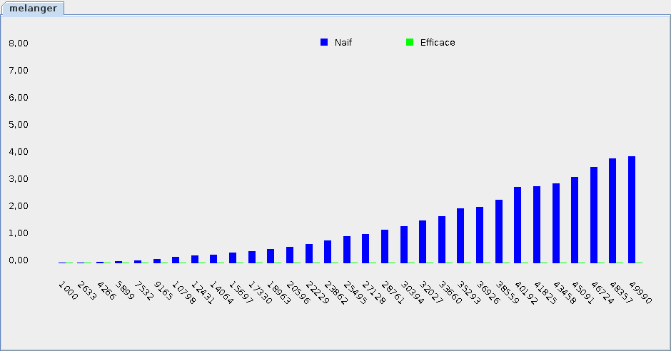

# Examen3

<strong>IMPORTANT</strong>: l'outil de validation est partiel pour l'examen. Tout vert <code>!=</code> 100%

<ul>
<li>CONSEIL: ne <strong>pas</strong> perdre de temps à avoir tout vert
<ul>
<li>S'assurer plutôt que votre code est correct <i>selon vous</i>
</ul>
<li>RAPPEL: on peut avoir <code>< ></code> pour autre chose que <code>&lt; C &gt;</code>
</ul>

## 10pts) Créer le projet

1. En utilisant Eclipse, je crée un nouveau projet Java
    * Le projet doit **obligatoirement** être comme suit:
        * nom du projet: `examen3`
        * chemin du projet: `~/3c6_PRENOM_NOM/examen3`
        * le projet doit utiliser le **JDK 1.8**
        * le projet utilise la librairie $[download ./examen3_gr2.jar](examen3_gr2.jar)
        * le projet utilise la base de données $[download ./examen3Gr2.db](examen3Gr2.db)

1. Je change l'encodage à **UTF-8**:
    * Clique-droit sur le projet => Properties
    * Je clique sur Resource
    * Je sélectionne *Text File Encoding* => *Other* => *UTF-8*
    * J'applique avec **Apply and Close**

1. La librairie `examen3_gr2.jar` contient:
    * la classe `Examen3Gr2`
    * l'interface `Tableau`
    * la classe `Liste`
    * l'interface `Melangeur`

1. Je crée la classe `MonExamen3` qui hérite de la classe `Examen3Gr2`

1. J'implante les méthodes pour remplir le contrat de `Examen3Gr2`

## 30pts) Créer la classe `MonTableau` qui implante l'interface `Tableau`

1. L'interface `Tableau` est comme suit:

    $[java ./Tableau]()

1. Je crée la classe `MonTableau` qui implante l'interface `Tableau`

1. J'utilise un paramètre de type pour indiquer que `MonTableau` mémorise des valeurs `Comparable`

1. La méthode `initialiserTableau` doit mémoriser les `valeurs` dans un attribut

1. La méthode `valeurMaximale` doit retourner la plus grande valeur du tableau

## 30pts) Implanter un `Sommet` et un `Graphe`

### Implanter la classe `Sommet`

1. Je crée une classe `Sommet` qui implante l'interface `Comparable`

1. J'ajoute un constructeur qui reçoit la valeur `int hauteur`

1. Le constructeur mémorise cette `hauteur` dans un attribut

1. J'implante la méthode `compareTo`, en basant la comparaison sur la `hauteur`

### Créer l'interface `Graphe`

1. Un `Graphe` mémorise des valeurs `Comparable`

1. Un `Graphe` contient la méthode `insererSommet`
    * qui reçoit un sommet à insérer dans le graphe (et ne retourne rien)

1. Un `Graphe` contient la méthode `sommetLePlusHaut`
    * qui retourne le sommet le plus haut du graphe

1. Un `Graphe` contient la méthode `sommetLePlusBas`
    * qui retourne le sommet le plus bas du graphe

### Créer la classe `MonGraphe` qui implante l'interface `Graphe`

1. J'utilise un paramètre de type pour indiquer que `MonGraphe` mémorise des valeurs de type `Sommet`

1. J'ajoute les méthodes pour satisfaire le contrat de l'interface `Graphe`
    * NOTE: je n'ai **pas** à écrire le code des méthodes, je peux les laisser vides.

## 20pts) Implanter un `MelangeurNaif` 

1. Une `Liste` contient les méthodes suivantes:

    $[java ./Liste]()

1. Je crée la classe `MelangeurNaif` qui implante l'interface `Melangeur`:

    $[java ./Melangeur]()

1. La méthode `melanger` doit 
    * accepter en entrée une liste
    * retourner une nouvelle liste, qui doit contenir exactement les mêmes éléments que la liste reçue en entrée, mais dans le désordre (c'est-à-dire dans un ordre choisi au hasard)
    * NOTE: voici du code utile pour gérer le hasard en Java

        $[java ./Hasard]()

## 10pts) Implanter un `MelangeurEfficace`

1. Je crée la classe `MelangeurEfficace`, qui implante aussi l'interface `Melangeur`

1. En me basant sur l'`atelier3_4`, j'implante une version efficace de la méthode `melanger` qui se base sur le principe de diviser pour régner.
    * NOTE: seule la méthode `melanger` doit être `public`

1. La performance devrait être comme suit:

    

## Finaliser

1. J'ajoute une méthode `main` à la classe `MonExamen3`:

    $[java ./MonExamen3Gr2 3 6]()

1. Je m'assure de fournir les objets:

    $[java ./MonExamen3Gr2 8 42]()

1. J'exécute mon projet et je m'assure qu'il n'y pas de plantage

1. J'ajoute les fichiers du projet dans Git 

1. Je fais un `commit` et un `push`

## Remise

1. Je pousse un commit avec **exactement** le commentaire `examen3`, p.ex:

        $ git add .
        $ git commit -a --allow-empty -m"examen3"
        $ git push

1. Comme redondance, je fais un `.zip` de mon projet et je le remets sur Moodle

<!--

1. Je peux faire l'entrevue avant la date limite en créant un billet `entrevue 2.2`
    * Le prof va prioriser les questions, je devrai peut-être faire preuve de patience

1. Sinon, le prof va me contacter avec un rendez-vous avant la date limite

-->
