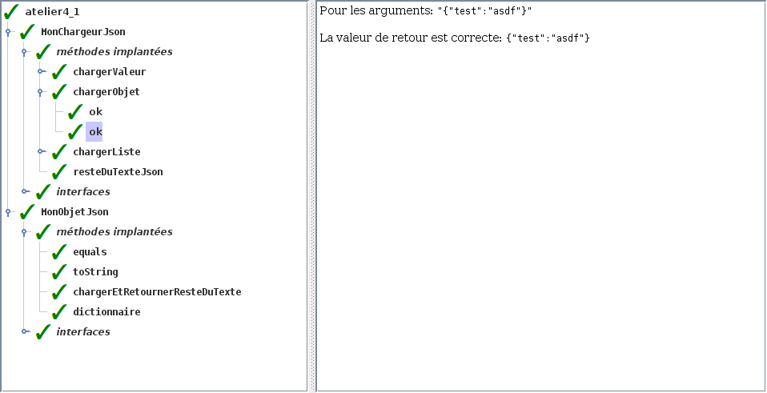

# Atelier 4.1: structures JSON (1)

En cas d'erreur <code>java.lang.NoClassDefFoundError</code>, retirer ces imports de vos fichiers:
<ul>
<li><code>import tutoriels.json.MonChargeurJson</code>
<li><code>import tutoriels.json.MonObjetJson</code>
<li><code>import tutoriels.json.MaListeJson</code>
</ul>

## Préalable

1. J'effectue d'abord le $[link ../tutoriel/](tutoriel 4.1)

## Objectifs

1. En utilisant Eclipse, je crée un nouveau projet Java
    * Le projet doit **obligatoirement** être comme suit:
        * nom du projet: `atelier4_1`
        * chemin du projet: `~/3c6_PRENOM_NOM/atelier4_1`
        * le projet doit utiliser le **JDK 1.8**
        * le projet utilise la librairie $[download ./atelier4_1.jar](atelier4_1.jar)
        * le projet utilise la base de données $[download ./atelier4_1.db](atelier4_1.db)

1. La libraire `tutoriel4_2.jar` contient `MonDictionnaire` qui implante l'interface `Dictionnaire`

    $[java ./Dictionnaire]()

    * pour créer un nouveau dictionnaire: `new MonDictionnaire<>(ValeurJson.class)`

1. Je crée la classe `MonAtelier4_1` qui hérite de la classe `Atelier4_1`

1. Je crée la hiérarchie de classe suivante:

    

        
    

    1. Je recopie les classes suivantes du `tutoriel4_1`:
        * `MonNullJson`
        * `MonBooleenJson`
        * `MonNombreJson`
        * `MaChaineJson`
        * `MaListeJson`

    1. Je crée la classe `MonObjetJson` qui hérite de `ObjetJson`

1. Je crée la classe `MonChargeurJson` qui implante l'interface `ChargeurJson`

    $[java ./ChargeurJson]()

    * je recopie chaque méthode à partir du `tutoriel4_1`
    * je code la nouvelle méthode `chargerObjet`

1. Je code les méthodes servant à charger du texte au format JSON.
    * pour `MonObjetJson`, je peux m'inspirer de `MaListeJson` du $[link ../tutoriel/](tutoriel 4.1)
    * pour simplifier, je peux ignorer le cas `{}` (objet vide)

1. Je corrige les erreurs de compilation

1. J'ajoute une méthode `main` à la classe `MonAtelier4_1`:

    $[java ./MonAtelier4_1 3 6]()

1. J'implante les méthodes pour remplir le contrat du `Atelier4_1`, p.ex:

    $[java ./MonAtelier4_1 8 26]()

1. J'exécute mon projet et je valide mon code:

    

        
    

1. J'ajoute les fichiers du projet dans Git 

1. Je fais un `commit` et un `push`

## Remise

1. Je pousse un commit avec **exactement** le commentaire `atelier 4.1`, p.ex:

        $ git commit --allow-empty -m"atelier 4.1"
        $ git push

<!--

1. Je peux faire l'entrevue avant la date limite en créant un billet `entrevue 4.1`
    * Le prof va prioriser les questions, je devrai peut-être faire preuve de patience

1. Sinon, le prof va me contacter avec un rendez-vous avant la date limite

-->
