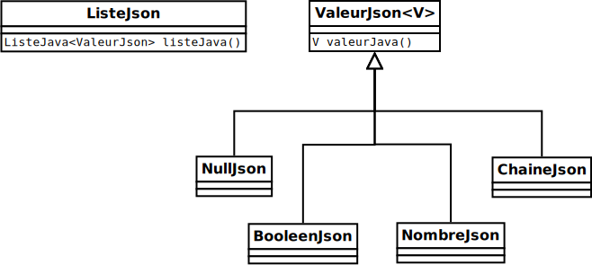
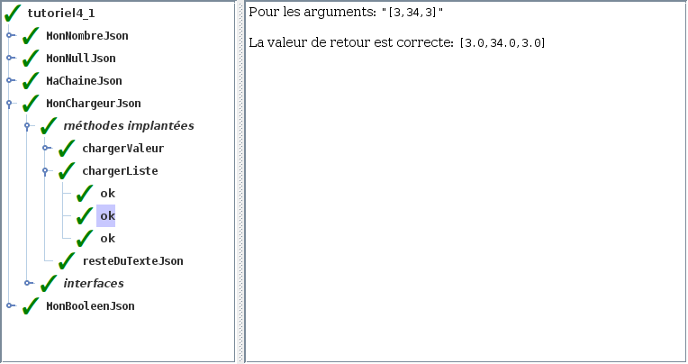

# Tutoriel 4.1: structures JSON (1)

## Objectifs

1. En utilisant Eclipse, je crée un nouveau projet Java
    * Le projet doit **obligatoirement** être comme suit:
        * nom du projet: `tutoriel4_1`
        * chemin du projet: `~/3c6_PRENOM_NOM/tutoriel4_1`
        * le projet doit utiliser le **JDK 1.8**
        * le projet utilise la librairie $[download ./tutoriel4_1.jar](tutoriel4_1.jar)
        * le projet utilise la base de données $[download ./tutoriel4_1.db](tutoriel4_1.db)

1. La libraire `tutoriel4_1.jar` contient `MaListeJava` qui implante l'interface `ListeJava`

    $[java ./ListeJava]()

    * pour créer une nouvelle liste: `new MaListeJava<>(ValeurJson.class)`

1. Je crée la classe `MonTutoriel4_1` qui hérite de la classe `Tutoriel4_1`

1. Je crée la hiérarchie de classe suivante:

    

        
    

    1. Je crée les valeurs JSON suivantes:

        * `MonNullJson` qui hérite de `ValeurJson` (avec le bon paramètre de type)
        * `MonBooleenJson` qui hérite de `ValeurJson` (avec le bon paramètre de type)
        * `MonNombreJson` qui hérite de `ValeurJson` (avec le bon paramètre de type)
        * `MaChaineJson` qui hérite de `ValeurJson` (avec le bon paramètre de type)

    1. Je crée la classe `MaListeJson` qui hérite de `ListeJson`

1. Je crée la classe `MonChargeurJson` qui implante l'interface `ChargeurJson`

    $[java ./ChargeurJson]()

    * la méthode `resteDuTexteJson()` retourne le texte restant après un chargement

1. Je code les méthodes servant à charger du texte au format JSON.

1. Je corrige les erreurs de compilation

1. J'ajoute une méthode `main` à la classe `MonTutoriel4_1`:

    $[java ./MonTutoriel4_1 3 6]()

1. J'implante les méthodes pour remplir le contrat du `Tutoriel4_1`, p.ex:

    $[java ./MonTutoriel4_1 8 31]()

1. J'exécute mon projet et je valide mon code:

    

        
    

1. J'ajoute les fichiers du projet dans Git 

1. Je fais un `commit` et un `push`

## Réalisation

### Étape 01: créer le projet `tutoriel4_1`

1. Je crée un projet nommé `tutoriel4_1`
    * *File* => *New* => *Java Project*
        * Je décoche *Use default location*
            * je navigue à la racine du dépôt Git `~/3c6_PRENOM_NOM`
            * je crée un nouveau répertoire nommé `tutoriel4_1`
            * je sélectionne ce nouveau répertoire
        * Je vérifie que le projet utilise le JDK **1.8**
        * Je clique sur *Finish*

### Étape 02: ajouter la librairie `tutoriel4_1.jar`

1. Je télécharge le fichier $[download ./tutoriel4_1.jar](tutoriel4_1.jar) et je le place **à la racine du projet**

1. Je rafraîchis Eclipse afin de voir le fichier `.jar`
    * *Clique-droit* sur le projet => *Refresh*

1. J'ajoute la librairie au `classpath`:
    * *Clique-droit* sur le projet => *Build path* => *Configure Build Path*
        * Onglet *Librairies* =>
        * Je clique sur *Add JARs...*
            * je sélectionne le projet `tutoriel4_1`
            * je sélectionne le fichier `tutoriel4_1.jar`
        * Je clique sur *Apply and Close*

### Étape 03: ajouter la base de données `tutoriel4_1.db`

1. Je télécharge le fichier $[download ./tutoriel4_1.db](tutoriel4_1.db) et je le place **à la racine du projet**

1. Je rafraîchis Eclipse afin de voir le fichier `.db`
    * *Clique-droit* sur le projet => *Refresh*

### Étape 04: créer la classe `MonTutoriel4_1`

1. Je crée une nouvelle classe nommée `MonTutoriel4_1`
    * *Clique-droit* sur le projet => *New* => *Class*
        *  *Name*: `MonTutoriel4_1`

### Étape 05: hériter de Tutoriel4_1

1. J'ouvre `MonTutoriel4_1` et j'ajoute `extends Tutoriel4_1`

1. J'utilise $[kbd](Ctrl+1) pour ajouter le `import` de `Tutoriel4_1`

1. J'utilise $[kbd](Ctrl+1) pour générer les méthodes manquantes
    * option `add unimplemented methods`

### Étape 06: créer la classe `MonNullJson`

1. Je crée une nouvelle classe nommée `MonNullJson`
    * *Clique-droit* sur le projet => *New* => *Class*
        *  *Name*: `MonNullJson`

1. J'ouvre `MonNullJson` et j'ajoute `extends ValeurJson<Void>`

1. J'utilise $[kbd](Ctrl+1) pour générer les méthodes manquantes
    * option `add unimplemented methods`

1. Je code la classe:

    $[java ./MonNullJson]()

### Étape 07: créer la classe `MonBooleenJson`

1. Je crée une nouvelle classe nommée `MonBooleenJson`
    * *Clique-droit* sur le projet => *New* => *Class*
        *  *Name*: `MonBooleenJson`

1. J'ouvre `MonBooleenJson` et j'ajoute `extends ValeurJson<Boolean>`

1. J'utilise $[kbd](Ctrl+1) pour générer les méthodes manquantes
    * option `add unimplemented methods`

1. Je code la classe:

    $[java ./MonBooleenJson]()

### Étape 08: créer la classe `MonNombreJson`

1. Je crée une nouvelle classe nommée `MonNombreJson`
    * *Clique-droit* sur le projet => *New* => *Class*
        *  *Name*: `MonNombreJson`

1. J'ouvre `MonNombreJson` et j'ajoute `extends ValeurJson<Double>`

1. J'utilise $[kbd](Ctrl+1) pour générer les méthodes manquantes
    * option `add unimplemented methods`

1. Je code la classe:

    $[java ./MonNombreJson]()

### Étape 09: créer la classe `MaChaineJson`

1. Je crée une nouvelle classe nommée `MaChaineJson`
    * *Clique-droit* sur le projet => *New* => *Class*
        *  *Name*: `MaChaineJson`

1. J'ouvre `MaChaineJson` et j'ajoute `extends ValeurJson<String>`

1. J'utilise $[kbd](Ctrl+1) pour générer les méthodes manquantes
    * option `add unimplemented methods`

1. Je code la classe:

    $[java ./MaChaineJson]()

### Étape 10: créer la classe `MaListeJson`

1. Je crée une nouvelle classe `MaListeJson`
    * *Clique-droit* sur le projet => *New* => *Class*
        *  *Name*: `MaListeJson`

1. J'ouvre `MaListeJson` et j'ajoute `extends ListeJson`

1. J'utilise $[kbd](Ctrl+1) pour générer les méthodes manquantes
    * option `add unimplemented methods`

1. Je code la classe:

    $[java ./MaListeJson]()

    * NOTE: pour simplifier, on ignore le cas `[]` (liste vide)

### Étape 11: créer la classe `MonChargeurJson`

1. Je crée une nouvelle classe nommée `MonChargeurJson`
    * *Clique-droit* sur le projet => *New* => *Class*
        *  *Name*: `MonChargeurJson`

1. J'utilise $[kbd](Ctrl+1) pour générer les méthodes manquantes
    * option `add unimplemented methods`

1. Je code la classe:

    $[java ./MonChargeurJson]()

### Étape 12: remplir le contrat `Tutoriel4_1`

1. J'implante les méthodes pour remplir le contrat du `Tutoriel4_1`, p.ex:

    $[java ./MonTutoriel4_1 8 31]()

### Étape 13: ajouter la méthode `main`

1. J'ouvre `MonTutoriel4_1` et j'ajoute la méthode `main`

    $[java ./MonTutoriel4_1 1 6]()

### Étape 14: exécuter pour valider

1. J'exécute mon projet et je valide mon code:

    

        
    

