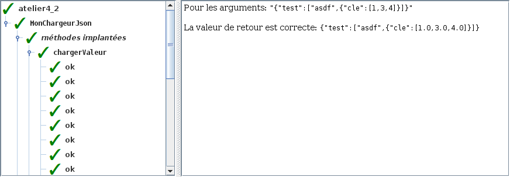

# Atelier 4.2: structures JSON (2)

En cas d'erreur <code>java.lang.NoClassDefFoundError</code>, retirer ces imports de vos fichiers:
<ul>
<li><code>import tutoriels.json.MonChargeurJson</code>
<li><code>import tutoriels.json.MonObjetJson</code>
<li><code>import tutoriels.json.MaListeJson</code>
</ul>

Ces imports masquent vos classe et créent un plantage dans l'outil de validation.

## Préalable

1. J'effectue d'abord le $[link ../tutoriel/](tutoriel 4.2)

## Objectifs

1. En utilisant Eclipse, je crée un nouveau projet Java
    * Le projet doit **obligatoirement** être comme suit:
        * nom du projet: `atelier4_2`
        * chemin du projet: `~/3c6_PRENOM_NOM/atelier4_2`
        * le projet doit utiliser le **JDK 1.8**
        * le projet utilise la librairie $[download ./atelier4_2.jar](atelier4_2.jar)
        * le projet utilise la base de données $[download ./atelier4_2.db](atelier4_2.db)

1. La librairie `atelier4_2.jar` contient:
    * `ValeurJson`
    * `Dictionnaire`
    * `ListeJava`

1. Je crée la classe `MonAtelier4_2` qui hérite de la classe `Atelier4_2`

1. Je crée la hiérarchie de classe suivante:

    

        
    

    1. Je recopie les classes suivantes de l'atelier `atelier4_1`:
        * `MonNullJson`
        * `MonBooleenJson`
        * `MonNombreJson`
        * `MaChaineJson`
        * `MaListeJson`
        * `MonObjetJson`

    1. J'adapte le code de `MaListeJson` et `MonObjetJson`
        * je change la signature pour hérité de `ValeurJson`
        * je modifie les méthodes

1. Je crée la classe `MonChargeurJson` qui implante l'interface `ChargeurJson`

    $[java ./ChargeurJson]()

    1. je recopie une partie du code à partir de l'`atelier4_1`
    1. je modifie la méthode `chargerValeur` :
        * j'ajoute `MaListeJson` et `MonObjetJson` comme valeurs possibles

1. Je corrige les erreurs de compilation

1. J'ajoute une méthode `main` à la classe `MonAtelier4_2`:

    $[java ./MonAtelier4_2 3 6]()

1. J'implante les méthodes pour remplir le contrat du `Atelier4_2`, p.ex:

    $[java ./MonAtelier4_2 8 26]()

1. J'exécute mon projet et je valide mon code:

    

        
    

1. J'ajoute les fichiers du projet dans Git 

1. Je fais un `commit` et un `push`

## Remise

1. Je pousse un commit avec **exactement** le commentaire `atelier 4.2`, p.ex:

        $ git commit --allow-empty -m"atelier 4.2"
        $ git push

<!--

1. Je peux faire l'entrevue avant la date limite en créant un billet `entrevue 4.2`
    * Le prof va prioriser les questions, je devrai peut-être faire preuve de patience

1. Sinon, le prof va me contacter avec un rendez-vous avant la date limite

-->
