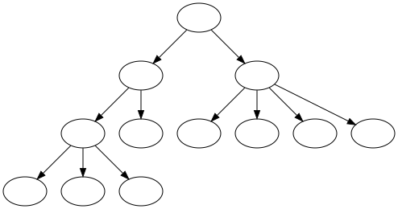

# Théorie 4.2: structures JSON (2)

<video width="50%" src="01.mp4" type="video/mp4" controls>

* La présentation de JSON à la ($[link ../../02/theorie/](théorie 4.1)) était incomplète

* En fait, JSON est un format récursif:
    * on peut avoir `[1,2,[2,4]]` (une liste à l'intérieur d'une liste)
    * on peut avoir `[1,2,[2,[5,423]]]` 
    * on peut avoir `[1,2,[2,[[44,2],423]]]` 
    * etc.

* Les structures récursives sont très populaires en informatique
    
* Avant de continuer avec JSON, on va regarder la notion d'arbre

* L'arbre est une structure récursive assez simple

## Arbre 

<video width="50%" src="02.mp4" type="video/mp4" controls>

* Un arbre est une structure avec une racine et des branches:

    

        
    

    * NOTE: l'arbre est typiquement dessiné avec la racine en haut

* Chaque cercle ci-haut est appelé un noeud

* Chaque noeud peut avoir des enfants (indiqués par les flèches)
 
* Chaque noeud a exactement un parent (sauf la racine qui n'a aucun parent)

## Arbre binaire de recherche

<video width="50%" src="03.mp4" type="video/mp4" controls>

* C'est un type d'arbre très utilisé en informatique:

    

        
    

* Chaque noeud contient un `Comparable`

* Chaque noeud a au plus deux enfants

* L'enfant à gauche est toujours plus petit que le parent (et grand-parent, etc.)
    * p.ex.: `0 < 1` et `4<5`

* L'enfant à droite est toujours plus grand que le parent (et grand-parent, etc.)
    * p.ex.: `5>3` et `2>1`

## Arbre binaire en Java

<video width="50%" src="04.mp4" type="video/mp4" controls>

* Il suffit de représenter un `Noeud`

    

        
    

* La définition de `Noeud` est récursive:
    * Qu'est-ce qu'un `Noeud`?
        * quelque chose qui contient deux noeuds!
            * `enfantGauche()` et `enfantDroit()`

* Par exemple, pour représenter l'arbre ci-haut:

    $[java ./Arbre02]()

## Format JSON (2): récursivité

<video src="05.mp4" width="50%"  type="video/mp4" controls>

* On peut penser à une liste comme à un arbre:
    * p.ex: `[1,2,[2,[[44,2],423]]]` 

    

        
    

    * une liste contenant
        * `1`
        * `2`
        * une liste contenant
            * `2`
            * une liste contenant
                * une liste contenant
                    * `44`
                    * `2`
                * `423`

* On voit qu'une liste peut être insérée à la place d'une valeur

* C'est la même chose pour les objets JSON

* Partout où on s'attend à avoir une valeur, on peut avoir une liste ou un objet

* Par exemple, voici des données JSON valides:
    * `{"cle01":[1,4,true,null,[1,"asdf"],{"test":false}]}`
    * `[4.0,-2,{"un":1,"deux":2,"trois":{"nom":"Trois"}}]`
    * ...

## Représentation Java de JSON (2)

<video src="06.mp4" width="50%"  type="video/mp4" controls>

* La hiérarchie des classes devient:

    

        
    

* `ListeJson` et `ObjetJson` sont des `ValeurJson`

* À noter que `ValeurJson` est paramétrée

* Pour définir la `ListeJson`, on va avoir ce genre de signature:

    $[java ./MaListeJson]()

    * `MaListeJson` est une `ValeurJson` qui contient une liste de valeurs JSON
        * où liste de valeurs JSON est `ListeJava<ValeurJson>`

* C'est encore une fois le principe de structure récursive:
    * Qu'est-ce qu'une valeur JSON? 
        * Une liste contenant des valeurs JSON
        * Un objet contenant des valeurs JSON
        * ...

## Analyse syntaxique de JSON (2)

<video src="07.mp4" width="50%"  type="video/mp4" controls>

* La structure récursive ne rend pas l'analyse syntaxique plus difficile

* Il suffit d'ajouter `MaListeJson` et `MonObjetJson` dans les valeurs possibles:

    $[java ./MonChargeurJson]()

* La signature de `ChargeurJson` devient même plus simple:

    $[java ./ChargeurJson]()

* D'ailleurs, l'analyse syntaxique est presque toujours récursive

* Considérer par exemple ces extraits de code:

    $[java ./ExempleSyntaxe]()

    * `(a + b) * c` est une expression
        * qu'est-ce qu'une expression?
            * c'est `VAR`: une variable
            * ou `EXPR + EXRP`: une expression `+` une expression
            * ou `(EXPR)`: une expression entre parenthèse
            * ou `EXPR * EXPR`: une expression `*` une expression
            * ...
    * `while(EXPR){BLOC}` est une instruction
        * qu'est-ce qu'une instruction?
            * c'est `while(EXPR){BLOC}` 
                où `BLOC` est une bloc d'instructions séparées par des `;`
            * ...
