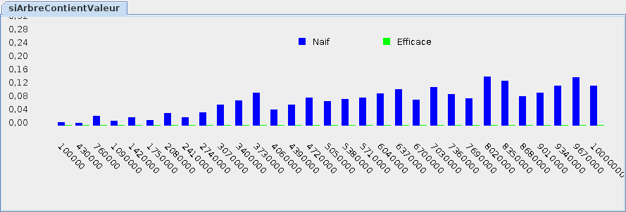

# Tutoriel 4.2: arbre (structure récursive)

## Objectifs

1. En utilisant Eclipse, je crée un nouveau projet Java
    * Le projet doit **obligatoirement** être comme suit:
        * nom du projet: `tutoriel4_2`
        * chemin du projet: `~/3c6_PRENOM_NOM/tutoriel4_2`
        * le projet doit utiliser le **JDK 1.8**
        * le projet utilise la librairie $[download ./tutoriel4_2.jar](tutoriel4_2.jar)
        * le projet utilise la base de données $[download ./tutoriel4_2.db](tutoriel4_2.db)

1. La libraire `tutoriel4_2.jar` contient `MonNoeud` qui implante l'interface `Noeud`
    $[java ./Noeud]()

1. Je crée la classe `MonTutoriel4_2` qui hérite de la classe `Tutoriel4_2`

1. Je crée la classe `ChercheurNaif` qui implante l'interface `Chercheur`
    * j'implante un chercheur naïf, c-à-d qui visite tous les noeuds
    * la méthode `siArbreContientValeur` 
        * reçoit:
            * `racine`: la racine d'un arbre *binaire*
            * `valeur`: une valeur
        * retourne vrai si la valeur est dans l'arbre
    * NOTE: la méthode `siArbreContientValeur` est récursive

1. Je crée la classe `ChercheurEfficace` qui implante l'interface `Chercheur`
    * j'implante un chercheur binaire ("diviser pour régner")
    * la méthode `siArbreContientValeur` 
        * reçoit:
            * `racine`: la racine d'un arbre *binaire*
            * `valeur`: une valeur
        * retourne vrai si la valeur est dans l'arbre
    * NOTE: la méthode `siArbreContientValeur` est récursive

1. Je corrige les erreurs de compilation

1. J'ajoute une méthode `main` à la classe `MonTutoriel4_2`:

    $[java ./MonTutoriel4_2 3 6]()

1. J'implante les méthodes pour remplir le contrat du `Tutoriel4_2`, p.ex:

    $[java ./MonTutoriel4_2 8 26]()

1. J'exécute mon projet, je valide mon code et je teste la performance:

    

        
    

1. J'ajoute les fichiers du projet dans Git 

1. Je fais un `commit` et un `push`

## Réalisation

### Étape 01: créer le projet `tutoriel4_2`

1. Je crée un projet nommé `tutoriel4_2`
    * *File* => *New* => *Java Project*
        * Je décoche *Use default location*
            * je navigue à la racine du dépôt Git `~/3c6_PRENOM_NOM`
            * je crée un nouveau répertoire nommé `tutoriel4_2`
            * je sélectionne ce nouveau répertoire
        * Je vérifie que le projet utilise le JDK **1.8**
        * Je clique sur *Finish*

### Étape 02: ajouter la librairie `tutoriel4_2.jar`

1. Je télécharge le fichier $[download ./tutoriel4_2.jar](tutoriel4_2.jar) et je le place **à la racine du projet**

1. Je rafraîchis Eclipse afin de voir le fichier `.jar`
    * *Clique-droit* sur le projet => *Refresh*

1. J'ajoute la librairie au `classpath`:
    * *Clique-droit* sur le projet => *Build path* => *Configure Build Path*
        * Onglet *Librairies* =>
        * Je clique sur *Add JARs...*
            * je sélectionne le projet `tutoriel4_2`
            * je sélectionne le fichier `tutoriel4_2.jar`
        * Je clique sur *Apply and Close*

### Étape 03: ajouter la base de données `tutoriel4_2.db`

1. Je télécharge le fichier $[download ./tutoriel4_2.db](tutoriel4_2.db) et je le place **à la racine du projet**

1. Je rafraîchis Eclipse afin de voir le fichier `.db`
    * *Clique-droit* sur le projet => *Refresh*

### Étape 04: créer la classe `MonTutoriel4_2`

1. Je crée une nouvelle classe nommée `MonTutoriel4_2`
    * *Clique-droit* sur le projet => *New* => *Class*
        *  *Name*: `MonTutoriel4_2`

### Étape 05: hériter de Tutoriel4_2

1. J'ouvre `MonTutoriel4_2` et j'ajoute `extends Tutoriel4_2`

1. J'utilise $[kbd](Ctrl+1) pour ajouter le `import` de `Tutoriel4_2`

1. J'utilise $[kbd](Ctrl+1) pour générer les méthodes manquantes
    * option `add unimplemented methods`

### Étape 06: créer la classe `ChercheurNaif`

1. Je crée une nouvelle classe nommée `ChercheurNaif`
    * *Clique-droit* sur le projet => *New* => *Class*
        *  *Name*: `ChercheurNaif`

1. J'ouvre `ChercheurNaif` et je complète la signature:

    $[java ./ChercheurNaif 1 1]()

1. J'utilise $[kbd](Ctrl+1) pour générer les méthodes manquantes
    * option `add unimplemented methods`

1. Je code la classe:

    $[java ./ChercheurNaif]()

### Étape 07: créer la classe `ChercheurEfficace`

1. Je crée une nouvelle classe nommée `ChercheurEfficace`
    * *Clique-droit* sur le projet => *New* => *Class*
        *  *Name*: `ChercheurEfficace`

1. J'ouvre `ChercheurEfficace` et je complète la signature:

    $[java ./ChercheurEfficace 1 1]()

1. J'utilise $[kbd](Ctrl+1) pour générer les méthodes manquantes
    * option `add unimplemented methods`

1. Je code la classe:

    $[java ./ChercheurEfficace]()

### Étape 08: remplir le contrat `Tutoriel4_2`

1. J'implante les méthodes pour remplir le contrat du `Tutoriel4_2`, p.ex:

    $[java ./MonTutoriel4_2 8 26]()

### Étape 09: ajouter la méthode `main`

1. J'ouvre `MonTutoriel4_2` et j'ajoute la méthode `main`

    $[java ./MonTutoriel4_2 1 6]()

### Étape 10: exécuter pour valider

1. J'exécute mon projet, je valide mon code et je teste la performance:

    

        
    

