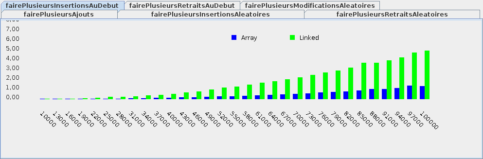

# Tutoriel 4.3: structures Java

## Objectifs

1. En utilisant Eclipse, je crée un nouveau projet Java
    * Le projet doit **obligatoirement** être comme suit:
        * nom du projet: `tutoriel4_3`
        * chemin du projet: `~/3c6_PRENOM_NOM/tutoriel4_3`
        * le projet doit utiliser le **JDK 1.8**
        * le projet utilise la librairie $[download ./tutoriel4_3.jar](tutoriel4_3.jar)
        * le projet utilise la base de données $[download ./tutoriel4_3.db](tutoriel4_3.db)

1. Je crée la classe `MonTutoriel4_3` qui hérite de la classe `Tutoriel4_3`

1. Je crée la classe `TesteurDeListeAbstrait` qui implante l'interface `TesteurDeListe`
    * j'implante les méthodes:
        * `fairePlusieursAjouts`
        * `fairePlusieursInsertionsAuDebut`
        * `fairePlusieursInsertionsAleatoires`
        * `fairePlusieursModificationsAleatoires`
        * `fairePlusieursRetraitsAleatoires`
        * `fairePlusieursRetraitsAuDebut`

1. Je crée la classe `TesteurDeListeArray` qui hérite de `TesteurDeListeAbstrait`
    * j'implante la méthode `nouvelleListe`
        * retourne: un nouvelle liste de type `ArrayList`

1. Je crée la classe `TesteurDeListeLinked` qui hérite de `TesteurDeListeAbstrait`
    * j'implante la méthode `nouvelleListe`
        * retourne: un nouvelle liste de type `LinkedList`

1. Je corrige les erreurs de compilation

1. J'ajoute une méthode `main` à la classe `MonTutoriel4_3`:

    $[java ./MonTutoriel4_3 3 6]()

1. J'implante les méthodes pour remplir le contrat du `Tutoriel4_3`, p.ex:

    $[java ./MonTutoriel4_3 8 26]()

1. J'exécute mon projet, je valide mon code et je teste la performance:

    

        
    

1. J'ajoute les fichiers du projet dans Git 

1. Je fais un `commit` et un `push`

## Réalisation

### Étape 01: créer le projet `tutoriel4_3`

1. Je crée un projet nommé `tutoriel4_3`
    * *File* => *New* => *Java Project*
        * Je décoche *Use default location*
            * je navigue à la racine du dépôt Git `~/3c6_PRENOM_NOM`
            * je crée un nouveau répertoire nommé `tutoriel4_3`
            * je sélectionne ce nouveau répertoire
        * Je vérifie que le projet utilise le JDK **1.8**
        * Je clique sur *Finish*

### Étape 02: ajouter la librairie `tutoriel4_3.jar`

1. Je télécharge le fichier $[download ./tutoriel4_3.jar](tutoriel4_3.jar) et je le place **à la racine du projet**

1. Je rafraîchis Eclipse afin de voir le fichier `.jar`
    * *Clique-droit* sur le projet => *Refresh*

1. J'ajoute la librairie au `classpath`:
    * *Clique-droit* sur le projet => *Build path* => *Configure Build Path*
        * Onglet *Librairies* =>
        * Je clique sur *Add JARs...*
            * je sélectionne le projet `tutoriel4_3`
            * je sélectionne le fichier `tutoriel4_3.jar`
        * Je clique sur *Apply and Close*

### Étape 03: ajouter la base de données `tutoriel4_3.db`

1. Je télécharge le fichier $[download ./tutoriel4_3.db](tutoriel4_3.db) et je le place **à la racine du projet**

1. Je rafraîchis Eclipse afin de voir le fichier `.db`
    * *Clique-droit* sur le projet => *Refresh*

### Étape 04: créer la classe `MonTutoriel4_3`

1. Je crée une nouvelle classe nommée `MonTutoriel4_3`
    * *Clique-droit* sur le projet => *New* => *Class*
        *  *Name*: `MonTutoriel4_3`

### Étape 05: hériter de Tutoriel4_3

1. J'ouvre `MonTutoriel4_3` et j'ajoute `extends Tutoriel4_3`

1. J'utilise $[kbd](Ctrl+1) pour ajouter le `import` de `Tutoriel4_3`

1. J'utilise $[kbd](Ctrl+1) pour générer les méthodes manquantes
    * option `add unimplemented methods`

### Étape 06: créer la classe `TesteurDeListeAbstrait`

1. Je crée une nouvelle classe nommée `TesteurDeListeAbstrait`
    * *Clique-droit* sur le projet => *New* => *Class*
        *  *Name*: `TesteurDeListeAbstrait`

1. J'ouvre `TesteurDeListeAbstrait` et je complète la signature:

    $[java ./TesteurDeListeAbstrait 1 1]()

1. J'utilise $[kbd](Ctrl+1) pour générer les méthodes manquantes
    * option `add unimplemented methods`

1. Je code la classe:

    $[java ./TesteurDeListeAbstrait]()

1. Je retire la méthode `nouvelleListe`

1. J'ajuste le signature pour ajouter le `abstract`

    $[java ./TesteurDeListeAbstrait_signature_finale 1 1]()

### Étape 07: créer la classe `TesteurDeListeArray`

1. Je crée une nouvelle classe nommée `TesteurDeListeArray`
    * *Clique-droit* sur le projet => *New* => *Class*
        *  *Name*: `TesteurDeListeArray`

1. J'ouvre `TesteurDeListeArray` et je complète la signature:

    $[java ./TesteurDeListeArray 1 1]()

1. J'utilise $[kbd](Ctrl+1) pour générer les méthodes manquantes
    * option `add unimplemented methods`

1. Je code la classe:

    $[java ./TesteurDeListeArray]()

### Étape 08: créer la classe `TesteurDeListeLinked`

1. Je crée une nouvelle classe nommée `TesteurDeListeLinked`
    * *Clique-droit* sur le projet => *New* => *Class*
        *  *Name*: `TesteurDeListeLinked`

1. J'ouvre `TesteurDeListeLinked` et je complète la signature:

    $[java ./TesteurDeListeLinked 1 1]()

1. J'utilise $[kbd](Ctrl+1) pour générer les méthodes manquantes
    * option `add unimplemented methods`

1. Je code la classe:

    $[java ./TesteurDeListeLinked]()

### Étape 09: remplir le contrat `Tutoriel4_3`

1. J'implante les méthodes pour remplir le contrat du `Tutoriel4_3`, p.ex:

    $[java ./MonTutoriel4_3 8 26]()

### Étape 10: ajouter la méthode `main`

1. J'ouvre `MonTutoriel4_3` et j'ajoute la méthode `main`

    $[java ./MonTutoriel4_3 1 6]()

### Étape 11: exécuter pour valider

1. J'exécute mon projet, je valide mon code et je teste la performance:

    

        
    

