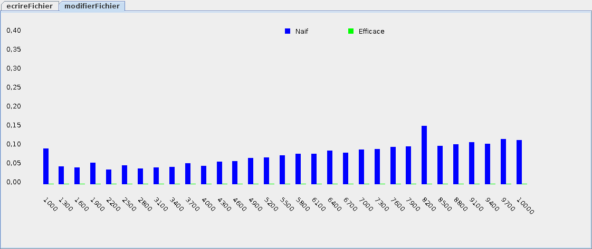

# Atelier 4.4: modifier un fichier (efficace)

## Préalable

1. J'effectue d'abord le $[link ../tutoriel/](tutoriel 4.4)

## Objectifs

1. En utilisant Eclipse, je crée un nouveau projet Java
    * Le projet doit **obligatoirement** être comme suit:
        * nom du projet: `atelier4_4`
        * chemin du projet: `~/3c6_PRENOM_NOM/atelier4_4`
        * le projet doit utiliser le **JDK 1.8**
        * le projet utilise la librairie $[download ./atelier4_4.jar](atelier4_4.jar)
        * le projet utilise la base de données $[download ./atelier4_4.db](atelier4_4.db)

1. Je télécharge le script de validation $[download ./tester_fichiers.sh](tester_fichiers.sh)
    * je place le script à la racine de mon projet

1. Je crée la classe `MonAtelier4_4` qui hérite de la classe `Atelier4_4`

1. À partir du `tutoriel4_4`, je recopie les classes suivantes:
    * `ManipulateurDeFichierAbstrait`
    * `ManipulateurDeFichierNaif`

1. Je crée la classe `ManipulateurDeFichierEfficace` qui hérite de `ManipulateurDeFichierAbstrait`
    * j'implante le méthode `modifierFichier`
        * je trouve comment créer un nouveau `RandomAccessFile`
        * j'utilise `.getBytes()` pour obtenir les octets d'une chaînes
        * j'utilise `System.lineSeparator()` pour obtenir le symbole de fin de ligne
            * NOTE: c'est `\n` en Linux, `\r` en macOS, et `\r\n` en Windows
                * donc 1 octet en Linux/macOS et 2 octets en Windows

1. Je corrige les erreurs de compilation

1. J'ajoute une méthode `main` à la classe `MonAtelier4_4`:

    $[java ./MonAtelier4_4 3 6]()

1. J'implante les méthodes pour remplir le contrat du `Atelier4_4`, p.ex:

    $[java ./MonAtelier4_4 8 26]()

1. J'efface tous les fichiers `.txt` du répertoire de mon projet:

        $ cd ~/3c6_PRENOM_NOM/atelier4_4
        $ rm *.txt

1. J'exécute mon projet, je valide mon code et je teste la performance:

    

        
    

1. J'exécute le script `tester_fichiers.sh` pour valider les fichier `.txt`

        $ cd ~/3c6_PRENOM_NOM/atelier4_4
        $ sh tester_fichiers.sh

            # doit afficher

            [Validation réussie!]

            # et non

            [Validation échouée]
            Il y a 1 lignes différentes
            Voir ou exécuter commandes_diff.sh pour les détails

1. J'ajoute les fichiers du projet dans Git 

1. Je fais un `commit` et un `push`

## Remise

1. Je pousse un commit avec **exactement** le commentaire `atelier 4.4`, p.ex:

        $ git commit --allow-empty -m"atelier 4.4"
        $ git push

<!--

1. Je peux faire l'entrevue avant la date limite en créant un billet `entrevue 4.4`
    * Le prof va prioriser les questions, je devrai peut-être faire preuve de patience

1. Sinon, le prof va me contacter avec un rendez-vous avant la date limite

-->
