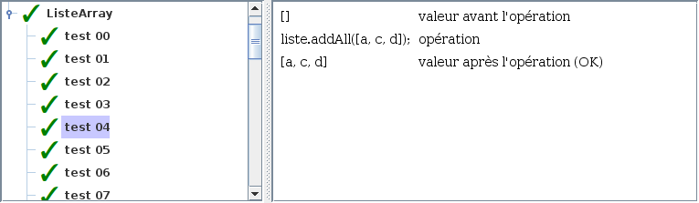
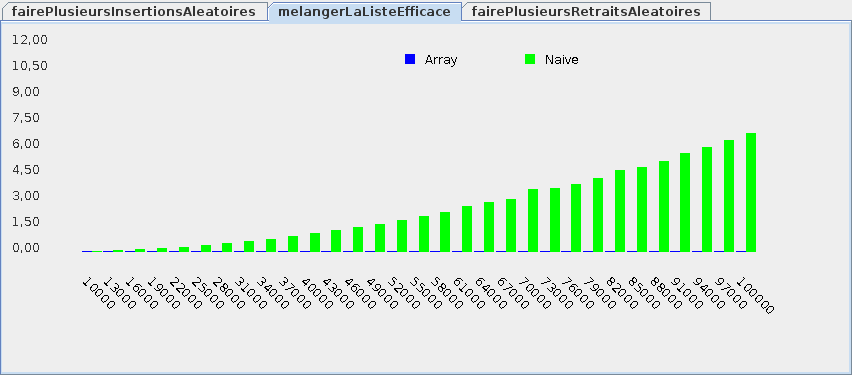

# Atelier 5.1: liste (relativement) efficace

## Préalable

1. J'effectue d'abord le $[link ../tutoriel/](tutoriel 5.1)

## Objectifs

1. En utilisant Eclipse, je crée un nouveau projet Java
    * Le projet doit **obligatoirement** être comme suit:
        * nom du projet: `atelier5_1`
        * chemin du projet: `~/3c6_PRENOM_NOM/atelier5_1`
        * le projet doit utiliser le **JDK 1.8**
        * le projet utilise la librairie $[download ./atelier5_1.jar](atelier5_1.jar)

1. Je recopie la classe `ListeJavaNaive` du $[link ../tutoriel/](tutoriel 5.1)

1. Je crée la classe `ListeJavaArray` qui hérite de la classe `ListeJava`

1. En suivant la théorie, j'implante les méthodes pour remplir le contrat de `ListeJava`
    * il faut un tableau plus grand que la liste
    * il faut aggrandir le tableau au besoin (et recopier les éléments)
    * il faut effectuer l'insertion et le retrait en décalant les éléments vers la gauche ou la droite

1. Je crée les classes `TesteurDeListeAbstrait`, `TesteurDeListeNaive` et `TesteurDeListeArray`
    * voir le $[link ../tutoriel/](tutoriel 5.1)

1. J'implante les méthodes de `TesteurDeListeAbstrait`, `TesteurDeListeNaive` et `TesteurDeListeArray`
    * en particulier, j'implante les méthodes suivants dans `TesteurDeListeAbstrait`:
        * `melangerLaListe`
        * `melangerLaListeEfficace`

1. Je crée la classe `MonAtelier5_1` qui hérite de la classe `Atelier5_1`

1. Je corrige les erreurs de compilation

1. J'ajoute une méthode `main` à la classe `MonAtelier5_1`:

    $[java ./MonAtelier5_1 3 6]()

1. J'implante les méthodes pour remplir le contrat du `Atelier5_1`, p.ex:

    $[java ./MonAtelier5_1 8 26]()

1. J'exécute mon projet, je valide mon code et vérifie la performance:

    

        
    

    

        
    

1. J'ajoute les fichiers du projet dans Git 

1. Je fais un `commit` et un `push`

## Remise

1. Je pousse un commit avec **exactement** le commentaire `atelier 5.1`, p.ex:

        $ git commit --allow-empty -m"atelier 5.1"
        $ git push

<!--

1. Je peux faire l'entrevue avant la date limite en créant un billet `entrevue 5.1`
    * Le prof va prioriser les questions, je devrai peut-être faire preuve de patience

1. Sinon, le prof va me contacter avec un rendez-vous avant la date limite

-->
