

# Quelle est l'opération effectuée

* Indiquer quelle opération est effectuée

<table>
<tr>
<th>avant l'opération</th>
<th>après l'opération</th>
</tr>
<tr>
<td>
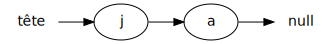
</td>
<td>
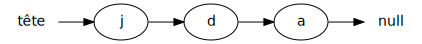
</td>
</tr>
</table>

 
 
<code>insert(1,'d');</code>
 
 

<table>
<tr>
<th>avant l'opération</th>
<th>après l'opération</th>
</tr>
<tr>
<td>
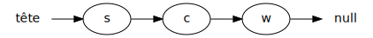
</td>
<td>
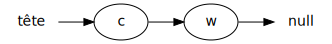
</td>
</tr>
</table>

 
 
<code>remove(0);</code>
 
 

<table>
<tr>
<th>avant l'opération</th>
<th>après l'opération</th>
</tr>
<tr>
<td>
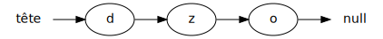
</td>
<td>
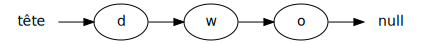
</td>
</tr>
</table>

 
 
<code>set(1,'w');</code>
 
 

<table>
<tr>
<th>avant l'opération</th>
<th>après l'opération</th>
</tr>
<tr>
<td>
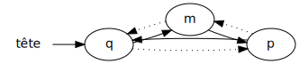
</td>
<td>
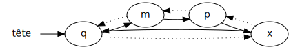
</td>
</tr>
</table>

 
 
<code>add('x');</code>
 
 

Mauvaises réponses

 
 
<code>insert(0,'x');</code>
 
 

 
 
<code>insert(1,'x');</code>
 
 

 
 
<code>insert(1,'w');</code>
 
 

 
 
<code>remove(0);</code>
 
 

 
 
<code>removeValue('c');</code>
 
 

 
 
<code>removeValue('w');</code>
 
 

# Est-ce valide

Pour chaque schéma ci-bas, indiquer s'il s'agit de:

* Une liste chaînée simple
* Une liste chaînée double
* Autre structure

**NOTE**: les flèches sont volontairement toutes pleines `→`

<table>
<tr>
<td>
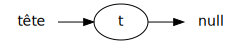
</td>
<td>
Une liste chaînée simple
</td>
</tr>

<tr>
<td>
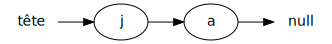
</td>
<td>
Une liste chaînée simple
</td>
</tr>

<tr>
<td>
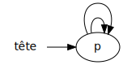
</td>
<td>
Une liste chaînée double
</td>
</tr>

<tr>
<td>
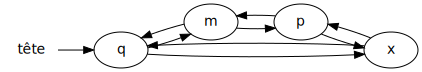
</td>
<td>
Une liste chaînée double
</td>
</tr>

<tr>
<td>
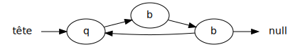
</td>
<td>
Autre structure
</td>
</tr>

<tr>
<td>
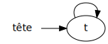
</td>
<td>
Autre structure
</td>
</tr>

<tr>
<td>
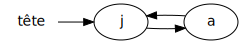
</td>
<td>
Autre structure
</td>
</tr>

<tr>
<td>
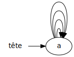
</td>
<td>
Autre structure
</td>
</tr>

<tr>
<td>
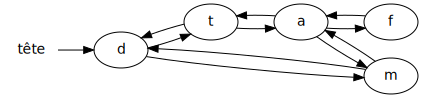
</td>
<td>
Autre structure
</td>
</tr>

</table>

# Décrire en mot quoi faire pour implanter l'opération

* Décrire en mot comment faire les opérations suivantes.

* La description doit correspondre au fonctionnement d'une liste chaînée
    * simple
    * OU double
    * MAIS ÉVITER de mélanger les deux

* NOTES:
    * un *curseur* est une variable qui pointe vers un élément de la chaîne
    * avancer le curseur veut dire pointer vers l'élément suivant
    * reculer le curseur veut dire pointer vers l'élément précédent

### Opération 01

<table>
<tr>
<th>avant l'opération</th>
<th>après l'opération</th>
</tr>
<tr>
<td>

</td>
<td>

</td>
</tr>
</table>

 

* Créer un curseur qui pointe vers {1:MCS:=le premier élément~`a`~∅}
* {1:MCS:=Avancer~Reculer} le curseur {1:MCS:1~2~=0~∅} fois
* {1:MCS:=Créer un nouvel élément `d`~∅}
* Prendre en note que: {1:MCS:=le suivant~le precedent~la tête~la valeur} {1:MCS:=de `d`~du curseur~∅} est maintenant {1:MCS:=le suivant~le precedent~le curseur~`d`~∅} {1:MCS:=du curseur~de `d`~∅}
* Prendre en note que: {1:MCS:=le suivant~le precedent~la tête~la valeur} {1:MCS:=du curseur~de `d`~∅} est maintenant {1:MCS:=`d`~le curseur} {1:MCS:du curseur~de `d`~=∅}

 

### Opération 02

<table>
<tr>
<th>avant l'opération</th>
<th>après l'opération</th>
</tr>
<tr>
<td>

</td>
<td>

</td>
</tr>
</table>

 

* Créer un curseur qui pointe vers {1:MCS:=le premier élément~`w`~∅}
* {1:MCS:=Avancer~Reculer} le curseur {1:MCS:=1~2~0~∅} fois
* {1:MCS:Créer un nouvel élément `c`~=∅}
* Prendre en note que: {1:MCS:le suivant~le precedent~=la tête~la valeur} {1:MCS:de `c`~du curseur~=∅} est maintenant {1:MCS:le suivant~le precedent~=le curseur~`c`~∅} {1:MCS:du curseur~de `c`~=∅}

### Opération 03

<table>
<tr>
<th>avant l'opération</th>
<th>après l'opération</th>
</tr>
<tr>
<td>

</td>
<td>

</td>
</tr>
</table>

 
 

* Créer un curseur qui pointe vers {1:MCS:=le premier élément~`o`~∅}
* {1:MCS:=Avancer~Reculer} le curseur {1:MCS:=1~2~0~∅} fois
* {1:MCS:Créer un nouvel élément `w`~=∅}
* Prendre en note que: {1:MCS:le suivant~le precedent~la tête~=la valeur} {1:MCS:de `w`~=du curseur~∅} est maintenant {1:MCS:le suivant~le precedent~le curseur~=`w`~∅} {1:MCS:du curseur~de `w`~=∅}

### Opération 04

<table>
<tr>
<th>avant l'opération</th>
<th>après l'opération</th>
</tr>
<tr>
<td>

</td>
<td>

</td>
</tr>
</table>

 
 

* Créer un curseur qui pointe vers {1:MCS:=le premier élément~`x`~∅}
* {1:MCS:Avancer~=Reculer} le curseur 1 fois
* {1:MCS:=Créer un nouvel élément `x`~∅}
* Prendre en note que: {1:MCS:=le suivant~le precedent~la tête~la valeur} {1:MCS:=de `x`~du curseur~∅} est maintenant {1:MCS:=le suivant~le precedent~le curseur~`x`~∅} {1:MCS:=du curseur~de `x`~∅}
* Prendre en note que: {1:MCS:le suivant~=le precedent~la tête~la valeur} {1:MCS:=de `x`~du curseur~∅} est maintenant {1:MCS:le suivant~le precedent~=le curseur~`x`~∅} {1:MCS:du curseur~de `x`~=∅}
* Prendre en note que: {1:MCS:=le suivant~le precedent~la tête~la valeur} {1:MCS:de `x`~=du curseur~∅} est maintenant {1:MCS:le suivant~le precedent~le curseur~=`x`~∅} {1:MCS:du curseur~de `x`~=∅}
* Prendre en note que: {1:MCS:le suivant~=le precedent~la tête~la valeur} du suivant {1:MCS:de `x`~=du curseur~∅} est maintenant {1:MCS:le suivant~le precedent~le curseur~=`x`~∅} {1:MCS:du curseur~de `x`~=∅}

<!--

public abstract void    add(E e);                   // ajoute à la fin
public abstract void    addAll(E[] elements);       // insère tout
public abstract void    insert(int position, E e);  // insère une nouvelle valeur à la position i
public abstract void    set(int position, E e);     // modifie la valeur à la position i
public abstract E       get(int position);          // obtenir la valeur à la position i
public abstract void    clear();                    // vide la liste
public abstract int     size();                     // taille de la liste
public abstract boolean isEmpty();                  // si vide
public abstract boolean contains(Object o);         // si la liste contient la valeur o
public abstract int     indexOf(Object o);          // indice de la valeur o
public abstract void    removeValue(Object o);      // indice de la valeur o
public abstract void    remove(int position);       // indice de la valeur o

-->

