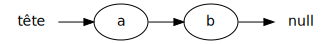
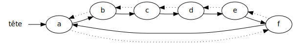
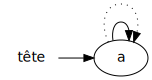
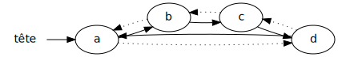
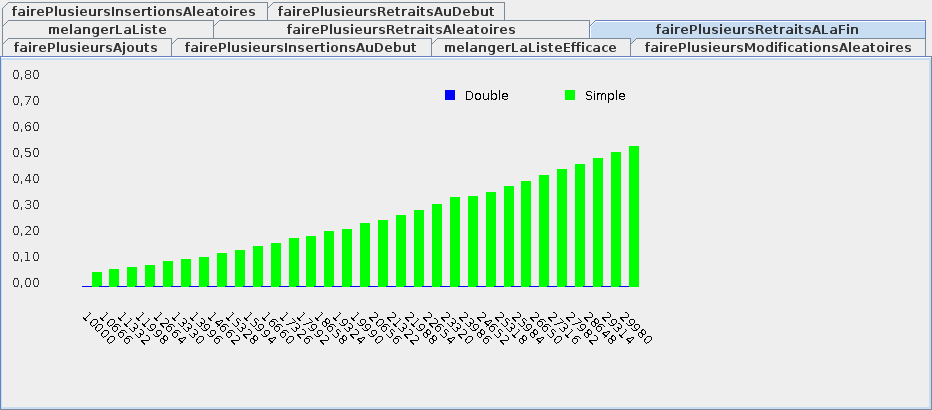
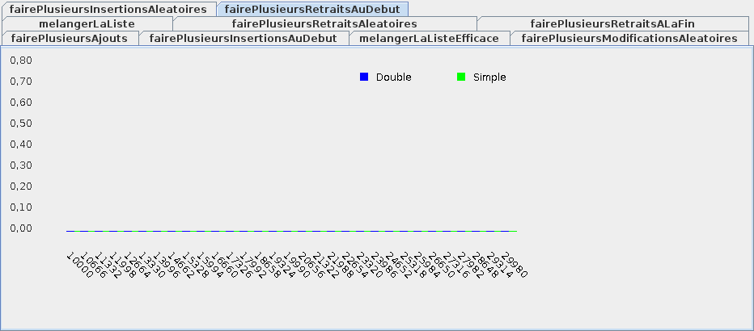
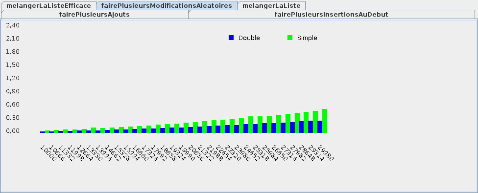

# Théorie 5.2: liste chaînée (simple et double)

<video src="01.mp4" width="50%" type="video/mp4" controls>

* Une liste chaînée utilise des pointeurs (références), p.ex:

    

* Chaque noeud ci-haut est un objet qui contient une valeur

* Pour obtenir le prochain élément, on suit la référence (la flèche)

* Inconvénient:
    * il faut faire une boucle pour obtenir un élément de la liste

* Avantages:
    * l'insertion/retrait au début est efficace
    * on ne consome pas d'espace mémoire en trop

## Exemple: ajouts dans liste chaînée simple

<video src="02.mp4" width="50%" type="video/mp4" controls>

<table>

<tr>
<td>
<code>liste // []</code>
</td>
<td>

</td>
</tr>

<tr>
<td>
<code>liste.add('a') // [a]</code>
</td>
<td>

</td>
</tr>

<tr>
<td>
<code>liste.add('b') // [a,b]</code>
</td>
<td>

</td>
</tr>

<tr>
<td>
<code>liste.add('c') // [a,b,c]</code>
</td>
<td>

</td>
</tr>

</table>

## Liste chaînée simple en Java

<video src="03.mp4" width="50%" type="video/mp4" controls>

* Il faut une classe pour représenter un élément:
    * l'élément contient la valeur et un pointeur vers l'élément suivant

    $[java ./ElementChaineSimple]()

* Et une classe pour la liste:
    * on mémorise la tête et la taille
    
    $[java ./ListeJavaChaineeSimple]()

* Pour modifier un élément, il d'abord le trouver avec une boucle

## Liste chaînée double

<video src="04.mp4" width="50%" type="video/mp4" controls>

* Dans une liste chaînée double, chaque élément pointe: 
    * vers l'élément suivant: `→`
    * vers l'élément précédent: `⇢`

    

* On peut donc accéder à la fin de la liste en reculant de 1 à partir de la tête
    * ci-haut, si on recule de 1 à partir de `a`, on arrive à `f` 

* Inconvénients:
    * plus difficile à implanter qu'une liste chaînée simple
    * il faut quand même faire une boucle pour obtenir un élément de la liste

* Avantages:
    * on peut chercher un élément *vers l'avant* ou *vers l'arrière*
    * l'insertion/retrait au début **et à la fin** est efficace
    * on ne consome pas d'espace mémoire en trop

## Exemple: ajouts dans liste chaînée double

<video src="05.mp4" width="50%" type="video/mp4" controls>

<table>

<tr>
<td>
<code>liste // []</code>
</td>
<td>

</td>
</tr>

<tr>
<td>
<code>liste.add('a') // [a]</code>
</td>
<td>

</td>
</tr>

<tr>
<td>
<code>liste.add('b') // [a,b]</code>
</td>
<td>

</td>
</tr>

<tr>
<td>
<code>liste.add('c') // [a,b,c]</code>
</td>
<td>

</td>
</tr>

<tr>
<td>
<code>liste.add('d') // [a,b,c,d]</code>
</td>
<td>

</td>
</tr>

</table>

## Liste chaînée double en Java

<video src="06.mp4" width="50%" type="video/mp4" controls>

* Notre classe pour l'élément contient cette fois-ci:
    * la valeur
    * un pointeur vers l'élément suivant
    * un pointeur vers l'élément précédent

    $[java ./ElementChaineDouble]()

* La classe pour la liste est similaire:
    
    $[java ./ListeJavaChaineeDouble]()

* Pour modifier un élément, on fait une boucle:
    * soit en cherchant vers l'avant
        * (lorsque la position est proche du début)
    * soit en cherchant vers l'arrière
        * (lorsque la position est proche de la fin)

* Pour insérer, on peut soit:
    * insérer après un élément
    * insérer avant un élément

* P.ex. insérer à la fin de la liste équivaut à:
    * insérer avant la tête!

## Efficacité simple Vs double

<video src="07.mp4" width="50%" type="video/mp4" controls>

* Pour ajouter à la fin:

    

* Pour retirer à la fin:

    

* Pour insérer au début:

    

* Pour retirer au début:

    

* Pour modifier au milieu:

    

