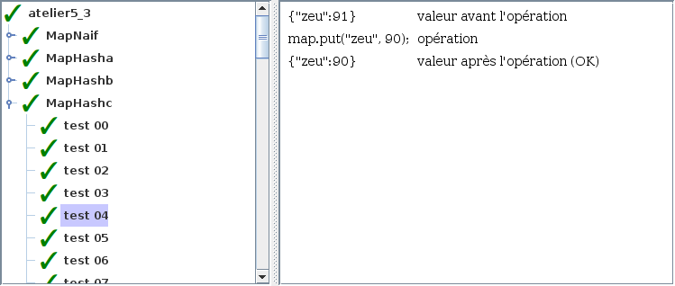

# Atelier 5.3: map par table de hachage

## Préalable

1. J'effectue d'abord le $[link ../tutoriel/](tutoriel 5.3)

## Objectifs

1. En utilisant Eclipse, je crée un nouveau projet Java
    * Le projet doit **obligatoirement** être comme suit:
        * nom du projet: `atelier5_3`
        * chemin du projet: `~/3c6_PRENOM_NOM/atelier5_3`
        * le projet doit utiliser le **JDK 1.8**
        * le projet utilise la librairie $[download ./atelier5_3.jar](atelier5_3.jar)

1. À partir du tutoriel $[link ../../03/tutoriel/](atelier 5.3), je recopie les classes:
    * `JavaMapNaif`
    * `TesteurDeMapAbstrait`
    * `TesteurDeMapNaif`

1. Je crée la classe `ChaineHasha` avec la signature suivante:

    $[java ./ChaineHasha 1 1]()

    * cette fonction de hachage doit être valide, mais le moins efficace possible

1. Je crée la classe `ChaineHashb` avec la signature suivante:

    $[java ./ChaineHashb 1 1]()

    * cette fonction de hachage doit être valide et relativement efficace

1. Je crée la classe `ChaineHashc` avec la signature suivante:

    $[java ./ChaineHashc 1 1]()

    * cette fonction de hachage doit être valide et efficace

1. Je crée la classe `MapJavaHash` qui hérite de la classe `MapJava`

1. En suivant la théorie, j'implante les méthodes pour remplir le contrat de `MapJava`

1. Je crée les classes suivantes:
    * `TesteurDeMapHasha` qui hérite de `TesteurDeMapAbstrait`
    * `TesteurDeMapHashb` qui hérite de `TesteurDeMapAbstrait`
    * `TesteurDeMapHashc` qui hérite de `TesteurDeMapAbstrait`

1. Dans chaque `TesteurDeMap`, j'utilise ce code pour créer un nouveau Map:

    $[java ./TesteurDeMap]()

    * NOTE: ne pas utiliser l'opérateur `<>` (ignorer l'avertissement)

1. Je crée la classe `MonAtelier5_3` qui hérite de la classe `Atelier5_3`

1. Je corrige les erreurs de compilation

1. J'ajoute une méthode `main` à la classe `MonAtelier5_3`:

    $[java ./MonAtelier5_3 3 6]()

1. J'implante les méthodes pour remplir le contrat du `Atelier5_3`, p.ex:

    $[java ./MonAtelier5_3 8 36]()

1. J'exécute mon projet, je valide mon code et vérifie la performance:

    

        
    

    

        
    

1. J'ajoute les fichiers du projet dans Git 

1. Je fais un `commit` et un `push`

## Remise

1. Je pousse un commit avec **exactement** le commentaire `atelier 5.3`, p.ex:

        $ git commit --allow-empty -m"atelier 5.3"
        $ git push

<!--

1. Je peux faire l'entrevue avant la date limite en créant un billet `entrevue 5.3`
    * Le prof va prioriser les questions, je devrai peut-être faire preuve de patience

1. Sinon, le prof va me contacter avec un rendez-vous avant la date limite

-->
