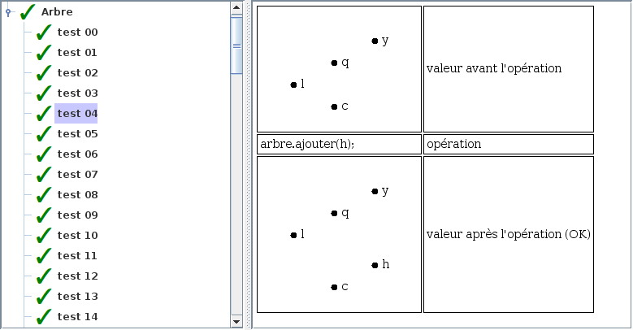

# Tutoriel 5.4: arbre

## Objectifs

1. En utilisant Eclipse, je crée un nouveau projet Java
    * Le projet doit **obligatoirement** être comme suit:
        * nom du projet: `tutoriel5_4`
        * chemin du projet: `~/3c6_PRENOM_NOM/tutoriel5_4`
        * le projet doit utiliser le **JDK 1.8**
        * le projet utilise la librairie $[download ./tutoriel5_4.jar](tutoriel5_4.jar)

1. Je crée la classe `MonNoeud` qui hérite de `Noeud`

1. Je crée la classe `MonArbre` qui hérite de `Arbre`

1. Je crée la classe `MonTutoriel5_4` qui hérite de la classe `Tutoriel5_4`

1. Je corrige les erreurs de compilation

1. J'ajoute une méthode `main` à la classe `MonTutoriel5_4`:

    $[java ./MonTutoriel5_4 3 6]()

1. J'implante la méthode pour remplir le contrat du `Tutoriel5_4`, p.ex:

    $[java ./MonTutoriel5_4 8 10]()

1. J'exécute mon projet, je valide mon code et vérifie la performance:

    

        
    

1. J'ajoute les fichiers du projet dans Git 

1. Je fais un `commit` et un `push`

## Réalisation

### Étape 01: créer le projet `tutoriel5_4`

1. Je crée un projet nommé `tutoriel5_4`
    * *File* => *New* => *Java Project*
        * Je décoche *Use default location*
            * je navigue à la racine du dépôt Git `~/3c6_PRENOM_NOM`
            * je crée un nouveau répertoire nommé `tutoriel5_4`
            * je sélectionne ce nouveau répertoire
        * Je vérifie que le projet utilise le JDK **1.8**
        * Je clique sur *Finish*

### Étape 02: ajouter la librairie `tutoriel5_4.jar`

1. Je télécharge le fichier $[download ./tutoriel5_4.jar](tutoriel5_4.jar) et je le place **à la racine du projet**

1. Je rafraîchis Eclipse afin de voir le fichier `.jar`
    * *Clique-droit* sur le projet => *Refresh*

1. J'ajoute la librairie au `classpath`:
    * *Clique-droit* sur le projet => *Build path* => *Configure Build Path*
        * Onglet *Librairies* =>
        * Je clique sur *Add JARs...*
            * je sélectionne le projet `tutoriel5_4`
            * je sélectionne le fichier `tutoriel5_4.jar`
        * Je clique sur *Apply and Close*

### Étape 03: créer la classe `MonTutoriel5_4`

1. Je crée une nouvelle classe nommée `MonTutoriel5_4`
    * *Clique-droit* sur le projet => *New* => *Class*
        *  *Name*: `MonTutoriel5_4`

### Étape 04: hériter de Tutoriel5_4

1. J'ouvre `MonTutoriel5_4` et j'ajoute `extends Tutoriel5_4`

1. J'utilise $[kbd](Ctrl+1) pour ajouter le `import` de `Tutoriel5_4`

1. J'utilise $[kbd](Ctrl+1) pour générer les méthodes manquantes
    * option `add unimplemented methods`

### Étape 05: créer la classe `MonNoeud`

1. Je crée une nouvelle classe nommée `MonNoeud`
    * *Clique-droit* sur le projet => *New* => *Class*
        *  *Name*: `MonNoeud`

1. J'ouvre `MonNoeud` et je complète la signature:

    $[java ./MonNoeud 1 1]()

1. J'utilise $[kbd](Ctrl+1) pour générer les méthodes manquantes
    * option `add unimplemented methods`

1. Je code la classe:

    $[java ./MonNoeud]()

### Étape 06: créer la classe `MonArbre`

1. Je crée une nouvelle classe nommée `MonArbre`
    * *Clique-droit* sur le projet => *New* => *Class*
        *  *Name*: `MonArbre`

1. J'ouvre `MonArbre` et je complète la signature:

    $[java ./MonArbre 1 1]()

1. J'utilise $[kbd](Ctrl+1) pour générer les méthodes manquantes
    * option `add unimplemented methods`

1. Je code la classe:

    $[java ./MonArbre]()

### Étape 07: remplir le contrat `Tutoriel5_4`

1. J'implante les méthodes pour remplir le contrat du `Tutoriel5_4`, p.ex:

    $[java ./MonTutoriel5_4 8 10]()

### Étape 08: ajouter la méthode `main`

1. J'ouvre `MonTutoriel5_4` et j'ajoute la méthode `main`

    $[java ./MonTutoriel5_4 1 6]()

### Étape 09: exécuter pour valider

1. J'exécute mon projet, je valide mon code et vérifie la performance:

    

        
    

