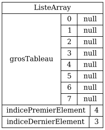
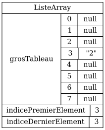
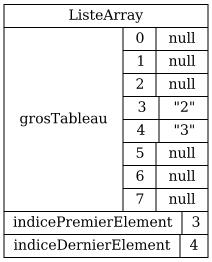
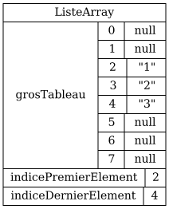
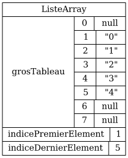

# 50pts) Implanter `MaListeArray`

Une `ListeArray` générale conserve de l'espace vide à la fin **et** au début du tableau.
On a donc un `indicePremierElement` **et** un `indiceDernierElement`.

L'avantage d'une telle `ListeArray` est que l'insertion est efficace à la fin **et** au début.

Par exemple:

<table>
<tr>
<td>
<code>ListeArray liste = new MaListeArray()</code>
</td>

<td>

</td>
</tr>

<tr>
<td>
<code>liste.add("2");</code>
</td>
<td>

</td>
</tr>

<tr>
<td>
<code>liste.add("3");</code>
</td>
<td>

</td>
</tr>

<tr>
<td>
<code>liste.insert(0,"1");</code>
</td>
<td>

</td>
</tr>

<tr>
<td>
<code>liste.insert(0,"0");</code>
</td>
<td>

</td>
</tr>

<tr>
<td>
<code>liste.add("4");</code>
</td>
<td>

</td>
</tr>

<tr>
<td>
<code>liste.add("5");</code>
</td>
<td>

</td>
</tr>
</table>

## Indices

Un `indiceListe` est un indice relatif à la liste qu'on représente.

Un `indiceGrosTableau` est un indice relatif au `grosTableau`.

<table>
<tr>
<th>
<code>indiceListe</code>
</th>
<td colspan="4">
<th>
<code>0</code>
</th>
<th>
<code>1</code>
</th>
<th>
<code>2</code>
</th>
<th>
<code>3</code>
</th>
<td colspan="4">
</td>
</tr>

<tr>
<td>
<code>indiceGrosTableau</code>
</td>
<td>
<code>0</code>
</td>
<td>
<code>1</code>
</td>
<td>
<code>2</code>
</td>
<td>
<code>3</code>
</td>
<td>
<code>4</code>
</td>
<td>
<code>5</code>
</td>
<td>
<code>6</code>
</td>
<td>
<code>7</code>
</td>
<td>
<code>8</code>
</td>
<td>
<code>9</code>
</td>
<td>
<code>10</code>
</td>
<td>
<code>11</code>
</td>
<td>
<code>12</code>
</td>
</tr>

<tr style="border:0px;">
<td style="border:0px;text-align:right;" colspan="6">
<code>indicePremierElement ↑</code>
</td>
</td>
<td style="border:0px;" colspan="2">
</td>
<td style="border:0px;" colspan="6">
<code>↑ indiceDernierElement</code>
</td>
</tr>
</table>

Ci-haut, `indicePremierElement` est `4` et `indiceDernierElement` est `7`.

## Attributs de `ListeArray`

$[java ./attributs]()

## Méthodes utiles déjà implantées dans `ListeArray`

$[java ./methodes_utiles]()

## Méthodes à implanter dans `ListeArray`

$[java ./methodes_a_implanter]()

NOTE: pour simplifier, on va toujours décaler à droite (alors qu'en réalité il faut aussi décaler à gauche, selon le contexte).

## Autres méthodes déjà implantées dans `ListeArray`

$[java ./autres_methodes]()

