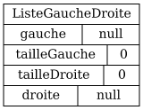
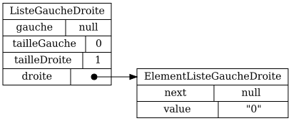
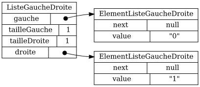
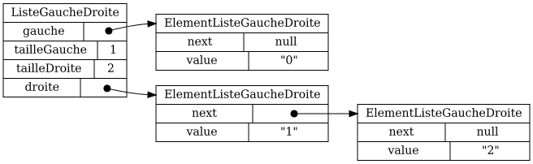
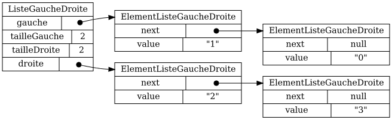
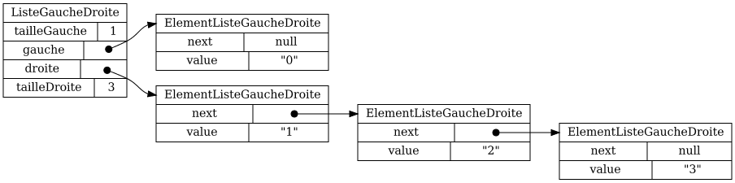
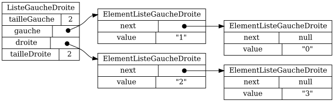

# 40pts) Implanter `MaListeGaucheDroite`

Une `ListeGaucheDroite` est une liste où il est efficace d'insérer et de retirer **au milieu**.

Pour ce faire, on conserve deux pointeurs: 

* `gauche`, vers une chaîne d'éléments qui correspond à la *première moitiée* de la liste
* `droite`, vers une chaîne d'éléments qui correspond à la *deuxième moitiée* de la liste

Il faut aussi équilibrer la liste, afin que les deux moitiés aient à peu près la même taille.

Par exemple:

<table>

<tr>
<td>
<code>ListeGaucheDroite liste = new MaListeGaucheDroite()</code>
</td>
</tr>

<tr>
<td>

</td>
</tr>

<tr>
<td>
<code>liste.add("0");</code>
</td>
</tr>

<tr>
<td>

</td>
</tr>

<tr>
<td>
<code>liste.add("1");</code>
</td>
</tr>

<tr>
<td>

</td>
</tr>

<tr>
<td>
<code>liste.add("2");</code>
</td>
</tr>

<tr>
<td>

</td>
</tr>

<tr>
<td>
<code>liste.add("3");</code>
</td>
</tr>

<tr>
<td>

</td>
</tr>

</table>

## Indices

Un `indiceListe` est un indice relatif à la liste qu'on représente.

Un `indiceGauche` est un indice relatif à la chaîne à gauche.

Un `indiceDroite` est un indice relatif à la chaîne à droite.

### ATTENTION

La chaîne à gauche est dans l'ordre inverse: 
l'élément à l'`indiceListe` `0` est l'élément le plus loin du pointeur `gauche`.

<table>
<tr>
<th>
<code>indiceListe</code>
</th>
<th>
<code>0</code>
</th>
<th>
<code>1</code>
</th>
<th>
<code>2</code>
</th>
<th>
<code>3</code>
</th>
<th>
<code>4</code>
</th>
<th>
<code>5</code>
</th>
<th>
<code>6</code>
</th>
<th>
<code>7</code>
</th>
</tr>

<tr>
<td>
<code>indiceGauche</code>
</td>
<td>
<code>3</code>
</td>
<td>
<code>2</code>
</td>
<td>
<code>1</code>
</td>
<td>
<code>0</code>
</td>
<td colspan="4">
</td>
</tr>

<tr>
<td>
<code>indiceDroite</code>
</td>
<td colspan="4">
</td>
<td>
<code>0</code>
</td>
<td>
<code>1</code>
</td>
<td>
<code>2</code>
</td>
<td>
<code>3</code>
</td>
</tr>
</table>

## Équilibrer

Comme un arbre binaire, on doit équilibrer une `ListeGaucheDroite`: quand trop d'éléments sont d'un seul côté, il faut décaler la liste.

<table>

<tr>
<td>
Avant équilibrage 
</td>
</tr>

<tr>
<td>

</td>
</tr>

<tr>
<td>
Après équilibrage (appel à <code>decalerVersLaGauche</code>)
</td>
</tr>

<tr>
<td>

</td>
</tr>

</table>

Ci-haut, l'élément qui était pointé par `droite` devient l'élément maintenant pointé par `gauche`. 

Ce qu'il reste des chaînes doit être préservé.

## Méthodes de `ElementListeGaucheDroite`

$[java ./ElementListeGaucheDroite]()

## Attributs de `ListeGaucheDroite`

$[java ./attributs]()

## Méthodes utiles déjà implantées dans `ListeGaucheDroite`

$[java ./methodes_utiles]()

## Méthodes à implanter dans `ListeGaucheDroite`

$[java ./methodes_a_implanter]()

## Autres méthodes déjà implantées dans `ListeGaucheDroite`

$[java ./autres_methodes]()
