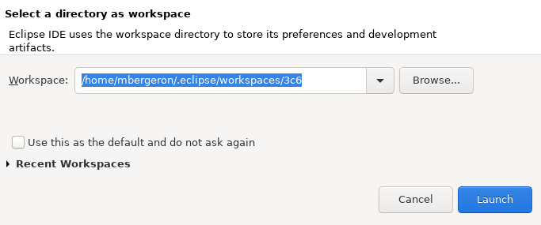

# Créer un Workspace sur le `C:\`

## Créer dès l'ouverture

	

1. Dès l'ouverture, je choisis *Browse*

1. Je navigue vers `C:\Users\123456` (où `123456` est ma DA)

1. Je crée un nouveau répertoire, p.ex. `workspace`

1. Je sélectionne ce nouveau répertoire

1. Finalement, $[link ../importer_projets/](j'importe mes projets) dans ce nouveau Workspace

## Créer une fois Eclipse ouvert

1. Je clique sur *File* => *Switch Workspace* => *Other*

	

1. Je navigue vers `C:\Users\123456` (où `123456` est ma DA)

1. Je crée un nouveau répertoire, p.ex. `workspace`

1. Je sélectionne ce nouveau répertoire

1. Finalement, $[link ../importer_projets/](j'importe mes projets) dans ce nouveau Workspace

