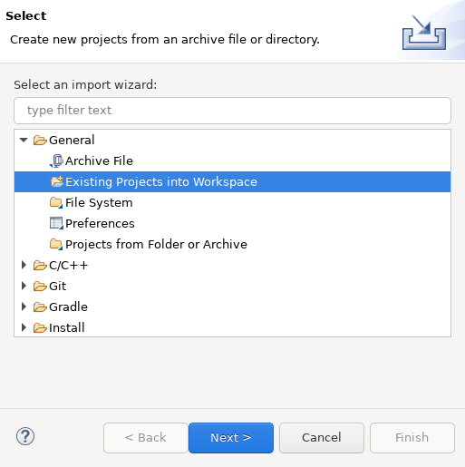
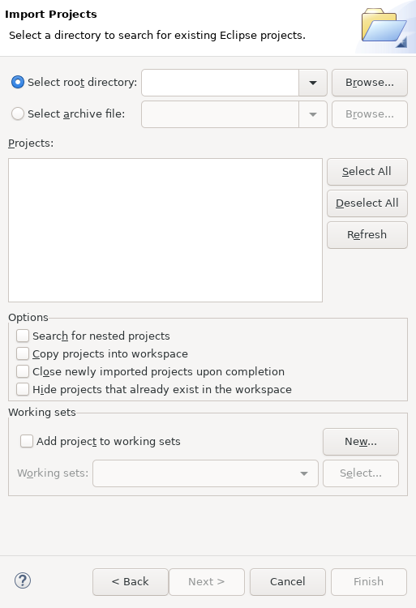
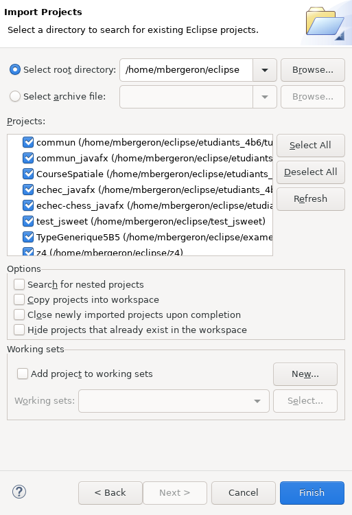

# Importer tous mes projets

1. Je clique sur *File* => *Import*

	

1. Je choisis *General* => *Existing Projects into Workspace*

	

1. Je clique sur *Browse* 

1. Je navigue à la racine de mon dépôt Git

1. Je vérifie que mes projets sont listés
	

		
	

	* Au besoin, je clique *Search for nested projects*

1. Je clique sur *Finish*

