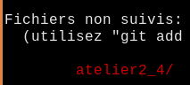
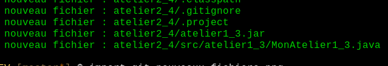

# Ajouter les fichiers dans Git

1. Je vérifie s'il manque des fichiers

        $ cd ~/3c6
        $ git status

    * Les fichiers en rouge ne sont pas suivi par git!

        

            
        

1. J'ajoute le fichier non-suivis avec `git add`, p.ex:

        $ git add atelier2_4

1. Je peux aussi tout ajouter:

        $ cd ~/3c6       # je m'assure d'être à la racine du dépôt
        $ git add .      # ajouter tout à partir de . (répertoire courant)

1. Je vérifie que les fichiers sont ajoutés:

        $ git status

    * Les nouveaux fichiers sont en verts:

        

            
        

1. Je fais un commit et un push

        $ git commit -a
        $ git push -u origin master     # si c'est mon premier push
        $ git push                      # sinon

1. Je vérifie que les fichiers sont sur GitHub:

    

        
    

