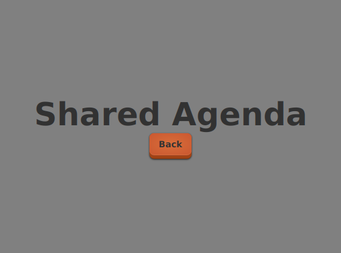
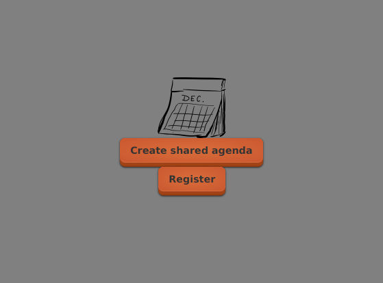

# Examen #1

## Consignes

1. Individuel

1. Documentation permise: Moodle, Google, **votre code**

1. Durée: 1h30

1. **ATTENTION**: remise automatique sur Moodle une fois le temps limite atteint

## Préambule

<video width="90%" src="examen01B.mp4" type="video/mp4" loop nocontrols autoplay>

1. Imaginons une application permettant de partager un agenda

1. Cette application est développée selon la méthodologie du cours

1. On imagine la même structure que le TP#1

1. En particuiler:

    * L'application démarre en affichant une page agenda

    * On peut naviguer vers une page file d'attente et revenir à la page agenda

    * L'application est traduite en anglais

    

    
    
    

## Structure de l'examen

* Partie 1: 5 questions avec extraits de code
    * 50pts (10pts par question)
    * planifier environs 1 heure

* Partie 2: 10 questions plus générales
    * 50pts (5pts par question)
    * planifier environs 30 minutes

## Débuter l'examen

[Cliquer ici pour commencer](https://cmontmorency.moodle.decclic.qc.ca/mod/quiz/view.php?id=302413)

