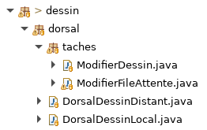

# Dessins collaboratifs

* Une application client/serveur pour collaborer à plusieurs sur un même dessin

## Créer des collaborations et ajouter des collaborateurs

* La page de file d'attente permet de

    * créer une collaboration (un dessin collaboratif)
    * ajouter un collaborateur à une collaboration existante

<video width="100%" src="examen02_02.mp4" type="video/mp4" loop nocontrols autoplay>

* L'affichage s'adapte à la taille de la fenêtre

    

* Le modèle de cette page est comme suit

    

## Dessiner de façon collaborative

* La page dessin permet de

    * dessiner une forme avec la souris
    * visualiser le dessin

<video width="100%" src="examen02_01.mp4" type="video/mp4" loop nocontrols autoplay>

* NOTES
    * La fenêtre de  *Charlie* (cercles bleus) n'est pas affichée ci-haut

## Structure de l'application

### Classes du dorsal

<!--

    

-->

<pre>
    DorsalDessinLocal
    ModifierFileAttente
    ModifierDessin

    DorsalDessinDistant
</pre>

### Graphe de tâches du dorsal

    

### Classes du frontal

<!--

    

-->

<pre>
    FrontalDessin
    AfficherFileAttente
    Navigation
    Initialisation
    AfficherDessin

    EvtSouris
    EvtAfficherFileAttente
    EvtAfficherVueDessin

    VueRacine

    VueFileAttente
    FragmentCollaboration
    FragmentCollaborateur
    CanvasForme

    VueDessin
    DonneesVueDessin
    CanvasDessin
</pre>

### Graphe de tâches du frontal

    

* NOTES
    * le groupe de tâches `AfficherFileAttente` est à compléter durant l'examen

### Autres classes

<!--

    

-->

<pre>
    MsgAjouterForme
    MsgAjouterCollaborateur
    MsgCreerCollaboration

    ModeleFileAttente
    Collaboration
    Collaborateur

    ModeleDessin
    MondeDessin2d
    ObjetDessin2d
    Forme
    Rectangle
    Triangle
    Cercle

    Session
    Declarations
    ClientDessin
    DessinLocal
    ServeurDessin
</pre>

### Ressources

<!--

    

-->

<pre>
    racine.xml

    file_attente.xml
    collaboration.xml
    collaborateur.xml

    dessin.xml

    dev.css
    prod.css

    chaines_fr.properties
    chaines_en.properties
</pre>
