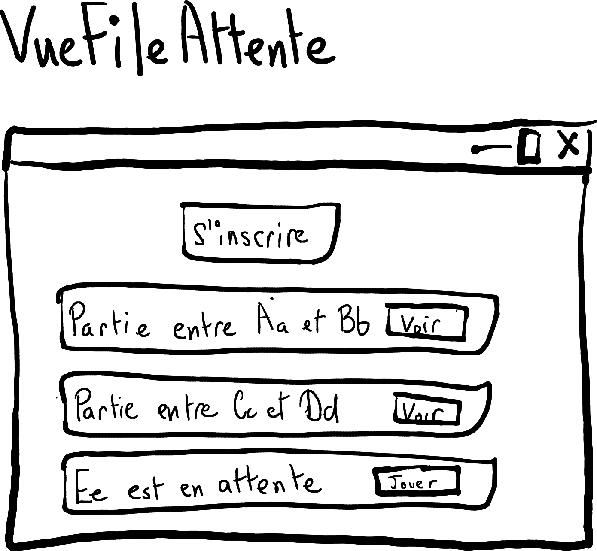
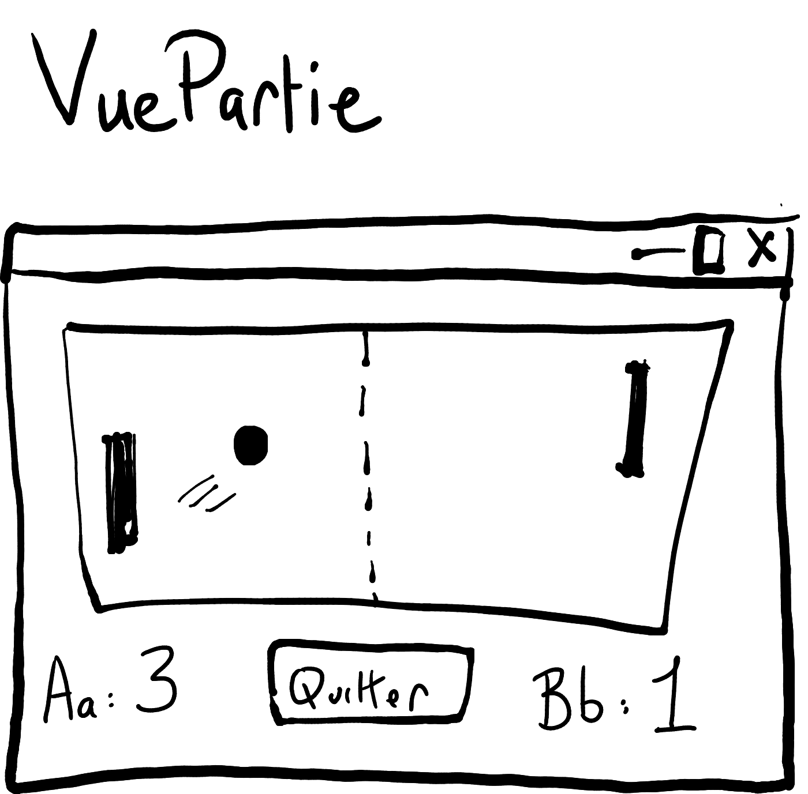
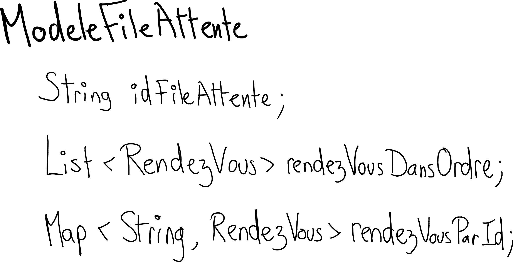
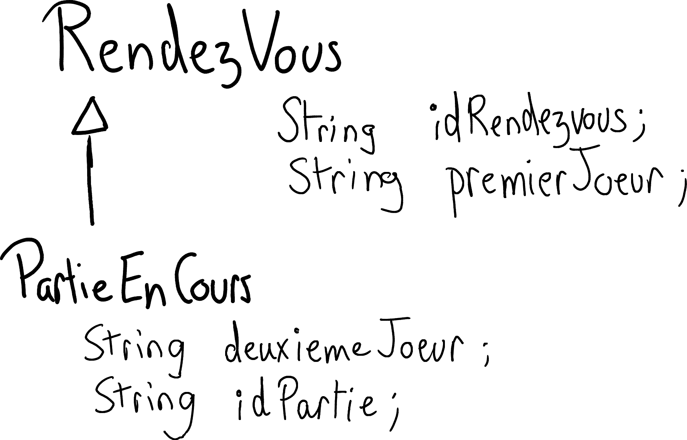
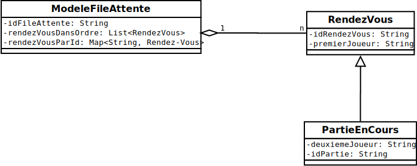

# Document conception pour les tutoriels

<video width="50%" src="modeles01.mp4" type="video/mp4" controls>

* Erratum: c'est bien la semaine 7 pour commencer à regarder le `ModelePartie`

## Vue

### NOTES

* «S'inscrire» ajoute un rendez-vous pour l'usager courant
* «Voir» permet d'observer une partie déjà en cours
* «Jouer» permet de débuter une partie contre un usager en attente

 
 
 
 

### NOTES

* «Quitter» revient à la file d'attente

## Modèles

 
 
 
 

 
 
 
 

 
 
 
 

### NOTES

<video width="50%" src="modeles02.mp4" type="video/mp4" controls>

* On peut aussi spécifier les modèles directement en Java:

$[java ./ModeleFileAttente]()

$[java ./RendezVous]()

$[java ./PartieEnCours]()

* Ou encore avec un diagramme:

* Voire même avec un exemple en Json

<pre>
{
    "idFileAttente" : "file01",
    "rendezVousDansOrdre": [
        {
            "idRendezVous": "rendezVous01",
            "premierJoueur": "Aa",
            "deuxiemeJoueur": "Bb",
            "idPartie": "partie01"
        },
        {
            "idRendezVous": "rendezVous02",
            "premierJoueur": "Cc",
            "deuxiemeJoueur": "Dd",
            "idPartie": "partie02"
        },
        {
            "idRendezVous": "rendezVous03",
            "premierJoueur": "Ee"
        }
    ],

    "rendezVousParId": {
        "rendezVous01":
            {
                "idRendezVous": "rendezVous01",
                "premierJoueur": "Aa",
                "deuxiemeJoueur": "Bb",
                "idPartie": "partie01"
            },
        "rendezVous02":
            {
                "idRendezVous": "rendezVous02",
                "premierJoueur": "Cc",
                "deuxiemeJoueur": "Dd",
                "idPartie": "partie02"
            },
        "rendezVous03":
            {
                "idRendezVous": "rendezVous03",
                "premierJoueur": "Ee"
            }
    }
}
</pre>

* L'important est de préciser le genre de données qu'on va sauvegarder et afficher

 
 
 
 

## Fonctionalités

<video width="50%" src="fonctionalites.mp4" type="video/mp4" controls>

### Boutons «s'inscrire» et «jouer»

1. Si l'usager est déjà dans la file d'attente:
    * le bouton «s'inscrire» et les boutons «jouer» doivent être cachés

### S'inscire dans la file d'attente

1. Action: l'usager clique sur le bouton «s'inscrire»
1. Effet: la `VueFileAttente` affiche un nouveau rendez-vous de type 
    * `Ee est en attente «Jouer»`

### Débuter une partie

1. Action: un usager *qui n'est pas* dans la file clique sur un bouton «Jouer»
1. Effet: on crée une nouvelle partie et on l'ouvre automatiquement

### Observer une partie

1. Action: un usager *qui n'est pas* dans la file clique sur un bouton «Voir»
1. Effet: on crée une nouvelle `VuePartie` pour observer une partie qui existe déjà

### Quitter une partie

1. Action: dans la `VuePartie`, l'usager clique sur «Quitter»
1. Effet: on ferme la `VuePartie` et on revient à la `VueFileAttente`

