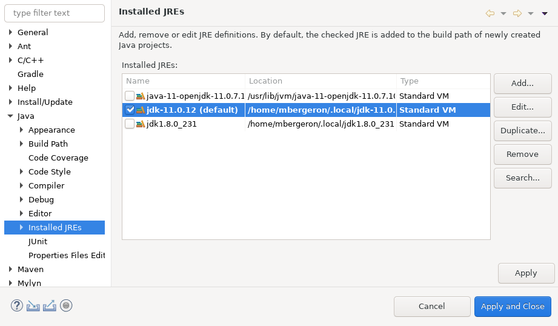

## Configurer Eclipse

<video width="50%" src="configurer_eclipse.mp4" type="video/mp4" controls>

1. Je démarre Eclipse
	* Je choisi mon `WORKSPACE`, p.ex. 
		* `Z:\eclipse-workspace` (Windows du Collège)
		* `C:\Users\PRENOM_NOM\eclipse-workspace` (Mon Windows)

1. Je m'assure que Eclipse utilise le *JDK 11*
	* *Window* => *Preferences*
	* *Java* => *Installed JREs*

		

			
		

	* Idéallement, Eclipse utilise **uniquement** le *JDK 11*

	* Si j'en ai pas besoin, je fait *Remove* sur tous les JDK **sauf 11**

	* Si le *JDK 11* n'est pas là, je l'ajoute:
		* *Add* =>
		* *Standard VM* => *Next*
		* Sélectionner le répertoire racine du *JDK*, p.ex: 
			* `C:\Program Files\Java\jdk-11.XXX`
		* *Finish*
		* *Apply and Close*

	* Je m'assure que le *JDK 11* est le défaut (en gras)
    
