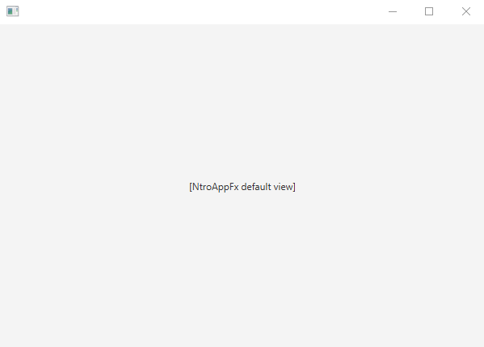
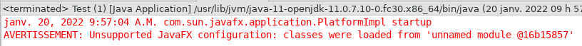

## Tester l'environnement de développement

<video width="50%" src="tester_environnement.mp4" type="video/mp4" controls>

* NOTE: la commande `$ sh gradlew tut01:run` va prendre du temps
    * (la première fois Gradle télécharge et compile toutes les dépendances)

 

1. Je télécharge $[download ./4f5_tut01.zip](4f5_tut01.zip)

1. Je décompresse l'archive sur mon disque dur

1. J'ouvre un Git-Bash dans le répertoire `4f5_tut01`
    * TRUC: naviguer vers le répertoire et faire
        * *Clique-droit* => *Git Bash here*

1. Je vérifie que je suis dans le bon répertoire

        $ ls

            # devrait afficher

            buildSrc  gradle  gradle.properties  gradlew  gradlew.bat  ...

1. J'exécute `tut01` via Gradle:

        $ sh gradlew tut01:run

    * devrait afficher la fenêtre suivante:

1. Je crée un projet Eclipse via Gradle

        $ sh gradlew tut01:eclipse

1. J'ouvre Eclipse et j'importe le projet `tut01`
    * *File* => *Import*
        * *General* => *Existing project into Workspace*
        * *Browse* => naviguer jusqu'au répertoire `4f5_tut01`
        * *Finish*

1. En Eclipse, j'exécute la classe `Tut01`
    * *Clique-droit* sur `Tut01.java`
        * => *Run-as*
        * => *Java application*

    * devrait afficher la même fenêtre:

### NOTE

C'est normal d'avoir l'avertissement suivant dans la console Eclipse:

Tout autre erreur ou avertissement indique un problème avec votre configuration

    

