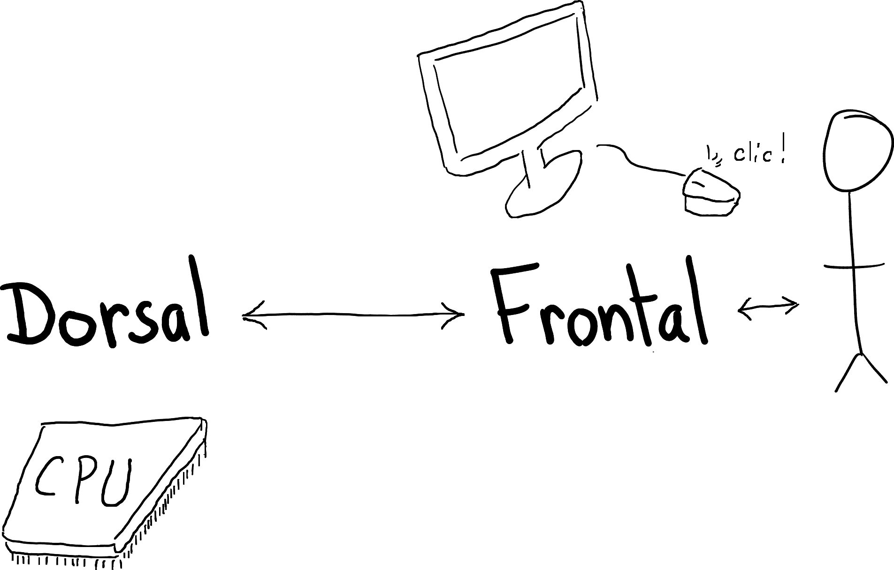
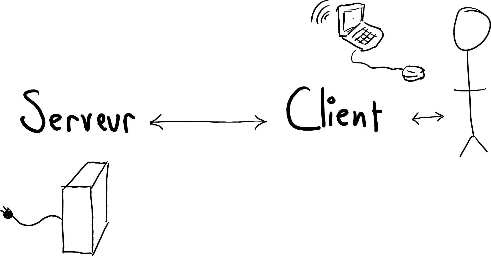
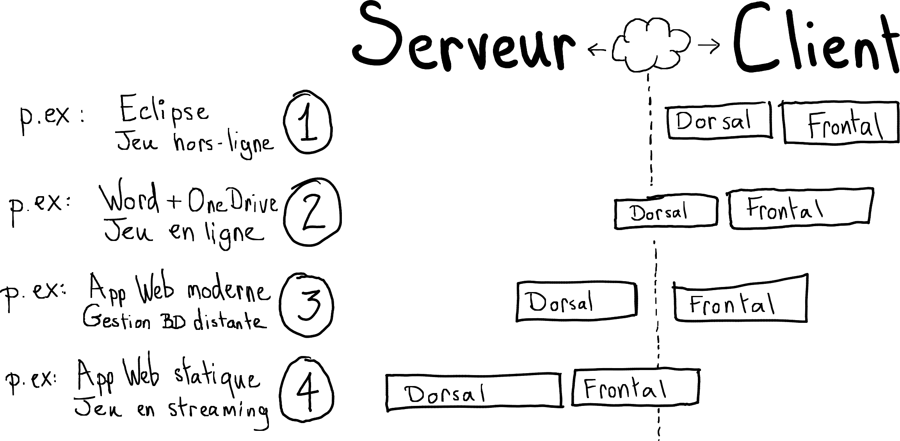
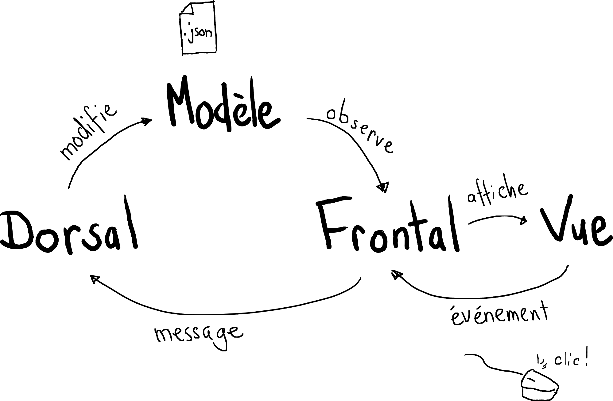
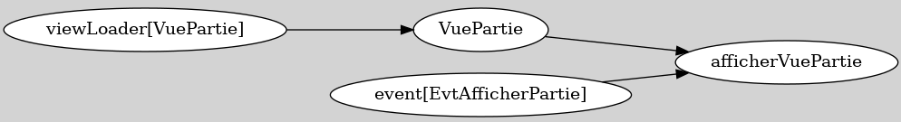

# Théorie: Application graphique client/serveur

## Frontal (*frontend*) et dorsal (*backend*)

<video width="50%" src="/cegep/420-4F5-MO/modules/02/theorie/dorsal_frontal.mp4" type="video/mp4" controls>

* Le Frontal est la couche de présentation d'une application
    * afficher les données (Vues)
    * interagir avec l'usager (via des Événements)

* Le Dorsal est l'engin (ou moteur) d'une application
    * charge les données (Modèles)
    * effectue les calculs compliqués

* Le Frontal et le Dorsal peuvent 
    * cohabiter dans le même programmes
    * ou habiter dans deux programmes différents

## Client et serveur

<video width="50%" src="/cegep/420-4F5-MO/modules/02/theorie/client_serveur.mp4" type="video/mp4" controls>

* Le Client et le Serveur sont toujours deux programmes différents

* Le Client est le programme qui s'exécute sur la machine l'usager

* Le Serveur est le programme qui s'exécute sur une machine distance, accessible via le réseau

## Frontal/Dorsal Vs Client/Serveur

<video width="50%" src="/cegep/420-4F5-MO/modules/02/theorie/client_serveur_frontal_dorsal.mp4" type="video/mp4" controls>

* Les notions de Frontal/Dorsal et Client/Serveur ne sont pas identiques!

* Une application peut avoir un Frontal et un Dorsal, sans avoir de Serveur

* Un Serveur peut exécuter la majeur partie du Frontal 
    * (dans ce cas le client est un programme minimaliste)

 
 

* Voici quelques exemples:

 

 
 

## `Ntro`, un cadriciel (*framework*) conçu pour l'enseignement

<video width="50%" src="/cegep/420-4F5-MO/modules/02/theorie/cadriciel_ntro.mp4" type="video/mp4" controls>

1. Un cadriciel permet 
    * d'organiser le code
    * de simplifier certaines tâches courantes (charger un modèle, créer une vue)

1. `Ntro` est développé par le prof à des fins pédagogiques

1. Le but est d'arrimer les concepts vu en cours avec le code, p.ex:
    * on voit les concepts de Client et de Frontal
    * en `Ntro`, on doit définir une classe `Client` et une classe `Frontal`

1. Un autre objectif est de visualiser le plus possible la logique de l'application

1. `Ntro` a aussi la particularité de supporter à la fois Java et Javascript (via JSweet)
    * p.ex. presque tout sur <a href="https://aiguilleur.ca">aiguilleur.ca</a> est programmé en Java:
        * le serveur Web
        * le dorsal, qui s'exécute sur le serveur
        * le frontal, qui peut s'exécuter
            * sur le serveur (en Java)
            * ou dans le navigateur (en Javascript tiré du même code Java)

## Patron *MVC* en `Ntro`

<video width="50%" src="/cegep/420-4F5-MO/modules/02/theorie/mvc_ntro.mp4" type="video/mp4" controls>

* De façon général, le patron *MVC* signifie qu'on organise le code en trois parties:
    * Les *Modèles*: 
        * les données
        * la logique *du domaine d'application* (p.ex. les règles d'un jeu)
    * Les *Vues*: 
        * affichage des données
        * interactions avec l'usager
    * Le *Contrôleur*:
        * la logique *du programme*, p.ex.
        * comment charger les modèles (base de données? fichiers?)
        * quand crééer les vues (dès le début? dynamiquement?)

* Typiquement, un cadriciel propose sa propre version du partron *MVC*

* Voici la version proposée par Ntro

    

    
    

    * On a une notion explicite de *Frontal* et de *Dorsal*
    * Le Frontal réagit aux *événements* usagers
    * Le Frontal envoit des *messages* au Dorsal
    * Seul le Dorsal peut modifier un modèle
    * Le Frontal reçoit des mises-à-jour quand le modèle est modifié
        * on dit que le frontal *observe* le modèle
        * via les mises-à-jour, le frontal peut afficher les données du modèle
        * (le Frontal ne manipule jamais le modèle au complet)

## Le client en `Ntro`

<video width="50%" src="/cegep/420-4F5-MO/modules/02/theorie/client_ntro.mp4" type="video/mp4" controls>

* La classe principale d'un client `Ntro` doit implanter `NtroClientFx` (pour JavaFx)

$[java ./ClientPong 1 1]()

* Cette classe doit appeler `launch` pour démarrer l'application

$[java ./ClientPong 3 5]()

* Elle doit aussi déclarer un frontal, des modèles, des messages et un dorsal

$[java ./ClientPong 7 26]()

## Le frontal en `Ntro`

<video width="50%" src="/cegep/420-4F5-MO/modules/02/theorie/frontal_ntro.mp4" type="video/mp4" controls>

* Le frontal est une classe qui implante `Frontend`

$[java ./FrontalPong 1 1]()

* Le frontal doit aussi créer des tâches, déclarer des événements et des vues:

$[java ./FrontalPong 3 16]()

* Une fois l'application prête, la méthode `execute` sera appelée:

$[java ./FrontalPong 18 21]()

## Le dorsal en `Ntro`

<video width="50%" src="/cegep/420-4F5-MO/modules/02/theorie/dorsal_ntro.mp4" type="video/mp4" controls>

* Le dorsal de base est une classe qui hérite de `LocalBackendNtro`

$[java ./DorsalPong 1 1]()

* Le dorsal doit aussi créer des tâches

$[java ./DorsalPong 3 6]()

* La méthode `execute` va être appelée quand l'application est prête:

$[java ./DorsalPong 8 11]()

## Le contrôleur en `Ntro`: un graphe de tâches

<video width="50%" src="/cegep/420-4F5-MO/modules/02/theorie/graphe_de_taches01.mp4" type="video/mp4" controls>

* `Ntro` n'a pas de notion explicite de contrôleur

* On va plutôt définir des graphes de tâches 
    * un pour le frontal et un pour le dorsal

* Le frontal va créé les tâches concernant les vues et les événements usager

* Le dorsal va créé les tâches pour recevoir les messages et modifier les modèles

### Définir les tâches du frontal en Java

<video width="50%" src="/cegep/420-4F5-MO/modules/02/theorie/graphe_de_taches02.mp4" type="video/mp4" controls>

* Pour définir une tâche, il faut ajouter cet `import static`

$[java ./Tasks 1 1]()

* Ensuite, on va utiliser un objet de type `FrontendTasks`:

$[java ./Tasks 4 21]()

* Si on décortique le code ci-haut, on a 

    * Créer une tâche nommée `afficherVuePartie`

        $[java ./Tasks 22 22]()

    * Cette tâche attend que la `VueRacine` soit créée:

        $[java ./Tasks 24 24]()

    * Cette tâche attend aussi que la `VuePartie` soit créée:

        $[java ./Tasks 26 26]()

    * Cette tâche se déclenche suite à l'événement `EvtAfficherPartie`

        $[java ./Tasks 28 28]()

    * Finalement, voici le code ce que la tâche exécute:

        $[java ./Tasks 30 36]()

    * La tâche commence par récupérer les résultats créés par les autres tâches

        * Récupérer la `VueRacine`

            $[java ./Tasks 38 38]()

        * Récupérer la `VuePartie`

            $[java ./Tasks 39 39]()

* REMARQUE: on doit avoir les mêmes valeurs dans `waitsFor` et dans `inputs.get`
    * P.ex. `created(VueRacine.class)` se répète comme suit:

    $[java ./Tasks 24 24]()
    $[java ./Tasks 38 38]()

    * On peut dire: 

        * `waitsFor` c'est ce dont j'ai besoin pour m'exécuter
        * `inputs.get` me permet de le récupérer
        

### Interpréter un graphe de tâches

<video width="50%" src="/cegep/420-4F5-MO/modules/02/theorie/graphe_de_taches03.mp4" type="video/mp4" controls>

* Voici un extrait du graphe des tâches du tutoriel 04:

* Chaque flèche est une dépendance

* On peut dire:
    * la tâche `viewLoader[VuePartie]` doit s'exécuter avant la tâche `VuePartie`

* On peut aussi dire:
    * la tâche `VuePartie` va s'exécuter dès que `viewLoader[VuePartie]` est terminée

* Une tâche peut produire un résultat (générer une valeur)

* Une tâche a accès aux résultats produits par les tâches précédentes

* Par exemple, la tâche `afficherVuePartie` a accès aux résultats des tâches:
    * `VuePartie`
    * `viewLoader[VuePartie]`
    * `event[EvtAfficherPartie]`

* Finalement, le graphe des tâches permet de gérer les événements et les messages

* Par exemple, la tâche `afficherVuePartie` va s'exécuter à chaque fois où:
    * la `VuePartie` existe
    * l'événement `EvtAfficherPartie` est déclenché

## La fenêtre en `Ntro` (classe `Window`)

<video width="50%" src="/cegep/420-4F5-MO/modules/02/theorie/ntro_window.mp4" type="video/mp4" controls>

* La classe `Window` représente la fenêtre principale de l'application

* Voici l'interface:

    $[java ./Window]()

* `resize` permet de changer la taille de la fenêtre (en pixels)

* `installRootView` permet d'afficher la Vue racine (la page principale)

* `show` permet d'afficher la fenêtre (qui est cachée par défaut)

* `fullscreen` premet d'afficher en plein écran

* `decorations` permet d'afficher ou non la barre et les boutons qu'ajoute l'OS

