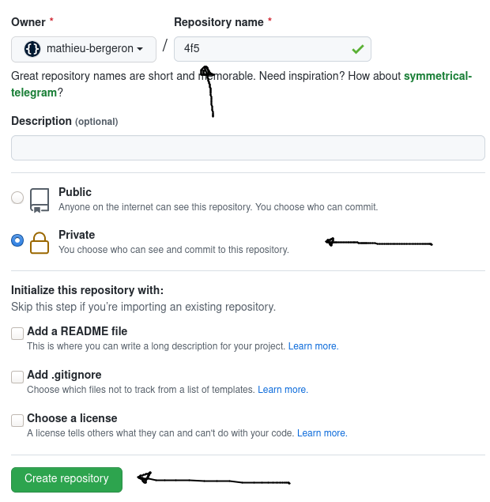
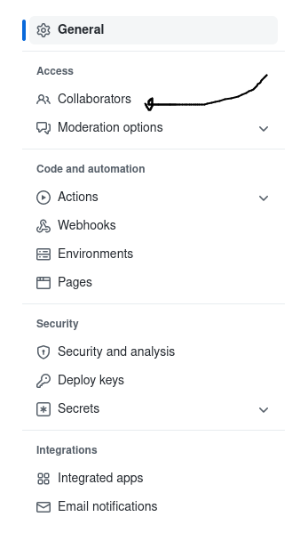
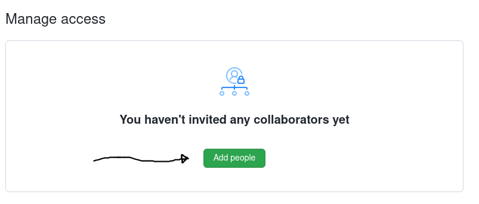
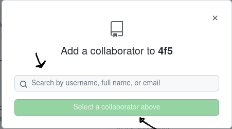

# Tutoriel 2.1: Créer mon dépôt Git

<strong>IMPORTANT</strong>

<ul>
<li>Je crée mon dépôt Git <strong>une seule fois</strong>
<ul>
 
<li>(j'utlise le même dépôt Git pour mon projet)
<li>(j'utlise le même dépôt Git pour tout le cours)
</ul>
</ul>

## Créer un compte sur GitHub

1. Si ce n'est pas déjà fait, je m'inscris à GitHub

    * https://github.com
    * *Sign-up*

## Créer mon dépôt Git *privé*

* Je me connecte à GitHub
* Sur ma page d'accueil, je clique *New*

    

* J'entre le nom du dépôt (p.ex. `4f5`)
* Je coche *Private*
* Je crée le dépôt en cliquant sur *Create repository*

    

## Ajouter `mathieu-bergeron` comme collaborateur

* Je visite la page du dépôt: https://github.com/USAGER/DEPOT
    * (ajuster l'adresse ci-haut selon votre USAGER et votre DEPOT)

* Je vais dans *Settings*

    

* Je vais *Access* / *Collaborators*

    

* Je clique sur *Add people* 

    

* Je saisi et sélectionne `mathieu-bergeron`
* Je clique sur *Add mathieu to this repository*

    

