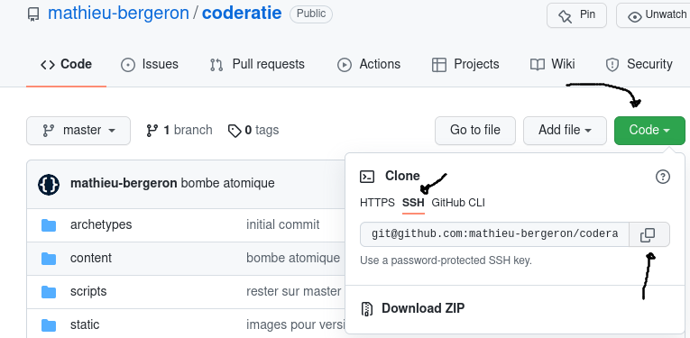

# Tutoriel 2.3: clone mon dépôt Git

<strong>IMPORTANT</strong>

<ul>
<li>Je fais ces étapes <strong>à chaque fois</strong> où j'ai besoin d'une copie fraîche de mon projet
<li>Par exemple:
<ul>
 
<li>je veux tester que ma remise fonctionne à partir d'un <code>$ git clone</code> neuf
<li>j'ai des erreurs Git que je n'arrive pas à corriger. Je peux
 
<ul>
<li>cloner mon dépôt pour avoir une nouvelle copie
<li>ajouter à la main des fichiers à cette nouvelle copie
<li>continuer avec cette copie qui ne devrait pas contenir d'erreur
</ul>
</ul>
</ul>

## Cloner mon dépôt Git

1. J'ouvre Git-Bash

1. Je navigue vers le répertoire où je veux ajouter mon dépôt Git
    * (**IMPORTANT**: utiliser **un autre** répertoire que votre Workspace d'Eclipse)
    * P.ex:

            $ mkdir  ~/mes_depots
            $ cd ~/mes_depots

1. Je clone mon dépôt Git:
    * (ajuster l'adresse ci-bas selon votre USAGER et votre DEPOT)

            $ git clone git@github.com:USAGER/DEPOT

1. Je peux aussi trouver l'adresse de mon dépôt sur GitHub:

    * Je navigue jusqu'à la page de mon dépôt
    * Je clique sur *Code*
    * Je clique sur *SSH*
    * Je copie l'adresse de mon dépôt

    

