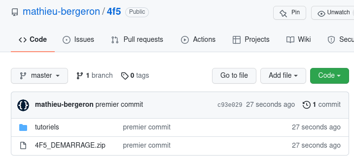

# Tutoriel 2.4: créer le projet Gradle `pong`

<strong>IMPORTANT</strong>

<ul>
<li>Je vais faire ces étapes <strong>deux fois</strong>:
<ol>
 
<li>pour créer le répertoire <code>tutoriels</code> et le projet <code>pong</code>
<li>pour créer le répertoire <code>mon_projet</code> et le projet <code>MON_JEU</code>
 
</ol>
 
<li>La deuxième fois, je dois <strong>adapter</strong> les étapes à mes besoins
<ul>
</ul>

## Télécharger le fichier de démarrage

1. Je télécharge $[download ./4F5_DEMARRAGE.zip](4F5_DEMARRAGE.zip)

1. Je place le fichier `4F5_DEMARRAGE.zip` **à la racine** de mon dépôt Git

## Utiliser le `.zip` pour créer le répertoire `tutoriels`

1. J'ouvre Git-Bash **à la racine** de mon dépôt Git

1. Je décompresse le fichier `4F5_DEMARRAGE.zip`

        $ unzip 4F5_DEMARRAGE.zip

1. Je renomme le répertoire `4F5_DEMARRAGE` vers `tutoriels`

        $ mv 4F5_DEMARRAGE tutoriels

1. Je vérifie que j'ai les bons fichiers

        $ ls tutoriels

            # Devrait afficher

            buildSrc  gradle  gradle.properties  gradlew  gradlew.bat  ...

## Renommer `MON_JEU` pour créer le répertoire `pong`

1. Je renomme le répertoire `MON_JEU` vers `pong`

        $ cd tutoriels
        $ mv MON_JEU pong

1. Je vérifie que j'ai les bons fichiers

        $ ls pong

            # Devrait afficher

            build.gradle  src

## Configurer `gradle.properties`

1. J'ouvre le fichier `gradle.properties`

        $ EDITEUR gradle.properties

1. Je renomme la classe principale vers `pong.ClientPong`

        # était: 
        clientMainClass=MON_JEU.ClientMonJeu

        # devient:
        clientMainClass=pong.ClientPong

## Configurer `settings.gradle`

1. J'ouvre le fichier `settings.properties`

        $ EDITEUR settings.gradle

1. Je renomme le projet racine:

        # était: 
        rootProject.name = '4F5_DEMARRAGE'

        # devient:
        rootProject.name = 'tutoriels'

1. Je m'assurer que le projet `pong` est inclus

        # était: 
        include 'MON_JEU'

        # devient:
        include 'pong'

## Compiler `pong`

1. Je compile `pong` pour la première fois

        $ sh gradlew build

## Pousser sur GitHub

1. J'ouvre Git-Bash **à la racine** de mon dépôt Git

        $ git add .
        $ git commit -a -m"premier commit"
        $ git push

## Vérifier sur GitHub

1. Je vérifie mes fichiers sur GitHub:

* NOTE: le `.zip` fait 65K, on peut se permettre de le pousser sur GitHub
