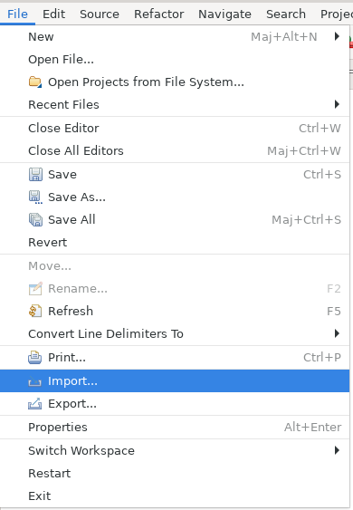
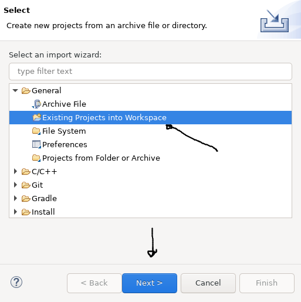
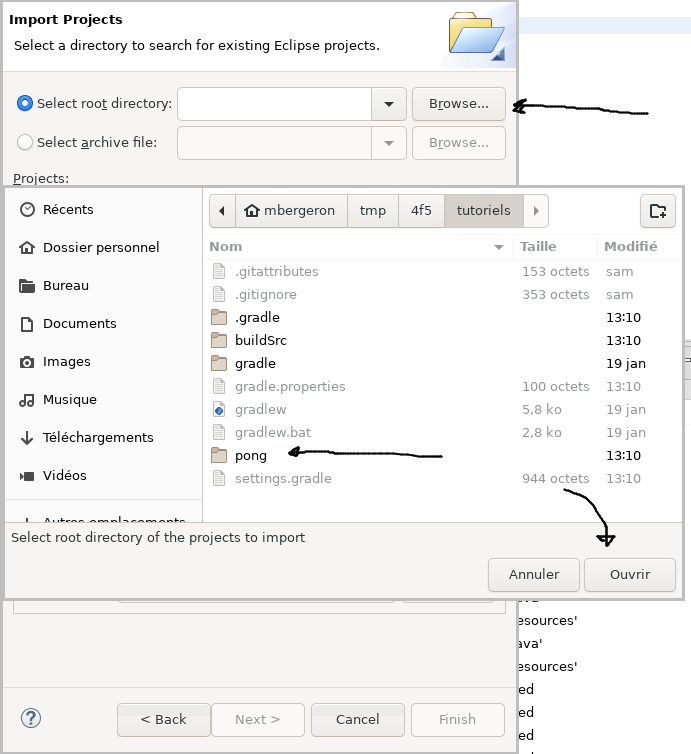
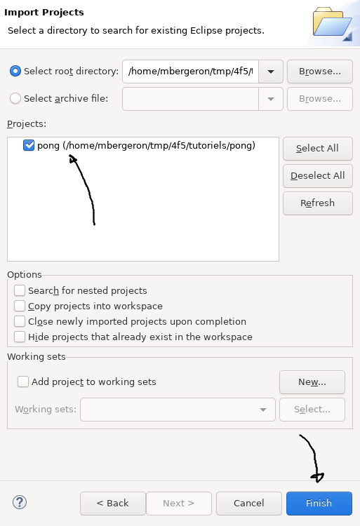

# Tutoriel 2.5: importer le projet `pong` en Eclipse

<strong>IMPORTANT</strong>

<ul>
<li>Je fais ces étapes <strong>à chaque fois</strong> où j'ai besoin d'importer un projet Gradle en Eclipse
<li>Par exemple:
<ul>
 
<li>j'ai un projet Gradle neuf et je veux l'importer pour la première fois en Eclipse
<li>j'ai des erreurs Eclipse et je veux m'assurer que le projet Eclipse est à jour
</ul>
</ul>

## En Gradle, je crée le projet Eclipse

1. J'ouvre Git-Bash **à la racine de mon projet Gradle**

        $ ls

            # devrait afficher
            buildSrc  gradle  gradle.properties  gradlew  gradlew.bat ...

1. Via Gradle, je génère le projet Eclipse

        $ sh gradlew build 
        $ sh gradlew eclipse

1. Je vérifie que les fichiers d'Eclipse ont été générés

        $ ls -a pong

            # devrait afficher les fichiers d'Eclipse

            .classpath .project .settings ...

## En Eclipse, j'importe le projet Eclipse `pong`

* En Eclipse, je clique sur *File* => *Import*

* Je sélectionne *General* => *Existing project into Workspace*
* Je clique sur *Next*

* Je clique sur *Browse* 
* Je navigue jusqu'au répertoire contenant mon projet
* Je sélectionne le répertoire de mon projet
* Je clique sur *Ouvrir*

* Je vérifie que le projet apparaît dans la liste
* Je clique sur *Finish*

