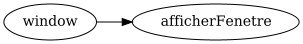

# Tutoriel 2.7: afficher la fenêtre et les tâches

## Exécuter le client

1. J'ouvre un Git-Bash dans le répertoire `tutoriels` de mon dépôt Git

1. J'exécute `ClientPong` en français

        $ sh gradlew clientFr

            # Devrait afficher

            [INFO] Locale: 'fr_CA'
            [INFO] App running. Press Enter here to exit.

1. J'observe que:
    * l'application affiche maintenant une fenêtre (il y a un frontal)
    * on peut maintenant quitter l'application en fermant la fenêtre

1. Je ferme la fenêtre pour quitter l'application

1. J'exécute `ClientPong` en anglais

        $ sh gradlew clientEn

            # Devrait afficher

            [INFO] Locale: 'en_CA'
            [INFO] App running. Press Enter here to exit.

1. Je ferme la fenêtre pour quitter l'application

## Afficher le graphe de tâches

1. J'ai maintenant un graphe de tâches pour mon frontal

1. Ce graphe est affiché dans `tutoriels/pong/_storage/graphs/frontend.png`

1. J'affiche mon graphe de tâches

    

        
    

1. J'observe que mon graphe est très simple et se lit:
    * «attendre que la fenêtre existe, puis exécuter la tâche `afficherFenetre`»

