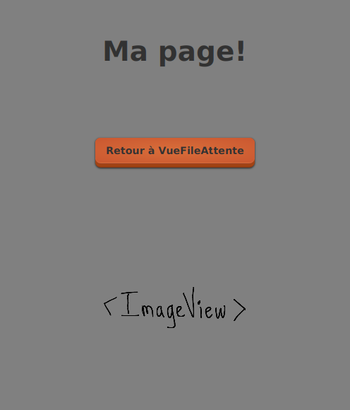
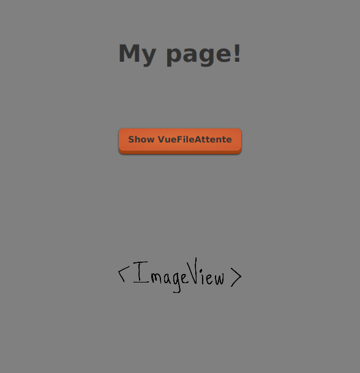

# Objectifs 3: créer la Vue de ma page

<video width="50%" src="presentation.mp4" type="video/mp4" controls>

<strong>IMPORTANT</strong>

<ul>
<li>J'importe la <code>VueRacine</code> dans mon projet
<li>Par contre, je n'importe pas tout de suite la <code>VueFileAttente</code> 
</ul>

 
<strong>IMPORTANT</strong>

<ul>
<li>Je commence à implanter <strong>ma Vue</strong>
<li>Je peux implanter une <strong>version simplifiée</strong> de ma Vue
    <ul>
        <li> mais <strong>je dois</strong> avoir:
        <ul>
        <li>2-3 éléments graphiques (bouton, image, texte)
        <li>du CSS
        <li>du texte traduit français/anglais
        </ul>
             
    </ul>
</ul>

1. J'effectue le $[link ../tutoriel/](tutoriel) pour comprendre comment créer une vue

1. Je commence à créer ma Vue
    * voici, <strong>par exemple</strong>, le genre de résultat qu'on cherche pour l'instant

        

            
        

        

            
        

    * **NOTE**: j'utilises du texte pertinent à mon projet!

1. Je crée la classe Java pour ma Vue
    * je copie la classe `VueRacine` à partir du tutoriel
    * je peux aussi copier et adapter d'autres classes

1. Je crée les fichiers `.css`, `.xml` et `.properties` pour mon projet
    * je copie `racine.xml` à partir du tutoriel 
    * je peux aussi copier et adapter d'autres fichiers

1. Je commence à remplir le `.xml` pour ma Vue
    * je m'assure d'avoir au moins un bouton ou autre élément

1. Je déclare ma nouvelle vue dans le frontal

1. Je code les tâches pour afficher ma page comme page principale
    * je copie les tâches pour afficher la `VueRacine`
    * je peux aussi copier et adapter d'autres tâches

1. Dans Eclipse, je m'assure d'avoir la même arborescence que pour le tutoriel
    * (mais avec des fichiers spécifiques à mon projet)

1. J'expérimente avec le CSS en JavaFx

    * je spécifie au moins 5 propriétés CSS spécifiques à mon projet

1. J'expérimente avec les traductions en JavaFx

    * je m'assure d'avoir au moins un élément avec du texte traduit

1. Je pousse mon projet sur GitHub, p.ex:

        $ git add .
        $ git commit -a -m module03
        $ git push 

1. Je vérifie que mes fichiers sont sur GitHub

1. Je vérifie que projet est fonctionnel avec un `$ git clone` neuf, p.ex:

        $ mkdir ~/tmp

        $ cd ~/tmp

        $ git clone git@github.com:USAGER/DEPOT

        $ cd DEPOT

        $ cd mon_projet

        $ sh gradlew clientFr

            # Doit afficher ma page directement, en français

        $ sh gradlew clientEn

            # Doit afficher ma page directement, en anglais

