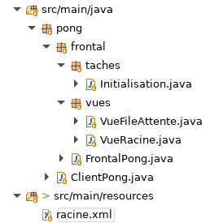
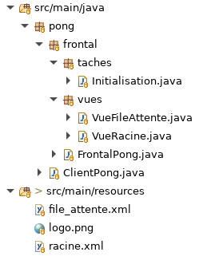
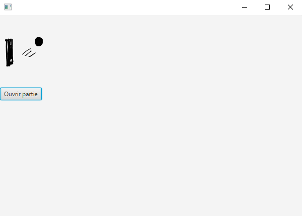
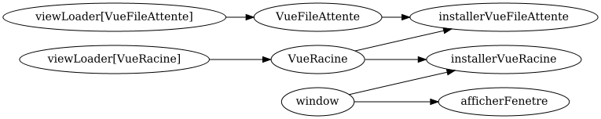

# Tutoriel 3.2: installer la `VueFileAttente`

## Créer la classe `VueFileAttente`

1. Dans le paquet `vues`, je crée la classe `VueFileAttente`

1. J'ajuste la signature de la classe, qui doit hériter de `ViewFx`:

    $[java ./VueFileAttente 1 1]()

1. Avec $[kbd](Ctrl+1), j'ajoute les `import` et la méthode obligatoire:

    $[java ./VueFileAttente]()

    * NOTES: 
        * la méthode `initialize` est requise par JavaFx.  
        * on va s'en servir au module 4

1. Je m'assure d'avoir l'arborescence suivante dans mon projet:

## Créer le fichier `.xml`

1. Dans le répertoire `pong/src/main/resources/`, je créer le fichier `file_attente.xml`

1. Pour commencer, j'ajoute le code suivant dans ce fichier:

    $[xml ./file_attente]()

    * NOTES: 
        * l'attribut `fx:controller` déclare notre classe `VueFileAttente`
        * on a une image et un bouton dans un VBox:
            * l'image devrait être au dessus et le bouton en bas

1. Je télécharge $[download ./logo.png](logo.png) et je copie le fichier dans `pong/src/main/resources`

1. Je m'assure d'avoir l'arborescence suivante dans mon projet:

## Déclarer la Vue dans le Frontal

1. J'ouvre `FrontalPong.java` et je déclare la `VueFileAttente`

    $[java ./FrontalPong]

## Créer la méthode `VueRacine.afficherSousVue`

1. Dans la `VueRacine` j'ai besoin d'une métode pour afficher une page (une sous-vue)

1. J'ouvre `VueRacine.java` et j'ajoute cette méthode:

    $[java ./VueRacine]

    * NOTE:
        * on fait `clear()` pour retirer une page serait déjà affichée
        * le résultat est qu'on affiche une page à la fois

## Créer les tâches pour charger la Vue

1. Dans la classe `Initialisation`, je crée les méthodes suivantes

    $[java ./Initialisation 15 44]

    * J'utilise $[kbd](Ctrl+1) pour ajouter les `import` requis

1. Dans `Initialisation.creerTaches`, j'ajoute les bons appels

    $[java ./Initialisation 1 12]

## Vérifier que la Vue s'affiche

1. J'exécute `pong`

        $ cd tutoriels
        $ sh gradlew client

1. Je vérifie qu'une fenêtre grise s'affiche

    

        
    

    * NOTES:
        * on voit le VBox en action: 
            * le premier enfant (l'image) est sur le dessus
            * le deuxième enfant (le bouton) est ajouté en bas, verticalement

## Vérifier le graphe de tâches

1. J'exécute le client `pong`

        $ cd tutoriels
        $ sh gradlew client

1. Je vérifie mon graphe de tâches `pong/_storage/graphs/frontend.png`

    

