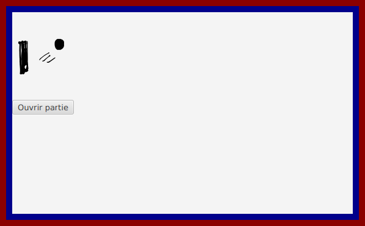

# Tutoriel 3.3: installer le CSS

## Préparer les fichiers `.xml`

1. Je vais ajouter des `id` et des `styleClass` à mon FXML

1. Dans `racine.xml`, j'ajoute:

    $[xml ./racine]()

    * NOTE: je porte attention aux lignes
        * 3
        * 4

1. Dans `file_attente.xml`, j'ajoute:

    $[xml ./file_attente]()

    * NOTE: je porte attention aux lignes
        * 3
        * 4
        * 14
        * 15

## Créer les fichiers `.css`

1. Je vais créer deux fichier `.css`
    * `dev.css` pour afficher les conteneurs et faciliter les tests
    * `prod.css` pour l'apparence finale de ma Vue

1. Dans `pong/src/main/resources/` j'ajoute donc
    * `dev.css`
    * `prod.css`

1. Je m'assure d'avoir l'arborescence suivante dans mon projet:

## Déclarer le CSS de l'application

* L'application a un seul fichier CSS

* Je le déclare dans le Frontal

* J'ouvre `FrontalPong.java` et j'ajoute:

    $[java ./FrontalPong01]()

       

## Ajouter des propriétés CSS

* Dans `dev.css`, je vais ajouter graduellement des propriétés pour voir l'effet

* J'ajoute:

    $[css ./dev01]()

    

        
    

    * On voit que le conteneur `VueRacine` prend toute la fenêtre

* J'ajoute:

    $[css ./dev02]()

    

        
    

    * On voit que `VueFileAttente` qui prend tout l'espace à l'intérieur de `VueRacine`

* J'expérimente avec différents alignements à l'intérieur de `VueFileAttente`

    $[css ./dev03]()

    <table>
    <tr>
    <td>
        <code>top-right</code>
    </td>
    <td>
        

            
        

    </td>
    </tr>

    <tr>
    <td>
        <code>bottom-left</code>
    </td>
    <td>
        

            
        

    </td>
    </tr>

    <tr>
    <td>
        <code>center</code>
    </td>
    <td>
        

            
        

    </td>
    </tr>
    <table>

    * NOTES: 
        * il existe évidemment d'autres options. 
        * on va utiliser `center` ici.

* J'ajoute du style pour les actions d'un `gros-bouton`

    $[css ./dev04]()

    

    <video width="50%" src="gros-bouton.mp4" type="video/mp4" loop nocontrols autoplay>
    

    * NOTE: le bouton ne fait toujours rien, ce n'est que du style ;-)

* Je choisi ou crée un style de bouton:

    

        
    

    * NOTE: le style de bouton est copié d'ici:
        * http://fxexperience.com/2011/12/styling-fx-buttons-with-css/ 

* Filnament, le `prod.css` est similaire, sauf que:
    * on ne montre pas les conteneurs
    * on a ajouté une couleur de fond

    $[java ./FrontalPong02]()

    

        
    

