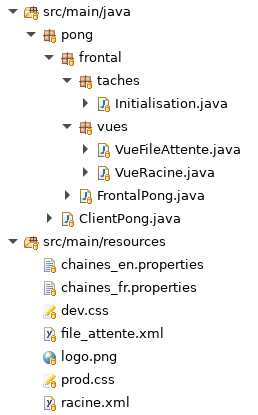
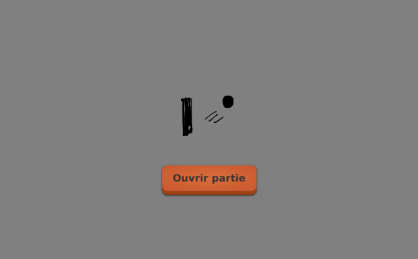

# Tutoriel 3.4: ajouter les traductions

## Créer les fichiers `.properties`

1. Je vais créer deux fichiers
    * `chaines_fr.properties` pour la version française
    * `chaines_en.properties` pour la version anglaise

1. Dans `pong/src/main/resources/` j'ajoute donc
    * `chaine_fr.properties`
    * `chaine_en.properties`

1. Dans chaque fichier, je vais donner une valeur à `ouvrirPartie`

1. Dans `chaines_fr.properties`, j'écris donc:

    <pre>
        ouvrirPartie=Ouvrir partie
    </pre>

1. Dans `chaines_en.properties`, j'écris donc:

    <pre>
        ouvrirPartie=Open Game
    </pre>

1. Je m'assure d'avoir l'arborescence suivante dans mon projet:

## Modifier les fichiers `.xml`

1. Je dois maintenant utiliser la valeur `ouvrirPartie`

1. Je modifie `file_attente.xml` comme suit:

    $[xml ./file_attente]()

    * À la ligne 4, le texte du bouton est maintenant `%ouvrirPartie`

## Déclarer les traductions

* L'application a un fichier `.properties` par défaut, puis un pour chaque autre langue

* Je dois déclarer les traductions dans le Frontal

* J'ouvre `FrontalPong.java` et j'ajoute:

    $[java ./FrontalPong01]()

## Vérifier que ça fonctionne

1. J'exécute le client `pong` en français

        $ cd tutoriels
        $ sh gradlew clientFr

    

        
    

1. J'exécute le client `pong` en anglais

        $ cd tutoriels
        $ sh gradlew clientEn

    

        
    

