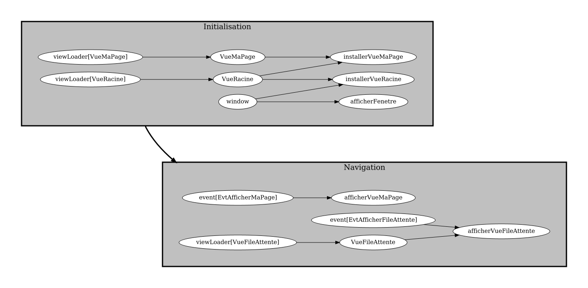

# Objectifs 4: implanter la navigation

<video width="50%" src="presentation.mp4" type="video/mp4" controls>

<strong>IMPORTANT</strong>

<ul>
<li>J'importe la <code>VueFileAttente</code> dans mon projet
<li>Par contre, je n'importe pas tout de suite la <code>VuePartie</code> 
</ul>

1. J'effectue le $[link ../tutoriel/](tutoriel) pour comprendre
    * comment gérer les événements usager
    * comment passer à un graphe de tâche hiérarchique
    * comment changer de page dans mon application `Ntro`

1. J'implante la navigation de base dans mon projet
    * mon application doit démarrer sur ma page
    * ensuite, on doit pouvoir naviguer vers `VueFileAttente` et revenir à ma page
    * voici, <strong>par exemple</strong>, le genre de résultat qu'on cherche 

        

        <video width="50%" src="objectifs04_fr.mp4" type="video/mp4" loop nocontrols autoplay>
        

        

        <video width="50%" src="objectifs04_en.mp4" type="video/mp4" loop nocontrols autoplay>
        

    * **NOTE**: j'utilises du texte pertinent à mon projet!

1. Je m'assure d'avoir un graphe de tâches hiérarchique
    * voici, <strong>par exemple</strong>, le genre de graphe que je devrais avoir

        

            
        

1. Je m'assure que mes noms d'attribut/méthode sont adéquats **pour mon projet**
    * on ne **veut pas** de `boutonOuvrirPartie` qui ouvre une page de paramètres!

1. Je pousse mon projet sur GitHub, p.ex:

        $ git add .
        $ git commit -a -m module04
        $ git push 

1. Je vérifie que mes fichiers sont sur GitHub

1. Je vérifie que projet est fonctionnel avec un `$ git clone` neuf, p.ex:

        $ mkdir ~/tmp

        $ cd ~/tmp

        $ git clone git@github.com:USAGER/DEPOT

        $ cd DEPOT

        $ cd mon_projet

        $ sh gradlew clientFr

            # Doit afficher ma page directement, en français
            # Doit permettre de naviguer
            # Doit générer un graphe de tâches hiérarchique
            #      dans _storage/graphs/frontend.png

        $ sh gradlew clientEn

            # Doit afficher ma page directement, en anglais
            # Doit permettre de naviguer
            # Doit générer un graphe de tâches hiérarchique
            #      dans _storage/graphs/frontend.png

