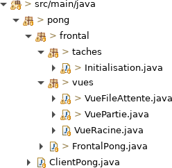
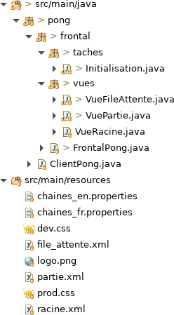

# Tutoriel 4.1: créer la `VuePartie`

## Créer la classe `VuePartie`

1. Dans le paquet `vues`, je crée la classe `VuePartie`

1. J'ajuste la signature de la classe, qui doit hériter de `ViewFx`:

    $[java ./VuePartie 1 1]()

1. Avec $[kbd](Ctrl+1), j'ajoute les `import` et la méthode obligatoire:

    $[java ./VuePartie]()

    * NOTES: 
        * la méthode `initialize` est requise par JavaFx.  
        * on va s'en servir pour accéder aux contrôles en Java

1. Je m'assure d'avoir l'arborescence suivante dans mon projet:

## Créer le fichier `.xml`

1. Dans le répertoire `pong/src/main/resources/`, je créer le fichier `partie.xml`

1. J'ajoute le code suivant dans ce fichier:

    $[xml ./partie]()

1. Je m'assure que `fx:controller` déclare bien le nom complet de la classe `VuePartie`
    * `pong.frontal.vues.VuePartie`

1. Je m'assure d'avoir l'arborescence suivante dans mon projet:

## Ajouter le CSS et les traductions

1. Dans `dev.css`, j'ajoute la règle suivante:

    $[css ./dev]()

1. Dans `chaines_fr.properties`, j'ajoute le texte pour `quitterPartie`

    <pre>
    quitterPartie=Retour
    </pre>

1. Dans `chaines_en.properties`, j'ajoute le texte pour `quitterPartie`

    <pre>
    quitterPartie=Back
    </pre>

## Déclarer la Vue dans le Frontal

1. J'ouvre `FrontalPong.java` et je déclare la `VuePartie`

    $[java ./FrontalPong]
