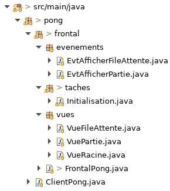

# Tutoriel 4.2: gestion d'événements usager

## Créer les événements `Ntro`

1. En Eclipse, je crée le paquet `pong.frontal.evenements`

1. Dans le paquet `evenements`, je crée les classes 
    * `EvtAfficherFileAttente`
    * `EvtAfficherPartie`

1. J'observe que la classe est nommée `EvtNomEvement` par convention

1. J'ajuste les signatures de ces classes, qui doivent hériter de `EventNtro`

    $[java ./EvtAfficherFileAttente]()
    $[java ./EvtAfficherPartie]()

1. Avec $[kbd](Ctrl+1), j'ajoute les `import`

1. Je m'assure d'avoir l'arborescence suivante dans mon projet:

## Déclarer les événements `Ntro` dans le Frontal

1. Je dois déclare mes nouveaux événements `Ntro` dans le Frontal

    $[java ./FrontalPong]()

## Récupérer les contrôles des Vues JavaFx

1. J'ajoute l'attribut `fx:id` sur chaque bouton:

    * dans `file_attente.xml`

        $[xml ./file_attente]()

        * NOTE: j'ajoute la ligne 2
            

    * dans `partie.xml`

        $[xml ./partie]()

        * NOTE: j'ajoute la ligne 2

1. J'observe que `fx:id` et `id` ne joue pas le même rôle
    * `fx:id` identifiant JavaFx 
    * `id` identifiant CSS

1. Dans mes classes `VueFileAttente` et `VuePartie`, j'ajoute un attribut pour le bouton

    * dans `VueFileAttente`

        $[java ./VueFileAttente01]()

    * dans `VuePartie`

        $[java ./VuePartie01]()

1. Je m'assure que dans les deux cas:
    * le nom de l'attribut correspond exactement au `fx:id` du fichier `.xml`
    * l'annotation `@FXML` est directemetn au dessus de l'attribut
    * j'utilise une ligne `Ntro.assertNotNull` pour détecter rapidement une erreur

## Créer les capteurs d'événements JavaFx

1. Dans mes classes `VueFileAttente` et `VuePartie`, je capte les événements JavaFx

    * dans `VueFileAttente`

        $[java ./VueFileAttente02]()

    * dans `VuePartie`

        $[java ./VuePartie02]()

1. J'exécute le client et je m'assure que mon capteur fonctionne

        $ cd tutoriels
        $ sh gradlew client

            # Dois afficher quand je cliques sur le bouton

            [VueFileAttente] clic: ACTION
            [VueFileAttente] clic: ACTION
            [VueFileAttente] clic: ACTION
            

## Créer et déclencher les événements `Ntro`

1. Dans mes classes `VueFileAttente` et `VuePartie`, j'ajoute

    * dans `VueFileAttente`

        $[java ./VueFileAttente03]()

    * dans `VuePartie`

        $[java ./VuePartie03]()

1. J'observe qu'un utilise les noms `evtNtro` et `evtFx` pour des raisons pédagogiques
    * ce n'est **pas** des bons noms de variables
    * mais on veut souligner le fait qu'il s'agit de types d'événement différents
